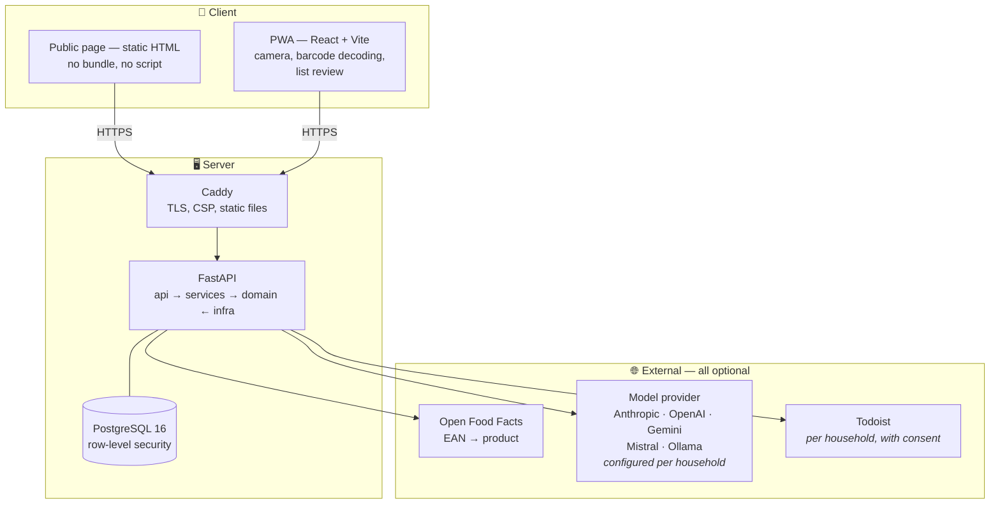
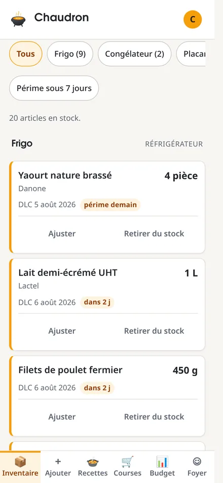
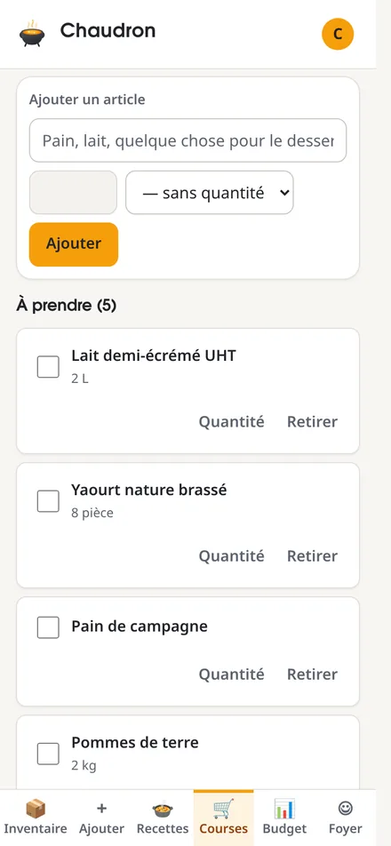
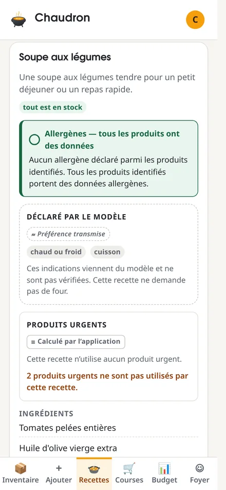
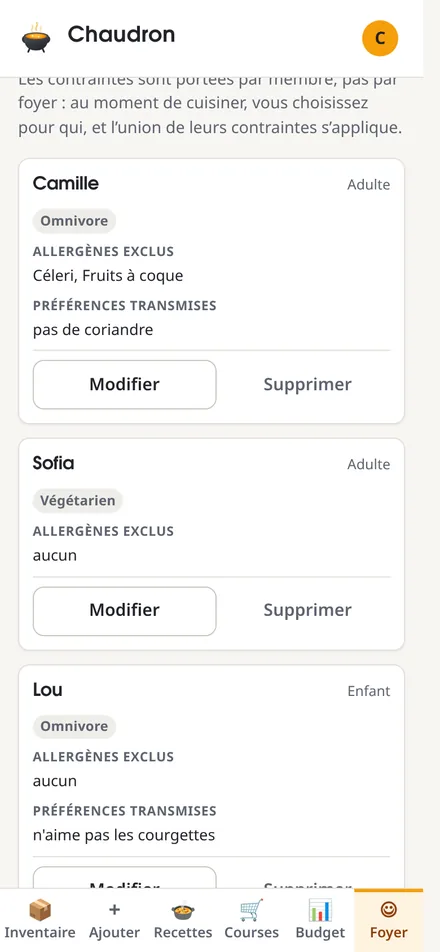
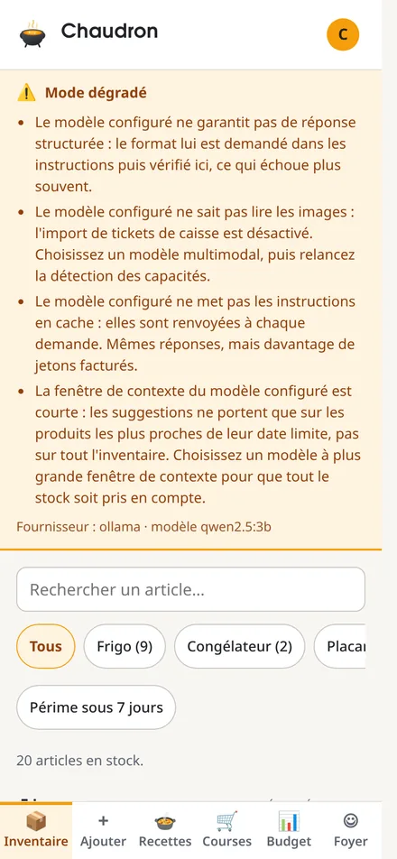

<div align="center">


**Throw in what you have. See what comes out.**

Self-hostable food stock management with AI recipe suggestions — running on
*your* model, *your* key, *your* server.

[](LICENSE)
[](https://github.com/ClaraVnk/chaudron/actions/workflows/ci.yml)
[](https://www.python.org/)
[](https://github.com/astral-sh/ruff)
[](https://mypy-lang.org/)
[](https://podman.io/)
[](CONTRIBUTING.md)

</div>

---

> [!WARNING]
> **Authentication has landed. Four things about it are still worth knowing
> before you put this on a public address.**
>
> - **There is no password reset**, because there is no SMTP anywhere in this
>   project. A forgotten password is a forgotten account — an owner re-inviting
>   the person is the only recovery path. That is a deliberate trade: an
>   unverified recovery flow is an account takeover with a friendly name.
> - **Registration is an enumeration oracle.** An address already in use gets a
>   `409`, so anyone can learn whether you have an account here. Closing it means
>   answering by email, which see above.
> - **The rate limiters are per process.** They are dictionaries on `app.state`,
>   so running with `--workers 2` gives whoever is guessing a password two
>   budgets instead of one. Run a single worker until that state moves to
>   PostgreSQL.
> - **Row-level security only enforces if the API connects as the application
>   role.** The table owner bypasses its own policies and nothing warns you:
>   provisioning is an installation step, not an option. An instance that skips
>   it passes every health check while isolating nothing. `ops/README.md` §2.5
>   has the command, including `--check`.
>
> Receipt import has since landed, and the budget it feeds with it — see
> *Features*. A photographed receipt still needs a vision model configured;
> a PDF order recap does not.

---

## Why

Most food inventory apps want your data, your subscription, or both. The ones
that generate recipes send your grocery habits to a service you don't control,
and stop working when the company pivots.

Chaudron takes the opposite position: **you host it, and you bring your own
model.** There is no Chaudron cloud, no Chaudron account, no Chaudron API key. The
application never pays for anyone's inference and never sees anyone's data.

## Features

| | | |
|---|---|---|
| 🔐 **Accounts and sessions** | ✅ built | Argon2id passwords (RFC 9106 profile), sessions held server-side so signing out means something, `__Host-` cookie, CSRF token on every unsafe method. The household header is now a *selector* checked against membership, never a proof. |
| 📦 **Stock tracking** | ✅ built | What you own, where it's stored, and when it expires — per household, not per person. Use-by and best-before are distinct: conflating them means either anxious alerts on dry pasta or silence on minced beef. Items can be corrected and removed after the fact. |
| 📷 **Barcode scanning** | ✅ built | Decoded **in the browser** — the server only ever sees thirteen characters, never a video stream. Products resolve through [Open Food Facts](https://world.openfoodfacts.org/). |
| 🍳 **Recipe suggestions** | ✅ built | Generated from the stock actually on hand. Whether an ingredient is in stock is **recomputed against your inventory**, never taken from the model's word for it. |
| 🥗 **Dietary constraints** | ✅ built | Allergens, diets and infant food rules are applied as a **filter on the inventory before the model is asked**, and every ingredient it writes back is re-resolved against what was allowed. A suggestion that cannot be resolved is discarded, not shown. The one constraint a filter cannot express — an infant's required texture — is sent to the model, under consent; see *What the model is not told*. |
| ⚖️ **Weekly balance** | ✅ built | Food-group coverage over a rolling seven days, computed from what was actually consumed and compared with published PNNS benchmarks — quoted from a versioned table, with the source URL, not paraphrased into a score. |
| 👍 **Feedback on suggestions** | ✅ built | Dismissing a recipe demotes it as a **tie-break only**. Expiry urgency and a gap in the weekly balance still outrank it, because an application that stops proposing courgettes because you frowned once is one that lets them rot. |
| 🛒 **Shopping list** | ✅ built | Built by hand or from what ran out. A refusal to re-buy something is remembered permanently, and undone by deleting it. |
| 📄 **Shopping list import** | ✅ built | A PDF, a text file, or pasted text becomes a **proposal you review line by line**. Nothing is written until you confirm; the parse is never persisted on its own. |
| ✅ **Todoist export** | ✅ built | Per household, with the token encrypted at rest and a recorded consent that can be withdrawn. |
| ⏰ **Expiry alerts on your phone** | ✅ built | A CalDAV collection of `VTODO`s. Because it advertises tasks and nothing else, an iPhone files it under **Reminders**, not Calendar. Read-only — writes are refused. |
| 🔑 **Bring your own model** | ✅ built | Anthropic, OpenAI, Gemini, Mistral, or a local Ollama. Your key, your bill, your choice. |
| 🏠 **Self-hosted** | ✅ built | Podman + systemd quadlets, Caddy in front, PostgreSQL row-level security, `age`-encrypted backups with a weekly restore drill. |
| 💶 **Budget** | ✅ built | Spending per calendar week or month, against an optional target, computed from **receipt totals** — which now exist. The arithmetic, its coverage warnings, and the path from a confirmed receipt to the figure on this screen are all tested. |
| 🧾 **Receipt import** | ✅ built | A drive order recap or a photographed till receipt becomes a **proposal you review line by line**; nothing reaches your stock until you confirm it, because a model that reads `PDT NOUV 1KG` is right about half the time and a silently wrong stock is worse than an empty one. The PDF path needs no model at all — the text is read straight out of the document, in a **separate process under memory and CPU limits**, so a decompression bomb costs one worker rather than the instance. A photo does need a vision model, and there is **no OCR engine here**: without one configured, the app says so instead of guessing. The image itself is never kept — only a hash, to catch the double upload. |
| 🏡 **Home Assistant** | ✅ built | A HACS custom integration in [`homeassistant/`](homeassistant/): what is expiring, what is expired, stock and shopping-list counts, food spend — and the shopping list as a **native `todo` entity**, so it appears in the dashboard's to-do card and in Assist. Authenticates with a scoped machine token, never a session. |
| 🔁 **Password reset** | ❌ not started | Needs outbound email. There is none, on purpose. |
| 📧 **Forwarded order emails** | ❌ not started | Configuration keys exist; the webhook does not. |

## Bring your own model

Each household configures its own model access. There is deliberately **no mode
in which the application funds inference for its users** — that decision removes
spend caps, quotas, abuse protection and a large amount of GDPR exposure in one
stroke.

| Mode | What you provide | Who pays |
|---|---|---|
| `byok` | Your own API key — Anthropic, OpenAI, Gemini or Mistral | You, directly to the provider |
| `ollama` | A base URL and a model name | Nobody — local inference |
| `instance_owner` | Nothing — uses the server's configured key | The operator, for their own household only |

Supported providers:

| Provider | Models | Vision | Notes |
|---|---|---|---|
| **Anthropic** | Claude | ✅ | Default in documentation and examples |
| **OpenAI** | GPT | ✅ | The API behind ChatGPT — a ChatGPT Plus subscription is *not* an API key |
| **Google** | Gemini | ✅ | |
| **Mistral AI** | Mistral, Pixtral | ✅ | **EU-hosted** — your grocery data never leaves European jurisdiction |
| **Ollama** | Whatever you load | ⚠️ depends | Fully local, zero outbound calls. Capabilities detected at configuration time |

> [!TIP]
> If keeping data under EU jurisdiction matters to you, **Mistral** (EU-hosted)
> or **Ollama** (nothing leaves your machine) are the two options that give you
> that without compromise.

### Honest about degradation

Providers are not equivalent. Reading a creased, faded thermal receipt is hard,
and a small local model will do it worse than a frontier one.

Chaudron does not paper over this. Providers **declare their capabilities**, and
the interface tells you what you're getting:

- Missing a capability that can be approximated → the feature works, with a
  documented quality drop.
- Missing a capability that changes the experience → **degraded mode**, shown as
  a persistent indicator explaining exactly what is reduced.
- Missing a capability the feature depends on → the feature is **disabled with
  the reason displayed**, not left to fail at runtime.

You will never discover a limitation at the moment it breaks.

### What the model is not told

Dietary constraints are **not instructions in a prompt**. Allergens, diets and
infant food rules remove stock from the list the model is shown, and every
ingredient it writes back is resolved against that same screened list before the
suggestion is displayed at all.

That matters because a prompt is a request and a filter is a rule. Asking a model
to avoid peanuts works until the day it doesn't, and nobody finds out until
somebody eats.

**What stays, and what goes.** The declared allergens and the diet never leave
the database: they are enum columns read only to build the filter, and no code
path puts either in a prompt. Nor does the stored suggestion keep them — no
member id, no allergen, no age band — so deleting a person deletes their
constraints for good.

Two things about the people at the table *do* reach the provider, because a
filter cannot express them:

- the **infant texture** — purée, moulinée, morceaux — sent as a required-texture
  instruction, which discloses that a young child eats this meal and at which
  feeding stage;
- each member's **free-text restriction**, sent as a preference. Nothing in the
  catalogue says which products contain coriander, so this one can only be asked
  for.

Both are health data under article 9 GDPR, so sending them is treated as what it
is: a transfer to a third party. It requires an explicit, per-configuration,
revocable **consent**, recorded in the database and checked before the API key is
even decrypted (migration `0016`). In `ollama` mode nothing leaves the machine
and no consent is asked for.

## Todoist and Apple Reminders

Chaudron pushes the shopping list to Todoist, and serves a CalDAV collection an
iPhone can add as an account. The obvious next question is whether the two can be
kept in step.

**Not by talking to each other.** Todoist and Reminders share no identity, no ID
space, and no rule for who was right when both changed. Wiring them together
means a mapping table, a conflict policy, and a duplicate every time a call
succeeds but its response is lost — with a third party planted in the middle of a
path Chaudron otherwise owns end to end.

They are kept in step by **both being spokes of the same hub**. Chaudron holds the
list; every destination is written to, and read back from, independently. Two
people in the same supermarket — one on Todoist, one on Reminders — converge
because they are looking at the same list, not because their apps found each
other.

### There is no Reminders API

Apple exposes two doors, and publishing a feed is not one of them: a *subscribed*
calendar carries `VEVENT` only, and any `VTODO` inside it is dropped without a
message. That was checked rather than assumed — the same limit is why Todoist's
own export emits its tasks as events.

The two doors are **CalDAV**, and **the device itself** via Shortcuts.

Chaudron takes the first. A CalDAV account added on the phone points at a
collection that declares `VTODO` and only `VTODO`, which is what makes iOS file
it under Reminders.

### The Apple path is the cleaner integration

Against expectation, given the two companies' reputations.

Chaudron chooses the `UID`, and therefore the resource URL, so `PUT` is
idempotent by construction: replaying it overwrites instead of duplicating. The
Todoist side needs a stored mapping and a request id to buy the same guarantee.
And a CalDAV client *writes back* — ticking an item off in the aisle reaches
Chaudron directly, with no polling loop and no public webhook endpoint.

### What is actually built

| | | |
|---|---|---|
| The CalDAV server | ✅ built | `DAV: 1, 3, calendar-access`. Credentials derived by HKDF from a key held apart from the database; the username carries no household id, so a URL in a proxy log is not an identity. |
| Expiry alerts as tasks | ✅ built | A −7/+30 day window, capped at 200 tasks. Read-only: writes get a `403`. |
| Handing out the subscription | ✅ built | Owner-only, now that there are owners. The secret is derived and never stored, so it is shown on request and never again by accident. |
| Todoist export | ✅ built | Per household, token encrypted with AES-256-GCM and a key from the environment, `consented_at` required by the schema rather than by a code path. |
| **Filing under Reminders on a real iPhone** | ⚠️ **unverified** | Driven end to end by `python-caldav` over a real socket, and re-parsed with `icalendar`. **Never tested on an iOS device.** The protocol says it should land in Reminders; no one has watched it happen. |
| A writable shopping-list collection | ⏳ proposed | The second collection, accepting `PUT`, `DELETE` and `STATUS:COMPLETED` so a check-off in the aisle marks the item bought in Chaudron — which is then reflected to Todoist on the next push. |
| Per-household revocation | ❌ missing | Both kill switches are instance-wide today: disabling the feed, or bumping its epoch, disconnects every household at once. Read-only expiry dates can live with that; **a writable list must not ship before it.** The column is designed in [`docs/calendar-feed.md`](docs/calendar-feed.md) §10. |

Google Calendar rejects `VTODO` outright. That household sees nothing, and the
cost is named here rather than discovered later.

## Architecture



Dependencies only point inward: `api → services → domain ← infra`. The domain
layer knows nothing about SQLAlchemy, HTTP, or any model SDK — it declares
interfaces, and infrastructure implements them. That is what makes three model
providers possible without the recipe logic knowing any of them exist.

Seventeen tables carry a `household_id`, from the very first commit — and since
the security audit, PostgreSQL enforces it on every one of them. A query that
forgets its tenant filter returns nothing because the *database* refuses it, not
because the code remembered. A schema test walks `Base.metadata` and fails the
build if a new table arrives without a tenant column or with a unique constraint
that forgets it. See [ADR 0006](docs/adr/0006-multi-tenant-from-day-one.md) and
[the data model](docs/data-model.md) §5.

The public page at `/` and the application at `/app/` are **two separate builds**,
not two routes. The landing page ships no JavaScript at all, is indexable, and
never registers the service worker; `/app/` is `noindex`, `no-store`, and carries
a stricter CSP. The reasoning is in
[`docs/public-page-and-indexing.md`](docs/public-page-and-indexing.md).

## Screenshots

Captures of the application running: real seeded stock, a real backend, and a
real local model behind the suggestions. Nothing here is a mockup —
[`tools/screenshots.py`](tools/screenshots.py) drives a browser against a live
stack, signs in, and photographs what it finds. It fails rather than saving a
half-loaded page.

| Inventory | Shopping list | Recipes |
|---|---|---|
|  |  |  |

The next two were taken against an instance with **no model configured at all**,
which is why neither shows a suggestion. That is not a gap in the capture:
neither screen calls a model, and photographing them on an instance without one
is the honest way to show that they do not need it.

| Who you cook for | What it cost |
|---|---|
|  |  |

**Left:** constraints are held **per member, not per household** — you choose who
you are cooking for and the union of their constraints applies. The two headings
are not decoration: *allergens excluded* is a filter applied to the inventory
before the model is asked anything, while *preferences transmitted* is the short
free text that does leave. The screen draws that line because
[*What the model is not told*](#what-the-model-is-not-told) depends on it.

**Right:** the budget with no receipts behind it, which is the state worth
photographing. It does not show `0,00 €`. It says there are no receipts for the
period, and that **twenty items entered stock with no price attached** — a
figure computed on partial data has to say the data is partial, or it is a
number that invites a conclusion it cannot support. The screen is also opt-in:
nothing is computed until you ask.

<div align="center">

</div>

The last one is the part worth looking at. That household is running
`qwen2.5:3b` locally, so the app says — permanently, before anything is
attempted — that a receipt cannot be *photographed* because the model cannot read
images, that instructions are not cached so every request bills more tokens, and
that the context window only fits the items closest to expiry. You are told what
you are getting, not shown an error once it fails.

That first line used to read "receipt import is disabled", which was wider than
the control behind it: only the photo path goes through a model, and a PDF order
recap imports on an instance with no provider at all. A banner that overstates
what it is switching off costs the household a feature that works.

## Quick start

Requires [uv](https://docs.astral.sh/uv/), Podman, and Node.js 22+.

```sh
git clone https://github.com/ClaraVnk/chaudron.git && cd chaudron
cp .env.example .env          # the app refuses to start if this is incomplete

# Database
podman run -d --name chaudron-db \
  -e POSTGRES_PASSWORD="$(openssl rand -hex 16)" \
  -v chaudron-db-data:/var/lib/postgresql/data:Z \
  -p 127.0.0.1:5432:5432 docker.io/library/postgres:16   # loopback only, never 0.0.0.0

# Backend
cd backend && uv sync && uv run alembic upgrade head
uv run uvicorn chaudron.api.main:app --reload            # one worker: see the warning above

# Frontend
cd ../frontend && cp .env.example .env.local   # one value: the API base URL
npm install && npm run dev
```

Then open the app and **create an account**. Registering also creates your first
household, signs you in, and sets a `__Host-`-prefixed session cookie; the API
answers `401` until it is there, and every unsafe request also has to echo the
CSRF token the session hands back.

The first screen you land on asks you to **create a storage location**, because
you have none. That is deliberate rather than an omission: nothing is seeded at
registration, since "fridge, freezer, cupboard" is a guess about someone's home,
and there is no way to delete a location once it exists. One tap accepts a
suggestion, or you name your own.

Want data to look at instead? `CHAUDRON_ENV=local uv run python scripts/seed.py`
fills a demonstration household with a credible French pantry and prints the
sign-in it created. It refuses to run in any other environment, because the
password is written in the source of a public repository.

Liveness and readiness are separate endpoints on purpose: `/healthz` says the
process is alive, `/readyz` says it can actually serve traffic.

Row-level security ships enabled, but it only *enforces* once the application
connects as a non-owning role — the table owner bypasses it, and nothing warns
you. [`ops/README.md`](ops/README.md) §2.5 has the provisioning steps and a
`--check` command; run it, because a silent no-op is exactly what this control
must never be.

## Development

```sh
cd backend
uv run ruff check . && uv run ruff format --check .
uv run mypy
uv run pytest --cov
```

```sh
cd frontend
npm run lint && npm run format:check
npm run typecheck && npm run build
```

Tests run against a **real PostgreSQL instance** via testcontainers. SQLite is
not used anywhere, including in tests — the reasoning is in
[ADR 0003](docs/adr/0003-backend-stack.md).

The backend targets **Python 3.14** and uses syntax that older interpreters
reject — `except A, B:` without parentheses is [PEP 758][pep758], valid since
3.14. If a file "fails to compile", check which interpreter is reading it before
concluding anything else.

[pep758]: https://peps.python.org/pep-0758/

Containers are built with **Podman**, never Docker. See
[`ops/README.md`](ops/README.md) for the quadlet units, the Caddy configuration
and the SELinux labelling that bind mounts require.

## Documentation

| Document | What it covers |
|---|---|
| [Architecture](docs/architecture.md) | System shape, layers, data flows, the Ollama topology problem |
| [Data model](docs/data-model.md) | Entities, tenancy and RLS, units, expiry batches, sessions, dietary tables |
| [API contract v1](docs/api-contract-v1.md) | The v1 endpoints, frozen before either side was written |
| [API contract v1.1](docs/api-contract-v1.1-dietary.md) | Dietary constraints, weekly balance, budget, shopping list and its export |
| [Calendar feed](docs/calendar-feed.md) | The CalDAV collection, its credentials, and what revocation still lacks |
| [Public page and indexing](docs/public-page-and-indexing.md) | Why `/` and `/app/` are two builds, and what each is allowed to do |
| [Scanning notes](docs/technical-notes-scanning.md) | Barcode reading in-browser, camera in a PWA, Open Food Facts |
| [Ingestion notes](docs/technical-notes-ingestion.md) | Inbound email, receipt OCR, shopping list export |
| [Label lexicon](docs/label-lexicon.md) | Expanding abbreviated till-receipt labels into something matchable |
| [Testing strategy](docs/testing-strategy.md) | Tenancy guards, the adapter conformance suite, what is deliberately not tested |
| [Security model](docs/security-model.md) | Threat model, trust boundaries, what is *not* covered |
| [Security baseline review](docs/security-review-baseline.md) | The pre-implementation review, and the findings the audit later re-tested |
| [Security audit](docs/security-audit-2026-08.md) | 35 findings against the running application, and what has been closed |
| [Penetration test 2026-08-04](docs/security-pentest-2026-08-04.md) | Seven dimensions attacked in parallel: what held, what broke, what is still open |
| [Operations](ops/README.md) | Quadlets, TLS, role provisioning, signed updates, backups and restore drills |
| [Decision records](docs/adr/) | Why things are the way they are — including what it costs |

## Security

The application has been audited against a running instance, not just read: 35
findings, 19 of them proven by exploitation rather than inferred. Closed since:
the fork-triggered deployment path, the SSRF port oracle, prompt injection
through the shared product catalogue, absent rate limiting on the endpoints that
spend money, application-only tenant isolation — now enforced by PostgreSQL —
and, the one that blocked everything else, **the absence of authentication**.
`X-Household-Id` used to be shipped inside the JavaScript bundle and accepted as
authorisation; it is now a selector checked against the session's memberships.

Still open, and named rather than buried: no password reset, an enumeration
oracle on registration, per-process rate limiters, and no retention policy for
the inventory snapshots kept alongside each suggestion.

Images are signed with cosign on publication, and the update path verifies the
signature against the workflow identity **before** applying it — there is no
portal, it is a systemd timer running `cosign verify` and a documented command
you can run yourself ([`ops/README.md`](ops/README.md) §5.2). Backups are
`age`-encrypted with a key generated off the server, and a weekly job restores
one to prove it can be.

The audit is committed in full, including
[AUD-004](docs/security-audit-2026-08.md), which called valid Python 3.14 syntax
a compilation failure and was wrong — a report you cannot check is not worth more
than one you can.

## Contributing

Read [CONTRIBUTING.md](CONTRIBUTING.md), and note the house rules: Conventional
Commits, PostgreSQL only, Podman only, everything versioned in English, and no
secrets ever.

By participating you agree to the [Code of Conduct](CODE_OF_CONDUCT.md).
Security issues go through [SECURITY.md](SECURITY.md) — not public issues.

## License

[GNU AGPL v3.0 or later](LICENSE).

Copyleft that covers network use: if you run a modified Chaudron as a service, you
owe your users the source. That is deliberate — this project exists so people
can own their food data, and a closed fork serving it back to them would defeat
the point.
