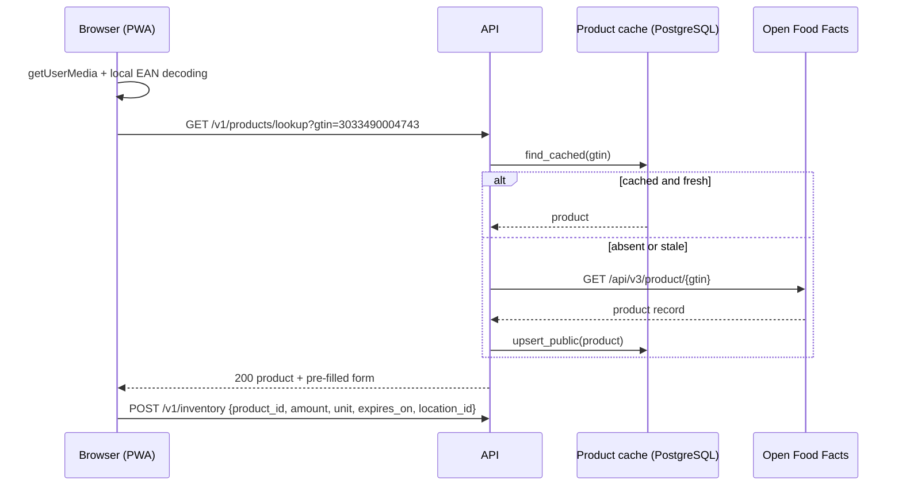
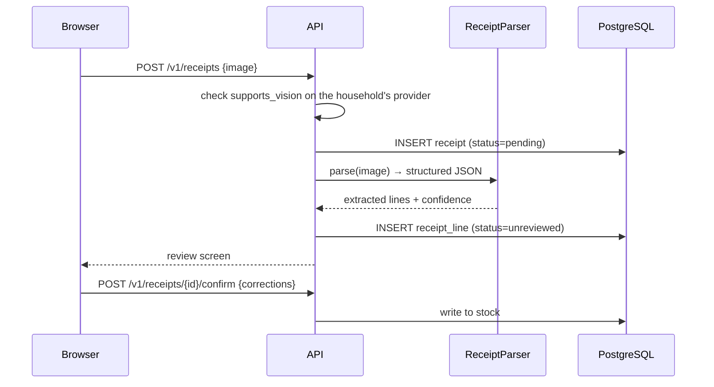

# Architecture

Framing document. Describes the shape of the system, the boundaries between
layers and the main flows. The structural decisions and the alternatives they
rejected are in the ADRs (`docs/adr/`); the detail of the entities is in
[`data-model.md`](data-model.md).

Every technical identifier cited here (tables, columns, modules, endpoints) is in
English, per the project convention.

---

## 1. Overview

Chaudron is a self-hostable application made of three artefacts:

| Artefact | Role | Technology |
|---|---|---|
| `frontend` | Installable PWA, camera access, data entry | React + Vite |
| `backend` | API, business logic, orchestration of external calls | FastAPI, Python 3.14 |
| `db` | Persistence | PostgreSQL 16 |

Three external dependencies, all optional or replaceable:

- **Open Food Facts** — resolves an EAN code into a product record. No answer
  degrades the experience (manual entry) but breaks nothing.
- **A model provider** — configured *per household*, not per instance.
- **An inbound email service** — to capture forwarded order confirmations.
  Entirely optional feature.

---

## 2. Layering

```
backend/src/chaudron/
├── api/        ← HTTP handlers, input/output schemas, authentication
├── services/   ← use cases, orchestration, transactions
├── domain/     ← entities, business rules, interfaces (ports)
└── infra/      ← SQLAlchemy, HTTP clients, model SDKs (adapters)
```

**Dependency rule, non-negotiable:** the arrows only point inwards.

```
api ──▶ services ──▶ domain ◀── infra
```

`domain` knows neither SQLAlchemy, nor HTTP, nor any SDK. It declares interfaces;
`infra` implements them; `services` receives the implementations by injection.
Concretely:

- An `import sqlalchemy` in `domain/` or `services/` is an architecture bug.
- An HTTP handler that contains a business rule is an architecture bug.
- A query that reaches the database from `api/` is an architecture bug.

This is not ceremony: it is what makes the domain testable without a database or
a network, and it is what allows three model provider implementations without the
recipe generation logic knowing about any of them.

### Ports defined by the domain

| Port | Planned implementations |
|---|---|
| `ProductCatalog` | Open Food Facts, local cache, manual entry |
| `RecipeGenerator` | Anthropic (BYOK or instance key), Ollama |
| `ReceiptParser` | Anthropic vision, Ollama vision (if the capability is declared) |
| `StockRepository`, `HouseholdRepository`, … | SQLAlchemy |
| `InboundEmailSource` | Webhook from the chosen provider |

---

## 3. Main flows

### 3.1 Scanning a barcode



Two answers other than a product are normal and the client handles both: `404`
when Open Food Facts does not know the code, which falls back to manual entry via
`POST /v1/products`; `422` for an in-store variable-weight code, which will never
be in a public reference. When the catalogue is unreachable, a stale cache entry
is served in preference to an error, and only a cache miss produces `503`.

The lookup takes the barcode as a query parameter rather than a posted body
because it is a read: it resolves a code against a shared catalogue and writes
nothing the caller owns. The stock write is the separate `POST /v1/inventory`
call, and it is the only one of the two that is tenant-scoped.

Barcode decoding happens **in the browser**, never server-side: sending a video
stream to the backend would be absurd in bandwidth as much as in latency. The
server only receives a 13-character string.

The product cache is not an optimisation, it is a condition of operation: it
avoids hammering a free community service, and it makes it possible to keep
serving already-known products when Open Food Facts is unavailable.

### 3.2 Importing a till receipt



**Nothing enters stock without human review.** A model that reads "PDT NOUV 1KG"
and proposes "new potatoes, 1 kg" is right half the time; a silently wrong stock
is worse than an empty stock, because the user stops trusting the application.
The review screen is not a safeguard against hallucinations, it is the product
itself.

If the provider configured by the household does not declare `supports_vision`,
the endpoint returns an explicit error and the interface hides the feature
upstream, with the reason displayed. No silent failure, no invented JSON.

### 3.3 Recipe suggestion

The available stock is serialised, sent to the household's `RecipeGenerator`, and
the response is constrained by a strict schema. The suggestion is persisted with
the provider mode, the model name and the token cost — necessary to diagnose a
quality complaint ("the recipes are rubbish" does not call for the same answer
depending on whether they come from a small local model or from the default
model).

The system prompt is stable and placed first to benefit from prompt caching; the
inventory, being volatile, comes after the cut point. This is not a
micro-optimisation: on this flow, the system prompt accounts for most of the
input tokens.

### 3.4 Receiving an order email

Each household gets a dedicated address. The user creates an automatic forwarding
rule in their mail client; the inbound provider posts a signed webhook to the
backend, which attaches the email to the household by the destination address and
processes the content as a receipt (same review path).

This route avoids Gmail OAuth — and therefore the CASA security audit, its cost
and its annual renewal — while working with any retailer and any mail provider.
Details in [`technical-notes-ingestion.md`](technical-notes-ingestion.md).

---

## 4. The hard part: Ollama topology

Supporting Ollama is not "adding an HTTP client". There are two irreconcilable
situations, and one has to choose which one is served.

**Case A — Ollama colocated with the backend.** The user self-hosts Chaudron and
runs Ollama on the same machine or the same network as the server. The call is
server → server, trivial. This is the self-hoster's case.

**Case B — Ollama on the user's machine.** The user connects to a Chaudron
instance hosted elsewhere, but their Ollama runs on their laptop or their NAS,
behind a NAT. **The backend cannot reach it.** The only component of the system
that can reach that Ollama is the user's browser.

Serving case B forces an inversion: the backend no longer makes the call, it
returns a *prompt bundle* to the client, which the browser sends itself to its
local Ollama, before posting the result back for validation and writing. This
assumes the user configures `OLLAMA_ORIGINS` on their instance to allow CORS, and
it moves part of the logic to the client — hence a surface to validate
server-side, since everything coming from the browser is hostile by default.

Case A does not have the same security properties either: a base URL supplied by
the user and called by the server is an SSRF primitive, and the usual filtering
(blocking private ranges) is useless here since the legitimate address of an
Ollama *is* private.

**This choice is settled in [ADR-0007](adr/0007-byok-and-local-inference.md):
v1 serves case A only.** `ollama` mode documents that it requires an instance
reachable from the server; the browser route is the identified extension path,
not work in progress. The reasoning is that supporting case B doubles the
execution path of every model feature — and exposes the prompt client-side —
before the product has a single external user.

The port abstraction that makes several providers possible at all is
[ADR-0005](adr/0005-llm-provider-abstraction.md); it is ADR-0007 that decides
which topologies of the local one are actually served.

---

## 5. Boundaries and contracts

- **Versioned API** under `/v1/`. A contract break creates `/v2/`, it does not
  modify `/v1/`.
- **Strict schemas on input and output** (Pydantic). Typing is not decoration: it
  is the only place where data can be refused before it contaminates the rest.
- **Model output treated as untrusted input.** JSON produced by an LLM goes
  through the same validation as a form posted by a stranger.
- **Configuration validated at startup**, with immediate shutdown if it is
  incomplete. A half-configured application accepting traffic is a deferred
  incident.

---

## 6. Security

| Surface | Treatment |
|---|---|
| Household API keys | Encrypted at rest, encryption key outside the database, never read back by the API (only the last 4 characters are exposed), never logged |
| User-supplied Ollama URL | See §4 — SSRF, validation mandatory |
| Isolation between households | `household_id` on every business table; no business query without a tenant filter; dedicated isolation tests |
| Receipt images | Contain consumption data and sometimes partial banking data. **Never retained**: the image is read in memory and discarded once the lines are extracted (`api-contract-v1.1-dietary.md` §6ter). `receipt.image_object_key` stays `NULL`, and exists only for a deployment that decides otherwise and brings its own retention policy |
| Inbound email webhook | Signature verified, otherwise anyone injects purchases into any household |
| Allergens | An error here has physical consequences. Never present allergen information coming from a model as authoritative |

---

## 7. Observability

Structured logs from the first commit (no `print`), with `household_id` and a
request identifier on every line. Errors carry their context rather than being
swallowed.

Three things deserve a metric from the start, because they are the only ones that
can drift silently: the failure rate of calls to the model provider, the human
correction rate on receipt lines (a direct proxy for parsing quality), and the
rate of barcodes not resolved by Open Food Facts.

---

## 8. Authentication, and what is still open

### 8.1 Authentication is settled and shipped

This section used to say the authentication strategy was undecided. It is not:
the description below is read from the code, not from an intention.

**Passwords.** Argon2id (`argon2-cffi`), parameters pinned to the RFC 9106
low-memory profile — 64 MiB, three passes, four lanes. Minimum length 12
characters and no composition rules; the only other bound is 1024 bytes, which
exists so that a very long password cannot be used as a CPU-exhaustion lever. A
login against an address that does not exist verifies a dummy digest, so the
response time does not distinguish "no such account" from "wrong password".
`user_account.password_hash` is nullable — an account created through an external
identity provider would have none, and a `NULL` hash can never authenticate.

**Sessions, server-side.** No JWT anywhere in the codebase. A session is a row in
`user_session`: 32 random bytes handed to the browser, stored only as its SHA-256
digest in `token_hash`. SHA-256 rather than Argon2 is deliberate here — the token
is already full-entropy, so there is nothing for a slow hash to protect against,
and every request would pay for it. Two deadlines are checked in the same
predicate: `expires_at`, absolute, which never moves, and `idle_expires_at`,
which slides forward on use. `revoked_at` closes a session; logging in always
mints a new row and revokes whatever session the request arrived holding, which
is what makes session fixation a non-event.

**Cookie.** `__Host-chaudron_session`, with `Secure`, `HttpOnly`, `SameSite=Lax`,
`Path=/` and no `Domain` — the `__Host-` prefix forbids one. There is no
"insecure mode for development": the `Secure` flag cannot be turned off, and
configuration validation refuses to start when the base URL is not `https://`.

**CSRF.** Not a double-submit cookie. The token lives server-side on the session
row (`user_session.csrf_token`) and reaches the client in the *response body* of
register, login and `GET /v1/auth/session` — a channel a cross-origin attacker
cannot read. The client echoes it in `X-CSRF-Token`, compared in constant time.
It is required on **every method outside `GET`, `HEAD` and `OPTIONS`**, so a
method added later is covered without anyone remembering to cover it.

**The household header is a selector, never a proof.** `X-Household-Id` is
accepted only when it names a household the caller already belongs to, checked
against `household_member` before any tenant is posted. Omitted with one
membership, it is inferred; omitted with several, the API answers `409` and lists
them; naming a household the caller is not a member of is `403`, and so is a
value that is not a canonical lowercase UUID. Only after that check does the
request set the session variable that arms the RLS policies (§6, and
`data-model.md` §5.3) — before it, the policies show nothing.

**Machine access tokens.** For scripts and home-automation, a second credential:
`Authorization: Bearer chdr_…`, 32 random bytes behind a scanner-friendly prefix,
stored as SHA-256 in `machine_token`, shown to the user exactly once. Five closed
scopes — `inventory:read`, `inventory:write`, `shopping:read`, `shopping:write`,
`budget:read` — additive and never implicit, so `inventory:write` does not grant
reads. There is no `*` and no `admin`. Two absences are deliberate: no scope
reaches recipe generation, which spends someone's inference budget, and none
reaches `household_person`, which holds health data. A token is **pinned** to the
household it was issued for; the header cannot widen it. Expiry is optional,
revocation immediate, and a token cannot mint another token — issuing, listing
and revoking all require a browser session. Contract in
[`api-contract-v1.1-dietary.md`](api-contract-v1.1-dietary.md) §10.

**Login throttling, not lockout.** Token buckets on unauthenticated endpoints:
per source address and per account for login (the per-account bucket is spent
even when the address does not exist, so it cannot be used to enumerate),
per address for registration, and per address for rejected bearer tokens.
Deliberately no account lockout — it hands any stranger a denial of service
against a known address.

### 8.2 What is genuinely still open

- **The inbound email provider.** `technical-notes-ingestion.md` §7 recommends
  self-hosting reception, with named fallbacks, but the recommendation is
  conditional on three checks that have not been made.
- **An external identity provider (OIDC).** Phase 2. Nothing is implemented; the
  nullable `password_hash` is the only place the schema anticipates it.
- **Throttling counters live in process memory.** Two workers would grant two
  budgets and a restart forgets every counter. They have to move to PostgreSQL
  before the deployment gains a second worker or replica.

Three items this section used to list are settled and have been moved into the
body of this document: the Ollama topology (§4, ADR-0007 — case A only in v1),
retention of receipt images (§6 — never retained), and the project licence
(AGPL-3.0-or-later).
