# Chaudron — data model

> Internal scoping document. **Every identifier cited (tables, columns, types,
> enum values) is authoritative exactly as written.**
> Target: PostgreSQL 16, SQLAlchemy 2.x declarative, Alembic.
> Status: **implemented**. The reference is
> `backend/src/chaudron/domain/models.py` and revisions `0001` to `0010` of
> `backend/migrations/versions/`; this document explains the decisions, it does
> not replace them. Sections 4.1 to 4.14 describe the original schema, 4.15 to
> 4.22 what v1.1 added (authentication, dietary constraints, budget, list
> export).

---

## 1. Purpose and scope

Chaudron manages a **household**'s (`household`) food stock and offers it
model-generated recipes, based on what is actually available.

The model has to hold for two years and two phases:

- **Phase 1** — personal/family use, a handful of households, all of them known.
- **Phase 2** — public opening, unknown households, third-party data.

The only real difference between the two phases is the **security posture**, not
the schema: multi-tenancy is present from the very first migration. A
single-user schema that will “be opened up later” does not exist — you do not
retrofit a missing `household_id` onto twelve tables and two years of history
without downtime.

Out of scope for this document: object storage for images, meal planning,
real-time collaborative shopping, and invitations. Authentication used to be part
of it; it no longer is, now that `user_session` (§4.15) is a table in the schema —
the protocol itself remains described in `docs/security-model.md`.

---

## 2. Overview

```mermaid
erDiagram
    household ||--o{ household_member : "groups"
    user_account ||--o{ household_member : "joins via"
    household ||--o{ storage_location : "defines"
    household ||--o{ inventory_lot : "owns"
    household ||--o{ shopping_list : "owns"
    household ||--o{ receipt : "owns"
    household ||--o{ recipe_suggestion : "owns"
    household ||--o{ product : "may privatise"
    household ||--o{ llm_provider_config : "configures"
    household ||--o{ llm_purpose_binding : "assigns"
    household ||--o{ household_person : "feeds"
    household ||--o{ budget_target : "sets for itself"
    household ||--o{ declined_repurchase : "declines"
    household ||--o{ shopping_export_target : "exports to"

    user_account ||--o{ user_session : "opens"
    user_account ||--o{ household_person : "may be"

    nutrition_reference ||--o{ pnns_guideline : "issues"
    nutrition_reference ||--o{ infant_food_restriction : "issues"
    product }o--o| shelf_life_guideline : "shelf-life family (not an FK)"
    product ||--o{ declined_repurchase : "targeted by"

    llm_provider ||--o{ llm_provider_config : "typed by"
    llm_provider_config ||--o{ llm_purpose_binding : "assigned to a purpose"
    llm_provider_config ||--o{ recipe_suggestion : "produced"
    llm_provider_config ||--o{ receipt : "parsed"

    product ||--o{ inventory_lot : "instantiated as"
    storage_location ||--o{ inventory_lot : "hosts"
    inventory_lot ||--o{ stock_movement : "journalled by"

    unit ||--o{ inventory_lot : "expresses"
    unit ||--o{ shopping_list_item : "expresses"
    unit ||--o{ receipt_line : "expresses"
    unit ||--o{ recipe_suggestion_ingredient : "expresses"
    unit ||--o{ product : "labels the pack size"

    shopping_list ||--o{ shopping_list_item : "contains"
    product ||--o{ shopping_list_item : "referenced by"

    receipt ||--o{ receipt_line : "contains"
    product ||--o{ receipt_line : "matched to"
    receipt_line ||--o| inventory_lot : "produced"

    recipe_suggestion ||--o{ recipe_suggestion_ingredient : "details"
    product ||--o{ recipe_suggestion_ingredient : "resolved to"
    recipe_suggestion ||--o{ stock_movement : "justifies"
    recipe_suggestion ||--o{ shopping_list_item : "feeds"

    user_account ||--o{ inventory_lot : "entered by"
    user_account ||--o{ receipt : "imported by"
    user_account ||--o{ recipe_suggestion : "requested by"
```



**Twenty-seven tables, of which eighteen carry a `household_id`** (§5.1) —
including the AI provider configuration, which is specific to each household
(§9), and the machine access tokens, which are pinned to one household at
issuance. The nine that do not split into two groups, and §5.1 lists both:

- **Six reference tables** are global because a per-household copy would let one
  household hold a different answer to a question that is not a preference:
  `unit`, `llm_provider`, and the four public guidance tables (§4.17). The public
  half of the `product` catalogue is global in the same spirit, though `product`
  itself is counted among the eighteen — its `household_id` is nullable.
- **Three structural exemptions**: `household`, `user_account` and `user_session`.

Six and nine are both correct and count different things; when §5.1 says nine and
this section says six, the difference is exactly those three structural
exemptions.

---

## 3. Cross-cutting conventions

| Topic | Choice | Why |
|---|---|---|
| Primary keys | `uuid` holding a **UUIDv7**, generated application-side (`uuid.uuid7()`, Python 3.14 stdlib) | (1) The PWA must be able to create a row **offline** and sync it without renumbering; a `bigserial` forces a server round trip. (2) An exposed sequential integer leaks the activity volume of *every* household, which is unacceptable in phase 2. (3) UUIDv7 is time-ordered: unlike v4, it does not destroy B-tree locality or the cache. |
| Timestamps | `timestamptz`, never `timestamp` | The household has a time zone, and “expires tomorrow” notifications are computed in it. A naive `timestamp` is a bug waiting for a trip abroad. |
| Expiry dates | `date` (not `timestamptz`) | A use-by date printed on a jar is a calendar date, not an instant. Converting it to an instant forces an arbitrary time zone and shifts the date by a day depending on the reader. |
| Quantities | `numeric(12,3)` / `numeric(14,3)` | Never floating point. `0.1 + 0.2 ≠ 0.3` on a stock of flour ends up as a phantom row at `-0.0000001 g` that cannot be deleted. |
| Amounts | `numeric(12,2)` + `currency char(3)` | Same reason, and the currency comes from the receipt, not from a constant. |
| Cost of model calls | `bigint` in **monetary micro-units** (`cost_micro`) | A call often costs less than a cent; rounding to two decimals makes cost tracking useless as soon as you aggregate. |
| Deletion | `archived_at timestamptz NULL` on the household's reference data (`storage_location`, `shopping_list`, private `product`) | A consumed lot still references its location; a `DELETE` breaks history or forces an `ON DELETE SET NULL` that loses the information. |
| Lot depletion | `depleted_at timestamptz NULL` (distinct from `archived_at`) | This is not a deletion: it is a business state, used for consumption statistics. Every “current stock” query filters `depleted_at IS NULL`, hence the systematic partial indexes. |
| Cascade | `ON DELETE CASCADE` from `household` onto everything it owns | Deleting a household is a GDPR erasure operation: it must be total and atomic, not a cleanup script that forgets a table. |
| Constraint naming | explicit convention on `MetaData` (`pk_`, `fk_`, `uq_`, `ck_`, `ix_`) | Without it, Alembic generates `DROP CONSTRAINT` on names auto-assigned by PostgreSQL, and migrations are not replayable identically. **The declared name is a component, not the final name** — see §3.1. |
| Stored secrets | `bytea` holding authenticated ciphertext, never `text` | The ciphertext is binary; base64-encoding it costs 33% and adds one more encoding to get wrong. The encryption key comes from the environment, **never from the database** (§9.2). |
| PostgreSQL extensions | `pg_trgm` only | Needed for fuzzy matching of receipt label → product. No `citext` (a functional unique index on `lower(email)` is enough), no `uuid-ossp` (UUIDs come from the application). |

### 3.1 The convention's prefix is not repeated

The convention renders a `CHECK` constraint as `ck_%(table_name)s_%(constraint_name)s`.
The name passed to `CheckConstraint(..., name=...)` or to
`op.create_check_constraint()` is therefore the **second half** of the final
name, and prefixing it with `ck_<table>_` by hand produces
`ck_budget_target_ck_budget_target_amount_positive`.

That is exactly what revisions `0005` and `0006` deployed: **eighteen constraints
across eight tables**, four of them past the 63-character limit and therefore
truncated by SQLAlchemy to a stem followed by four hexadecimal hash digits
(`..._duratio_eb80`). Alembic applies the same convention *inside* a migration,
because `migrations/env.py` passes it `target_metadata` — so the doubling is
invisible when reading the migration code.

This is not cosmetic. Since the name in the database is no longer the model's,
nothing in the application can address these constraints: an `IntegrityError`
handler that wants to turn a violation into a message has no name to filter on, a
later revision has to hard-code a truncation hash, and a hand-written
`ALTER TABLE … DROP CONSTRAINT` using the model's name fails. The four truncated
ones are worse: their name cannot be deduced from reading anything, only from
querying `pg_constraint`.

Revision `0010` renames them — `RENAME CONSTRAINT`, a catalogue update, with no
table rewrite and no window during which the invariant would not be enforced.
Each rename checks the catalogue first: an already-correct name is skipped, a
name not found under either of its two forms raises, because a silent no-op would
leave a database that `alembic check` declares clean and whose constraint has
vanished.

`backend/tests/test_schema_naming_guard.py` closes the class, with **two** guards,
because neither of them sees what the other sees. The first compares the
**catalogue to the model** — `pg_constraint` and `pg_index` on a database migrated
to `head`, diffed against what `Base.metadata` yields. It is the only comparison
that sees the truncation, which happens when the DDL is emitted, after every
source file has had its say; `alembic check` does not see it, because autogenerate
does not compare `CHECK` constraints. The second reads **the model alone** and
rejects a declared name that repeats the prefix of its own template — the case the
first one cannot catch, the one where the model itself carries the doubled name
and the database therefore agrees with it.

---

## 4. Entities

### 4.1 `household`

**Why it exists** — the household is the root of ownership: all the stock, the
lists and the receipts belong to it, never to a person.

| Column | Type | Notes |
|---|---|---|
| `id` | `uuid` PK | |
| `name` | `varchar(120)` NOT NULL | |
| `timezone` | `varchar(64)` NOT NULL DEFAULT `'UTC'` | basis for computing expiry alerts |
| `default_currency` | `char(3)` NOT NULL DEFAULT `'CHF'` | default currency for receipts |
| `is_instance_owner` | `boolean` NOT NULL DEFAULT false | this household operates the instance (§9.4) |
| `created_at` / `updated_at` | `timestamptz` NOT NULL | |
| `archived_at` | `timestamptz` NULL | |

**Constraints** — `ck_household_currency_format`: `default_currency ~ '^[A-Z]{3}$'`.

**Indexes**

- `uq_household_instance_owner` (unique on a constant expression WHERE
  `is_instance_owner`) → guarantees that **at most one** household owns the
  instance. It is the only household allowed to use the environment's API key;
  making it a database constraint rather than a convention stops an
  administration mistake from making the operator pay for a third party.
- No other index: nobody lists households outside administration.

---

### 4.2 `user_account`

**Why it exists** — a person's identity, **independent of the household**: the
same account can belong to the family household and to a flat share.

| Column | Type | Notes |
|---|---|---|
| `id` | `uuid` PK | |
| `email` | `varchar(320)` NOT NULL | |
| `password_hash` | `text` NULL | nullable: an account created through OIDC has none |
| `display_name` | `varchar(120)` NOT NULL | |
| `created_at` / `updated_at` | `timestamptz` NOT NULL | |
| `last_login_at` | `timestamptz` NULL | |
| `disabled_at` | `timestamptz` NULL | |

**No `household_id` here.** That is the structuring choice of this table: putting
the household on the user would forbid dual membership and would force
duplicating an account (hence a password, hence a half-effective reset) the day
someone moves house.

**Constraints** — `uq_user_account_email_lower`: **functional unique** index on
`lower(email)`. A unique on raw `email` lets `Kevin@…` and `kevin@…` both through.

**Indexes**

- `uq_user_account_email_lower` (unique, `lower(email)`) → serves login
  (`WHERE lower(email) = lower(:input)`) *and* guarantees uniqueness. One object
  for both needs.

---

### 4.3 `household_member`

**Why it exists** — an account's membership of a household, and its role.

| Column | Type | Notes |
|---|---|---|
| `household_id` | `uuid` PK, FK → `household(id)` ON DELETE CASCADE | |
| `user_id` | `uuid` PK, FK → `user_account(id)` ON DELETE CASCADE | |
| `role` | `membership_role` NOT NULL | `owner` \| `member` \| `viewer` |
| `joined_at` | `timestamptz` NOT NULL | |
| `invited_by_user_id` | `uuid` NULL, FK → `user_account(id)` ON DELETE SET NULL | |

**Composite primary key `(household_id, user_id)`**: nobody references a
membership by an id, and the composite provides for free the index for the query
“does this user have access to this household?”, run on every HTTP request.

**Indexes**

- PK `(household_id, user_id)` → access control on every request, and the list of
  a household's members.
- `ix_household_member_user_id` → “which households for this user?” at login and
  in the household picker. Without it, the PK is useless (wrong prefix).

---

### 4.4 `unit`

**Why it exists** — the reference table of units of measure and of their
conversion factor to the canonical unit of their dimension.

| Column | Type | Notes |
|---|---|---|
| `code` | `varchar(16)` PK | `g`, `kg`, `ml`, `l`, `piece`, `tbsp`, … |
| `dimension` | `quantity_dimension` NOT NULL | `mass` \| `volume` \| `count` |
| `factor_to_canonical` | `numeric(18,9)` NOT NULL | `kg` → `1000` (canonical: `g`) |
| `symbol` | `varchar(16)` NOT NULL | display |
| `is_canonical` | `boolean` NOT NULL DEFAULT false | |
| `sort_order` | `smallint` NOT NULL DEFAULT 0 | |

**A reference table rather than a PostgreSQL `ENUM`**: an enum cannot carry the
conversion factor, and adding “tablespoon” must not be a type migration. Populated
by a seed migration, hence versioned and reproducible.

**Constraints**

- `ck_unit_factor_positive`: `factor_to_canonical > 0`.
- `uq_unit_code_dimension`: unique `(code, dimension)`. **Apparently redundant**
  (`code` is already the PK) but indispensable: it is the target of the composite
  foreign keys `(unit_code, dimension)` of the quantity tables, which makes it
  impossible to store `dimension = 'mass'` with `unit_code = 'ml'`.

**Indexes**

- `uq_unit_canonical_per_dimension` (unique on `dimension` WHERE `is_canonical`) →
  guarantees a single canonical unit per dimension; that is an invariant of
  conversion, not a spoken convention.

---

### 4.5 `product`

**Why it exists** — the catalogue: what an item *is*, independently of how much of
it you own. Populated from Open Food Facts at scan time.

| Column | Type | Notes |
|---|---|---|
| `id` | `uuid` PK | |
| `household_id` | `uuid` **NULL**, FK → `household(id)` ON DELETE CASCADE | NULL = public catalogue |
| `gtin` | `varchar(14)` NULL | barcode normalised to GTIN-14 (left-padded) |
| `name` | `text` NOT NULL | |
| `brand` | `text` NULL | |
| `category_tag` | `text` NULL | OFF taxonomy (`en:flours`) |
| `image_url` | `text` NULL | |
| `net_content_value` | `numeric(12,3)` NULL | pack contents (500 g) |
| `net_content_unit_code` | `varchar(16)` NULL, FK → `unit(code)` | |
| `unit_weight_g` | `numeric(12,3)` NULL | mass of one piece → `count` ↔ `mass` conversion |
| `density_g_per_ml` | `numeric(8,4)` NULL | `volume` ↔ `mass` conversion |
| `default_shelf_life_days` | `smallint` NULL | suggested expiry date at scan time |
| `source` | `product_source` NOT NULL | `open_food_facts` \| `manual` \| `receipt_import` |
| `off_payload` | `jsonb` NULL | raw snapshot of the OFF response |
| `off_synced_at` | `timestamptz` NULL | |
| `created_by_user_id` | `uuid` NULL, FK → `user_account(id)` ON DELETE SET NULL | |
| `created_at` / `updated_at` | `timestamptz` NOT NULL | |
| `archived_at` | `timestamptz` NULL | |

**A nullable `household_id` is deliberate.** The public catalogue is shared:
scanning a bag of flour must not create one row per household, and corrections
benefit everyone. But “the carrots from the market” have no barcode and have no
business in the public catalogue: `household_id NOT NULL` isolates them. It is the
only place in the schema where ownership is optional.

**`off_payload` in JSONB**: OFF changes its schema without warning and its useful
fields shift. We keep the raw response so that a field we had not planned for can
be extracted *after the fact*, without re-scanning 2,000 products.

**Constraints**

- `uq_product_gtin_global`: unique on `gtin` WHERE `household_id IS NULL` AND
  `gtin IS NOT NULL` — a barcode points at a single public product.
- `uq_product_household_gtin`: unique `(household_id, gtin)` WHERE
  `household_id IS NOT NULL` AND `gtin IS NOT NULL`.
- `ck_product_gtin_digits`: `gtin ~ '^[0-9]{8,14}$'`.
- `ck_product_net_content_pair`: `(net_content_value IS NULL) = (net_content_unit_code IS NULL)`.

**Indexes**

- `ix_product_name_trgm` (GIN, `gin_trgm_ops` on `name`) → fuzzy matching of
  receipt labels (`raw_label % product.name`) and as-you-type search in manual
  entry. Without it, every 30-line receipt causes 30 sequential scans of the
  catalogue.
- `ix_product_household_id` (partial, WHERE `household_id IS NOT NULL`) → “my own
  products” on the entry screen. Partial because most rows are public and have no
  business in this index.
- The two uniques above also serve resolution at scan time
  (`WHERE gtin = :ean AND household_id IS NULL`).

---

### 4.6 `storage_location`

**Why it exists** — the physical place a lot sits in (fridge, freezer, cupboard,
cellar). Configurable per household, because “garage fridge” is a thing.

| Column | Type | Notes |
|---|---|---|
| `id` | `uuid` PK | |
| `household_id` | `uuid` NOT NULL, FK → `household(id)` ON DELETE CASCADE | |
| `name` | `varchar(80)` NOT NULL | |
| `kind` | `storage_kind` NOT NULL | `fridge` \| `freezer` \| `chaudron` \| `cellar` \| `other` |
| `sort_order` | `smallint` NOT NULL DEFAULT 0 | |
| `created_at` | `timestamptz` NOT NULL | |
| `archived_at` | `timestamptz` NULL | |

**`kind` in addition to `name`**: business behaviour depends on the type, not on
the label. A lot moved to the freezer has its expiry date suspended (§7); you
cannot deduce that from the string “Bottom freezer”.

**Constraints**

- `uq_storage_location_household_id`: unique `(household_id, id)` — target of the
  composite FKs (§5).
- `uq_storage_location_name`: unique `(household_id, lower(name))` WHERE
  `archived_at IS NULL` — two active “Fridge” entries are a data-entry mistake;
  two “Fridge” entries one of which is archived are legitimate history.

**Indexes** — the two uniques cover everything. Listing a household's locations
uses `uq_storage_location_name`.

---

### 4.7 `inventory_lot`

**Why it exists** — a physical lot: *this* bag of flour, bought on *this* date,
with *this* expiry date, in *this* place. It is the central table.

The brief hesitated between `stock_item` and `inventory_lot`: these are **two
views of the same thing**, and a single table carries them. “I have 1.5 kg of
flour” is the result of a `SUM` over active lots, not a stored row. Denormalising
a `stock_item` aggregate per product would introduce a second source of truth to
reconcile; we will add it as a materialised view the day a profile justifies it,
not before.

| Column | Type | Notes |
|---|---|---|
| `id` | `uuid` PK | |
| `household_id` | `uuid` NOT NULL, FK → `household(id)` ON DELETE CASCADE | |
| `product_id` | `uuid` NOT NULL, FK → `product(id)` ON DELETE RESTRICT | |
| `storage_location_id` | `uuid` NULL, composite FK → `storage_location` | NULL = “not put away” |
| `quantity_value` | `numeric(12,3)` NOT NULL | quantity **as entered** |
| `quantity_unit_code` | `varchar(16)` NOT NULL, composite FK → `unit` | |
| `quantity_dimension` | `quantity_dimension` NOT NULL | denormalised, see §6 |
| `quantity_canonical` | `numeric(14,3)` NOT NULL | in g / ml / piece |
| `initial_quantity_canonical` | `numeric(14,3)` NOT NULL | to display “40% left” |
| `best_before` | `date` NULL | |
| `date_kind` | `expiry_date_kind` NOT NULL | `use_by` \| `best_before` \| `unknown` |
| `opened_at` | `date` NULL | |
| `acquired_on` | `date` NULL | |
| `unit_price` | `numeric(12,2)` NULL | price paid, frozen |
| `currency` | `char(3)` NULL | |
| `entry_source` | `stock_entry_source` NOT NULL | §8 |
| `source_receipt_line_id` | `uuid` NULL, FK → `receipt_line(id)` ON DELETE SET NULL | §8 |
| `created_by_user_id` | `uuid` NULL, FK → `user_account(id)` ON DELETE SET NULL | |
| `note` | `text` NULL | |
| `depleted_at` | `timestamptz` NULL | |
| `created_at` / `updated_at` | `timestamptz` NOT NULL | |

**Constraints**

- `uq_inventory_lot_household_id`: unique `(household_id, id)` — target of
  `stock_movement`'s composite FKs.
- Composite FK `(household_id, storage_location_id)` → `storage_location(household_id, id)`.
- Composite FK `(quantity_unit_code, quantity_dimension)` → `unit(code, dimension)`.
- `ck_inventory_lot_quantity_positive`: `quantity_value > 0 AND quantity_canonical >= 0`.
- `ck_inventory_lot_depleted_consistency`: `depleted_at IS NOT NULL OR quantity_canonical > 0`
  — an active lot at zero is an inconsistent state that silently makes the stock
  wrong.
- `ck_inventory_lot_price_pair`: `(unit_price IS NULL) = (currency IS NULL)`.
- `ck_inventory_lot_date_kind`: `date_kind <> 'unknown' OR best_before IS NULL`
  — you do not qualify a date you do not have, and vice versa.

**Indexes**

- `uq_inventory_lot_merge_key` (unique, `NULLS NOT DISTINCT`, on
  `(household_id, product_id, storage_location_id, best_before, quantity_dimension)`
  WHERE `depleted_at IS NULL`) → **the merge key** (§7). It makes an atomic
  `INSERT … ON CONFLICT DO UPDATE` possible on a repeated scan, which avoids the
  race between two phones scanning the same pack. `NULLS NOT DISTINCT`
  (PostgreSQL 15+) is mandatory: without it, two lots without an expiry date never
  conflict and the stock fragments.
- `ix_inventory_lot_location_active` (`household_id, storage_location_id` WHERE
  `depleted_at IS NULL`) → the main “my fridge” screen, the application's most
  frequent query.
- `ix_inventory_lot_expiry_active` (`household_id, best_before` WHERE
  `depleted_at IS NULL AND best_before IS NOT NULL`) → the “expiring soon” widget
  and the daily notification job. The partial divides the index by the historical
  volume.
- `ix_inventory_lot_product_active` (`household_id, product_id` WHERE
  `depleted_at IS NULL`) → “do I have flour?”, asked once per ingredient during
  recipe generation and shopping-list resolution.
- `ix_inventory_lot_source_receipt_line` (`source_receipt_line_id`) → undoing a
  receipt import (“delete this receipt and everything it created”).

---

### 4.8 `stock_movement`

**Why it exists** — the **append-only** journal of every quantity change: intake,
consumption, waste, adjustment, transfer.

It is the only table “beyond” the requested scope, and it is justified by three
uses that sit at the heart of the product: measuring waste (“how much did I throw
away this month”), feeding suggestions from real consumption history, and
offering an *undo* on a touch action performed one-handed in front of an open
fridge. Without a journal, `UPDATE lot SET quantity = quantity - x` destroys the
information.

| Column | Type | Notes |
|---|---|---|
| `id` | `uuid` PK | |
| `household_id` | `uuid` NOT NULL, FK → `household(id)` ON DELETE CASCADE | |
| `inventory_lot_id` | `uuid` NOT NULL, composite FK → `inventory_lot` | |
| `kind` | `stock_movement_kind` NOT NULL | `intake` \| `consumption` \| `waste` \| `adjustment` \| `transfer` |
| `delta_canonical` | `numeric(14,3)` NOT NULL | **signed** |
| `quantity_dimension` | `quantity_dimension` NOT NULL | |
| `occurred_at` | `timestamptz` NOT NULL | |
| `actor_user_id` | `uuid` NULL, FK → `user_account(id)` ON DELETE SET NULL | |
| `recipe_suggestion_id` | `uuid` NULL, FK → `recipe_suggestion(id)` ON DELETE SET NULL | “consumed while cooking this” |
| `reason` | `text` NULL | |

**Accepted invariant** — `inventory_lot.quantity_canonical` is a **cache** of
`SUM(delta_canonical)` over the lot's movements, maintained **in the same
transaction**. The journal is the historical truth, the column is the read truth.
The drift risk is real and is handled by a periodic reconciliation job that
alerts instead of silently correcting. The pure alternative (event sourcing,
quantity always computed) makes the main screen expensive and the
`uq_inventory_lot_merge_key` index impossible; the trade-off is owned and listed
in §11.

**Constraints** — `ck_stock_movement_delta_nonzero`: `delta_canonical <> 0`.
Composite FK `(household_id, inventory_lot_id)` → `inventory_lot(household_id, id)`.

**Indexes**

- `ix_stock_movement_lot` (`inventory_lot_id, occurred_at DESC`) → recomputation
  and display of a lot's history, and reconciliation.
- `ix_stock_movement_household_occurred` (`household_id, occurred_at DESC`) →
  the “recent activity” screen and monthly waste statistics.

---

### 4.9 `shopping_list` / `shopping_list_item`

**Why it exists** — what needs buying. Several lists coexist (“weekly shop”,
“party”), exactly one of them is the default.

**`shopping_list`**

| Column | Type |
|---|---|
| `id` | `uuid` PK |
| `household_id` | `uuid` NOT NULL, FK → `household(id)` ON DELETE CASCADE |
| `name` | `varchar(120)` NOT NULL |
| `is_default` | `boolean` NOT NULL DEFAULT false |
| `created_at` / `updated_at` | `timestamptz` NOT NULL |
| `archived_at` | `timestamptz` NULL |

- `uq_shopping_list_household_id`: unique `(household_id, id)` (composite FK target).
- `uq_shopping_list_default`: unique on `(household_id)` WHERE `is_default AND archived_at IS NULL`
  → a single default list, guaranteed by the database and not by an application
  convention that concurrency will work around.

**`shopping_list_item`**

| Column | Type | Notes |
|---|---|---|
| `id` | `uuid` PK | |
| `household_id` | `uuid` NOT NULL | |
| `shopping_list_id` | `uuid` NOT NULL, composite FK | |
| `product_id` | `uuid` NULL, FK → `product(id)` ON DELETE SET NULL | |
| `label` | `text` NULL | free text (“some bread”) |
| `quantity_value` | `numeric(12,3)` NULL | |
| `quantity_unit_code` | `varchar(16)` NULL, FK → `unit(code)` | |
| `quantity_dimension` | `quantity_dimension` NULL | |
| `origin` | `shopping_item_origin` NOT NULL | `manual` \| `low_stock` \| `recipe` |
| `origin_recipe_suggestion_id` | `uuid` NULL, FK → `recipe_suggestion(id)` ON DELETE SET NULL | |
| `sort_order` | `integer` NOT NULL DEFAULT 0 | |
| `checked_at` | `timestamptz` NULL | |
| `checked_by_user_id` / `added_by_user_id` | `uuid` NULL | |
| `created_at` | `timestamptz` NOT NULL | |

**`product_id` nullable and `label` nullable, but not both**: you often add “some
bread” without knowing which bread. Forcing a catalogue product at that moment
turns a 2-second gesture into a form.

- `ck_shopping_list_item_target`: `product_id IS NOT NULL OR label IS NOT NULL`.
- `ck_shopping_list_item_quantity_triplet`: the three quantity columns are all
  null or all set.
- Composite FK `(quantity_unit_code, quantity_dimension)` → `unit(code, dimension)`.

**Indexes**

- `ix_shopping_list_item_pending` (`household_id, shopping_list_id, sort_order`
  WHERE `checked_at IS NULL`) → display of the current list, the only hot query.
  Checked items stay for history but leave the index.
- `ix_shopping_list_item_product` (`product_id` WHERE `product_id IS NOT NULL`) →
  “is this product already on a list?”, asked on every automatic addition to
  avoid duplicates.

---

### 4.10 `receipt` / `receipt_line`

**Why it exists** — the photo of a till receipt and its interpretation by a
multimodal model, before human confirmation.

**`receipt`**

| Column | Type | Notes |
|---|---|---|
| `id` | `uuid` PK | |
| `household_id` | `uuid` NOT NULL | |
| `uploaded_by_user_id` | `uuid` NULL | |
| `image_object_key` | `text` NOT NULL | object-storage key, **prefixed by the household_id** |
| `image_sha256` | `char(64)` NOT NULL | |
| `status` | `receipt_status` NOT NULL | `uploaded` \| `parsing` \| `parsed` \| `confirmed` \| `failed` |
| `merchant_name` | `text` NULL | |
| `purchased_at` | `timestamptz` NULL | |
| `total_amount` | `numeric(12,2)` NULL | |
| `currency` | `char(3)` NULL | |
| `provider_code` / `model` / `prompt_version` | `varchar` NULL | audit |
| `provider_mode` | `llm_provider_mode` NULL | `byok` \| `ollama` \| `instance_owner` (§9.5) |
| `llm_provider_config_id` | `uuid` NULL, FK → `llm_provider_config(id)` ON DELETE SET NULL | |
| `input_tokens` / `output_tokens` | `integer` NULL | |
| `cost_micro` | `bigint` NULL | |
| `latency_ms` | `integer` NULL | |
| `raw_response` | `jsonb` NULL | raw model output |
| `parse_error` | `text` NULL | |
| `parsed_at` | `timestamptz` NULL | |
| `lines_truncated` | `boolean` NOT NULL DEFAULT false | the reading hit the line ceiling and the proposal **omits purchases** (rev. `0019`) |
| `degradation_notice` | `text` NULL | what the reading left out when a capability was missing (ADR-0005 `degraded`); NULL means nothing was |
| `created_at` / `updated_at` | `timestamptz` NOT NULL | |

**`raw_response` kept**: when a user reports “it invented a line”, the only usable
thing is the raw output set against the prompt version. Without it, debugging a
non-deterministic pipeline is impossible. And since each household picks its own
provider, `provider_mode` is what distinguishes “the default model misread it”
from “a local model with no vision was used to read an image”.

**`lines_truncated` and `degradation_notice` are stored rather than recomputed**,
and revision `0019` added them to close a bug rather than to add a feature. Both
values were computed correctly at the point of reading and then dropped by the
write: `_proposal` rebuilds the response from this row, the row had nowhere to put
them, so the API answered `truncated: false` and `degradation_notice: null` on
every receipt ever imported — including the ones where something *had* been left
out.

That is worse than a missing field. A field that is absent tells a client to go and
look; a field that is present and always says “nothing was omitted” tells it there
is nothing to look for. The truncation case is the one that matters: the ceiling
exists so a hostile document cannot exhaust the instance, but an ordinary long
receipt trips it too, and confirming the proposal then writes a stock that is short
by however many lines went over, with nothing on screen having said so.

Stored rather than held in the first response because the proposal is **persisted
and re-read** before it is confirmed — a notice that lived only in the first
response would vanish exactly at the moment it needed to be on screen. Rows written
before `0019` carry the default, which is the schema's history and not a finding
about those readings: the surplus lines were never stored, so whether an already
imported receipt was cut short is not recoverable, and writing `false` because it
is the common case would invent the provenance the revision exists to record.

- `uq_receipt_household_sha256`: unique `(household_id, image_sha256)` → prevents
  the same receipt being imported twice, a very frequent case on mobile (photo
  re-sent after a perceived timeout). A constraint rather than an application
  check, because the two uploads are concurrent.

**Indexes**

- `uq_receipt_household_sha256` → also serves deduplication at upload.
- `ix_receipt_household_purchased` (`household_id, purchased_at DESC NULLS LAST`)
  → the “my receipts” list, sorted by purchase date.
- `ix_receipt_pending` (`created_at` WHERE `status IN ('uploaded','parsing')`) →
  the worker draining the receipts to parse. Index **deliberately not prefixed by
  `household_id`**: it is a cross-household queue, and the partial keeps it tiny
  (a few rows) whatever the total volume.
- `ix_receipt_operator_cost` (`created_at` WHERE `provider_mode = 'instance_owner'`)
  → same justification as its counterpart on `recipe_suggestion`: only those
  calls are paid for by the operator.

**`receipt_line`**

| Column | Type | Notes |
|---|---|---|
| `id` | `uuid` PK | |
| `household_id` | `uuid` NOT NULL | |
| `receipt_id` | `uuid` NOT NULL, composite FK | |
| `line_no` | `smallint` NOT NULL | |
| `raw_label` | `text` NOT NULL | label as printed (`PDT NOUV 1KG`) |
| `quantity_value` / `quantity_unit_code` / `quantity_dimension` | | interpreted, nullable |
| `unit_price` / `total_price` | `numeric(12,2)` NULL | |
| `matched_product_id` | `uuid` NULL, FK → `product(id)` ON DELETE SET NULL | |
| `match_confidence` | `numeric(4,3)` NULL | 0..1 |
| `match_status` | `receipt_line_match_status` NOT NULL | `pending` \| `suggested` \| `confirmed` \| `rejected` \| `ignored` |
| `created_at` | `timestamptz` NOT NULL | |

`raw_label` is kept **even after matching**: it is the corpus that will make
matching better, and the only evidence of what was written when the user disputes
it.

The receipt → stock link exists in **one direction only**
(`inventory_lot.source_receipt_line_id`). A pair of reciprocal FKs would create a
cycle and two truths to maintain.

- `uq_receipt_line_no`: unique `(receipt_id, line_no)` → the receipt's order is
  meaningful and a re-parse must not duplicate lines.
- `ck_receipt_line_confidence_range`: `match_confidence BETWEEN 0 AND 1`.

**Indexes**

- `uq_receipt_line_no` → displaying a receipt in order.
- `ix_receipt_line_pending` (`household_id, created_at` WHERE
  `match_status IN ('pending','suggested')`) → the “lines to confirm” screen,
  which is the main friction point of the receipt flow.

---

### 4.11 `recipe_suggestion` / `recipe_suggestion_ingredient`

**Why it exists** — a recipe produced by a model from a state of the stock, and
the full trace of how it was produced (model, prompt, tokens, cost).

**`recipe_suggestion`**

| Column | Type | Notes |
|---|---|---|
| `id` | `uuid` PK | |
| `household_id` | `uuid` NOT NULL | |
| `requested_by_user_id` | `uuid` NULL | |
| `title` | `text` NOT NULL | |
| `summary` | `text` NULL | |
| `servings` | `smallint` NULL | |
| `prep_minutes` / `cook_minutes` | `smallint` NULL | |
| `payload` | `jsonb` NOT NULL | complete structured output (steps, utensils…) |
| `stock_snapshot` | `jsonb` NOT NULL | what was sent to the model |
| `provider_code` / `model` / `prompt_version` | `varchar(120)` NOT NULL | |
| `provider_mode` | `llm_provider_mode` NOT NULL | `byok` \| `ollama` \| `instance_owner` |
| `llm_provider_config_id` | `uuid` NULL, FK → `llm_provider_config(id)` ON DELETE SET NULL | |
| `input_tokens` / `output_tokens` / `cached_input_tokens` | `integer` NOT NULL DEFAULT 0 | |
| `cost_micro` | `bigint` NOT NULL DEFAULT 0 | monetary micro-units |
| `latency_ms` | `integer` NULL | |
| `finish_reason` | `varchar(40)` NULL | detects truncations |
| `status` | `recipe_status` NOT NULL | `generated` \| `saved` \| `cooked` \| `discarded` |
| `rating` | `smallint` NULL | 1..5 |
| `cooked_at` | `timestamptz` NULL | |
| `created_at` / `updated_at` | `timestamptz` NOT NULL | |

**`stock_snapshot` frozen**: without it, there is no answering “why did it suggest
that when I had no eggs”. It is also sensitive data — it is a complete inventory
of the household — and therefore subject to the same retention as receipts (§11).

The quartet `provider_mode` / `model` / `prompt_version` / `cost_micro` is not
decorative: it is what lets you compare two prompts on satisfaction (`rating`)
and know what a user costs before opening to the public.

**`provider_mode` is denormalised here, on top of `llm_provider_config_id`, and
that is deliberate.** A configuration gets edited and deleted; a suggestion
produced three months ago must go on saying *what* it was produced with. Without
that copy, a quality complaint becomes undiagnosable as soon as the user has
switched provider in the meantime — which is precisely when they complain. A bad
suggestion from a small local model in `ollama` is a support matter (“try a
bigger model”); the same one in `instance_owner` is a product matter (it is our
prompt and our default model). These are two different triage queues, and nothing
else in the schema lets you separate them.

- `uq_recipe_suggestion_household_id`: unique `(household_id, id)` (composite FK target).
- `ck_recipe_suggestion_rating_range`: `rating BETWEEN 1 AND 5`.
- `ck_recipe_suggestion_tokens_nonneg`: the counters are `>= 0`.

**Indexes**

- `ix_recipe_suggestion_household_created` (`household_id, created_at DESC`) →
  the household's suggestion history, and its own token-consumption tracking.
- `ix_recipe_suggestion_operator_cost` (`created_at, model` WHERE
  `provider_mode = 'instance_owner'`) → **cross-household**, serves the
  operator's cost report. The partial predicate is not an optimisation: it is the
  business definition of the index. Calls in `byok` and `ollama` are paid for by
  the household, never by the operator, and have no business in an aggregated
  invoice (§11, question 14). This index and its counterpart on `receipt` are the
  only two in the schema that do not start with `household_id`; that is owned,
  they serve an operations query and not a user query. This note used to say "to
  be revisited the day RLS is enabled" — RLS has been enabled since revision
  `0004` (§5.3), and the revisit turns out to be a no-op: the policies are
  deliberately not `FORCE`d, and the operator's cost report runs as the owning
  role, which the policies do not filter. For a role that *is* subject to them the
  planner appends `household_id = <constant>` and a leading-`household_id` index
  wins instead — so exactly two changes would make this index the wrong one:
  turning on `FORCE ROW LEVEL SECURITY`, or running the report as the application
  role.

**`recipe_suggestion_ingredient`**

| Column | Type | Notes |
|---|---|---|
| `id` | `uuid` PK | |
| `household_id` | `uuid` NOT NULL | |
| `recipe_suggestion_id` | `uuid` NOT NULL, composite FK | |
| `position` | `smallint` NOT NULL | |
| `raw_label` | `text` NOT NULL | “2 yellow onions” |
| `quantity_value` / `quantity_unit_code` / `quantity_dimension` | | nullable |
| `product_id` | `uuid` NULL, FK → `product(id)` ON DELETE SET NULL | resolution |
| `availability` | `ingredient_availability` NOT NULL | `in_stock` \| `partial` \| `missing` \| `unknown` |
| `is_optional` | `boolean` NOT NULL DEFAULT false | |

This table exists because two flows depend on it: “add what is missing to the
shopping list” and “I cooked it → decrement the stock”. Both require a
`label → product` resolution, a fuzzy and expensive operation we do not want to
redo on every render. The ingredients also stay in `payload` in their raw form:
this table is the usable projection, not the source.

- `uq_recipe_suggestion_ingredient_position`: unique `(recipe_suggestion_id, position)`.

**Indexes**

- `uq_…_position` → ordered display.
- `ix_recipe_ingredient_missing` (`household_id, product_id` WHERE
  `availability IN ('missing','partial')`) → “add the missing ingredients to the
  list” in a single query.

---

### 4.12 `llm_provider`

**Why it exists** — the **global** reference table of supported AI providers, of
what they require (key? URL?) and of what they can do by default.

| Column | Type | Notes |
|---|---|---|
| `code` | `varchar(40)` PK | `anthropic`, `ollama`, … |
| `display_name` | `varchar(80)` NOT NULL | |
| `requires_api_key` | `boolean` NOT NULL | |
| `requires_base_url` | `boolean` NOT NULL | true for `ollama` |
| `default_model` | `varchar(120)` NULL | pre-fills the interface |
| `default_supports_vision` | `boolean` NOT NULL DEFAULT false | |
| `default_supports_structured_output` | `boolean` NOT NULL DEFAULT false | |
| `default_max_context_tokens` | `integer` NULL | |
| `is_enabled` | `boolean` NOT NULL DEFAULT true | operational kill switch |
| `sort_order` | `smallint` NOT NULL DEFAULT 0 | |

**A reference table and not a PostgreSQL enum.** The instruction is explicit:
adding a provider must not be a destructive migration. An `ENUM` would force an
`ALTER TYPE` for every new provider and could not carry the capabilities. A row
inserted by a seed migration, by contrast, is additive, reversible, and can be
switched off through `is_enabled` without deleting existing configurations —
which matters, because removing a provider with active `llm_provider_config` rows
would break the households concerned.

**Indexes** — the PK is enough; the table has fewer than ten rows.

---

### 4.13 `llm_provider_config`

**Why it exists** — **a given household**'s access to the AI model: mode,
endpoint, model, and where applicable the encrypted API key. There is no key
shared by the application.

| Column | Type | Notes |
|---|---|---|
| `id` | `uuid` PK | |
| `household_id` | `uuid` NOT NULL, FK → `household(id)` ON DELETE CASCADE | |
| `label` | `varchar(80)` NOT NULL | “My Anthropic key”, “The NAS Ollama” |
| `mode` | `llm_provider_mode` NOT NULL | `byok` \| `ollama` \| `instance_owner` |
| `provider_code` | `varchar(40)` NOT NULL, FK → `llm_provider(code)` ON DELETE RESTRICT | |
| `model` | `varchar(120)` NOT NULL | |
| `base_url` | `text` NULL | required in `ollama` mode |
| `api_key_ciphertext` | `bytea` NULL | **never read by the API** (§9.2) |
| `api_key_last4` | `char(4)` NULL | in the clear, for visual recognition |
| `api_key_encryption_key_id` | `varchar(32)` NULL | encryption key version |
| `api_key_set_at` | `timestamptz` NULL | “key set on …” |
| `supports_vision` | `boolean` NOT NULL DEFAULT false | **effective** capability (§9.3) |
| `supports_structured_output` | `boolean` NOT NULL DEFAULT false | |
| `max_context_tokens` | `integer` NULL | |
| `consented_at` | `timestamptz` NULL | the household's agreement that its data may reach **this** third party (rev. `0016`). NULL ⇒ refused, before any decryption |
| `consent_revoked_at` | `timestamptz` NULL | withdrawal; the row survives it, so “who did you send this to?” stays answerable |
| `status` | `llm_config_status` NOT NULL | `unverified` \| `verified` \| `invalid_credentials` \| `disabled` |
| `last_verified_at` | `timestamptz` NULL | |
| `last_error` | `text` NULL | |
| `created_by_user_id` | `uuid` NULL, FK → `user_account(id)` ON DELETE SET NULL | |
| `created_at` / `updated_at` | `timestamptz` NOT NULL | |
| `archived_at` | `timestamptz` NULL | |

**Constraints**

- `uq_llm_provider_config_household_id`: unique `(household_id, id)` — target of
  `llm_purpose_binding`'s composite FK, which makes it impossible to assign
  another household's key (§9.4).
- `uq_llm_provider_config_label`: unique `(household_id, lower(label))` WHERE
  `archived_at IS NULL`.
- `ck_llm_provider_config_secret_triplet`: the three secret columns
  (`api_key_ciphertext`, `api_key_last4`, `api_key_encryption_key_id`) are **all
  null or all set**. A ciphertext without a key identifier is undecryptable after
  the first rotation; a `last4` without a ciphertext shows the user a key that
  does not exist.
- `ck_llm_provider_config_mode_requirements`: by mode —
  `byok` ⇒ `api_key_ciphertext IS NOT NULL`;
  `ollama` ⇒ `api_key_ciphertext IS NULL AND base_url IS NOT NULL`;
  `instance_owner` ⇒ `api_key_ciphertext IS NULL`.
  This is the constraint that makes the rule “the instance's key is never copied
  into the database” **checkable by the database itself**, and not merely written
  in a document nobody will re-read.
- `ck_llm_provider_config_last4_length`: `char_length(api_key_last4) = 4`.
- `ck_llm_provider_config_revocation_follows_consent`:
  `consent_revoked_at IS NULL OR (consented_at IS NOT NULL AND consent_revoked_at
  >= consented_at)`. **Not** the predicate its namesake on
  `shopping_export_target` uses, and the difference is nullability: there
  `consented_at` is NOT NULL, so the bare comparison suffices. Here it would
  evaluate to NULL against a null consent, and a CHECK rejects only FALSE — so the
  verbatim copy admitted exactly the row the name forbids, *withdrawn having never
  agreed*. The `IS NOT NULL` conjunct is what makes the constraint mean what it is
  called.

**Consent is per configuration, and is not required for `ollama`.** Local
inference transmits to nobody, so there is no art. 6(1)(a) consent to collect, and
`docs/security-model.md` §12 requires the mode to stay fully functional without
one. Splitting the consent per configuration rather than per household is what
makes it *specific*: Mistral (EU) and Ollama (local) are the two setups with no
transfer, and agreeing to an EU processor is not the act of agreeing to a
Chapter V transfer. Enforced in `services/providers.py`, on every load, before the
credential is decrypted — so a withdrawal takes effect at the next request rather
than at the next restart.

**Indexes**

- `ix_llm_provider_config_household_active` (`household_id` WHERE
  `archived_at IS NULL`) → the household's configuration screen, the only routine
  read.
- `ix_llm_provider_config_invalid` (`household_id` WHERE
  `status = 'invalid_credentials'`) → the “your key no longer works” banner,
  shown on every page; must be answered at no cost.
- `ix_llm_provider_config_unconsented` (`household_id` WHERE `archived_at IS NULL
  AND (consented_at IS NULL OR consent_revoked_at IS NOT NULL)`) → the refusal has
  to be as cheap as the banner that reports it: every recipe suggestion and every
  receipt import loads the household's active configurations and reads these two
  columns.

---

### 4.14 `llm_purpose_binding`

**Why it exists** — to say which configuration serves which **purpose**:
generating a recipe, or reading a receipt.

| Column | Type | Notes |
|---|---|---|
| `household_id` | `uuid` PK, FK → `household(id)` ON DELETE CASCADE | |
| `purpose` | `llm_purpose` PK | `recipe_generation` \| `receipt_parsing` |
| `llm_provider_config_id` | `uuid` NOT NULL | composite FK |
| `updated_at` | `timestamptz` NOT NULL | |

**Constraints** — composite FK `(household_id, llm_provider_config_id)` →
`llm_provider_config(household_id, id)` ON DELETE CASCADE. Here the composite is
not hygiene: it is a **security control**. Without it, a guessed identifier would
be enough to spend another household's API key.

The composite primary key `(household_id, purpose)` guarantees **at most one
active configuration per purpose** — with no “active” row to unmark, hence no
window in which two configurations would both be active.

**Indexes** — the PK covers the only hot query (“which config for this purpose in
this household?”), run before every model call.

---

### 4.15 `user_session`

**Why it exists** — a logged-in browser, held server-side, so that logging out
means something. Added by revision `0009`, the one that closes the audit's
AUD-001 finding: until then, `X-Household-Id` *was* the access control — that is,
an address standing in for proof.

| Column | Type | Notes |
|---|---|---|
| `id` | `uuid` PK | |
| `user_id` | `uuid` NOT NULL, FK → `user_account(id)` ON DELETE CASCADE | |
| `token_hash` | `varchar(64)` NOT NULL | SHA-256 of the cookie value, lowercase hex |
| `csrf_token` | `varchar(64)` NOT NULL | **in the clear, deliberately** |
| `created_at` / `last_used_at` | `timestamptz` NOT NULL | |
| `expires_at` | `timestamptz` NOT NULL | absolute deadline, never moves |
| `idle_expires_at` | `timestamptz` NOT NULL | idle deadline, sliding |
| `revoked_at` | `timestamptz` NULL | |

**A row rather than a JWT.** A token the application merely *validates* is a token
it cannot take back: revocation would require a deny list — that is, this table
with extra steps and a window during which a stolen credential still works.
Chaudron holds a minor's health data (`household_person`, §4.16) and third-party
tokens (`llm_provider_config`, `shopping_export_target`): “log out everywhere”
must cut access the instant it is asked for, not at expiry.

**The token is hashed like a password, but not with the same function.**
`token_hash` is a SHA-256, not an Argon2, and here — and only here — that is the
right choice: the token is 256 bits drawn from `secrets`, so there is no
dictionary to slow down, and running a function with a 64 MiB memory cost **on
every request** would be a denial of service the application inflicts on itself.
The reasoning does not carry over to the password, which is chosen by a human and
stays on Argon2id (`infra/passwords.py`).

`csrf_token` is in the clear for the opposite reason: it is not a login
credential. It is worth nothing without the cookie, which is hashed, and it has
to be readable in order to be handed back to the client, which must return it in
`X-CSRF-Token` on every unsafe method.

**Two deadlines rather than one.** `expires_at` bounds the session absolutely;
`idle_expires_at` moves forward with use, so that a tab forgotten on a shared
machine stops working well before the absolute limit. A session is alive only as
long as both are in the future and `revoked_at` is `NULL`.

**No `household_id`, and that is not an oversight** (§5.1). A session belongs to
an *account*, and an account can open two households; attaching it to one would
impose one login per household, exactly the modelling mistake that `user_account`
avoids (§4.2). It could not work anyway: the session is what *establishes* the
tenant, so an RLS policy keyed on the tenant would have to be satisfied before
the tenant is known. Membership is read by a `SECURITY DEFINER` function
(`chaudron_user_memberships(uuid)`, revision `0009`), before any household is set
on the transaction.

**Indexes**

- `uq_user_session_token_hash` (unique) → the lookup key of **every**
  authenticated request. Unique also because two sessions sharing a digest would
  mean the generator is broken.
- `ix_user_session_user_id` → “revoke everything for this account”, and the
  expiry sweep.

---

### 4.16 `household_person`

**Why it exists** — someone who eats here, and what they can eat. It is the
`/v1/members` resource, and it is **distinct from `household_member`** (§4.3).

| Column | Type | Notes |
|---|---|---|
| `id` | `uuid` PK | |
| `household_id` | `uuid` NOT NULL | |
| `user_account_id` | `uuid` NULL, FK → `user_account(id)` ON DELETE SET NULL | a display courtesy, **never an access path** |
| `display_name` | `varchar(120)` NOT NULL | |
| `age_band` | `age_band` NOT NULL DEFAULT `'adult'` | a band, never a date of birth |
| `diet` | `diet` NOT NULL DEFAULT `'omnivore'` | |
| `allergens` | `allergen[]` NOT NULL DEFAULT `'{}'` | **`deferred`** |
| `infant_texture` | `infant_texture` NULL | `NULL` outside the infant bands |
| `free_text_restrictions` | `text` NULL | **`deferred`**, ≤ 500 characters |
| `sort_order` | `smallint` NOT NULL DEFAULT 0 | |
| `created_at` / `updated_at` | `timestamptz` NOT NULL | |

**Why these are not columns on `household_member`.** That table is an
access-control row: it says which *account* can open which household, and with
what role. Three things break if the dietary profile is bolted onto it.

*A nine-month-old infant has no account.* Extending `household_member` would make
`user_account` mandatory for every eater: cooking for a baby would mean
manufacturing an account for them — an email address, a password reset path, a
login surface — for a person who can consent to none of it. The same goes for the
grandmother who eats here on Sundays and will never log in.

*The contract needs an opaque identifier.* `GET /v1/members` returns an `id` and
`PATCH /v1/members/{id}` addresses it. `household_member` is keyed on
`(household_id, user_id)`: the only identifier it could expose is the account's —
that is, publishing a person's cross-household identity on a dietary endpoint.

*The two life cycles are not the same.* Removing someone's access must not erase
the constraints the household still cooks with; erasing health data must not
silently revoke an access. One and the same row cannot be deleted for one reason
and kept for the other.

Hence: its own identity, its own tenant column, and an *optional* link to an
account.

**Everything below the name is health data** (GDPR art. 9), and for an infant, a
minor's. `allergens` and `free_text_restrictions` are `deferred`, exactly like
`LlmProviderConfig.api_key_ciphertext` (§9.2): an ordinary
`select(HouseholdPerson)` — resolving a display name, for instance — does not
load them, and the code that legitimately needs them says so with an `undefer()`
that is visible in review and findable by grep. The application enforces the
rule, not the comment that describes it. Deleting the row deletes the constraints
with it: **no `archived_at` here**, because “erased” has to mean erased.

**Which of these columns reach the model, exactly.** Two do, and both because a
filter cannot carry what they say:

- `free_text_restrictions`, as a *preference* — nothing in the catalogue says
  which products contain coriander — and therefore through the same
  neutralisation as a catalogue label (`infra/untrusted_text.py`);
- `infant_texture`, as a required-texture instruction. Purée and morceaux are
  ways of preparing an ingredient, not grounds for withholding one, so no
  screening of the inventory can express them. It discloses that a young child
  eats this meal, and at which feeding stage.

`allergens`, `diet` and `age_band` never leave. The model learns what it may cook
with, and of who is at the table only what it must be told in order to cook
correctly. The infant *food* rules stay a filter like the allergens: it is the
texture alone that travels.

Both departures are art. 9 data reaching a third party, so both are gated on the
consent recorded in `llm_provider_config` (§4.13, `consented_at` /
`consent_revoked_at`, rev. `0016`), refused before the credential is decrypted,
and in `ollama` mode neither leaves the machine at all.

**Constraints**

- `uq_household_person_household_id`: unique `(household_id, id)` (composite FK target).
- `uq_household_person_user_account`: unique `(household_id, user_account_id)`,
  **partial** `WHERE user_account_id IS NOT NULL`. One profile per account per
  household, and the partial is indispensable: the people without an account —
  the infant, the guest — are the reason this table exists, and their `NULL`s
  must not collide.
- `ck_household_person_infant_texture_band`:
  `(age_band ∈ infant bands) = (infant_texture IS NOT NULL)`. The contract's
  `422`, expressed where it cannot be forgotten: a texture without an infant band
  makes no sense, an infant band without a texture leaves a hard constraint
  undefined.
- `ck_household_person_allergens_wellformed`: no `NULL` in the array, cardinality
  ≤ 14. A `NULL` in an array compares as *unknown* in every containment test —
  the one answer an allergy filter must never give.
- `ck_household_person_free_text_length`: ≤ 500 characters, bounded **in the
  database too**, because a bound held by the API alone is a bound the next
  author forgets.

---

### 4.17 Dietary reference tables

Four **global** tables (§5.1), added by revision `0005` and populated by the same
migration: `nutrition_reference`, `pnns_guideline`, `infant_food_restriction`,
`shelf_life_guideline`.

They sit outside the tenant for a reason that is not sharing: a household must
not be able to hold a *different* answer to “is honey forbidden before twelve
months”. This is not a preference (ADR-0009).

**`nutrition_reference`** — a published edition of the nutritional reference
cited.

| Column | Type | Notes |
|---|---|---|
| `version` | `varchar(32)` PK | |
| `label` | `varchar(120)` NOT NULL | |
| `published_on` | `date` NOT NULL | |
| `source_url` | `text` NOT NULL | the page the household can go and read |
| `is_current` | `boolean` NOT NULL DEFAULT false | |

It exists so that a *version* is a row a foreign key can point at. Published
guidance gets revised; when it does, a suggestion produced in the spring must go
on saying which edition it was judged against. Without this table, the version
would be a string copied into a column, and one revision would rewrite three
months of history by making every past shortfall refer to figures nobody was
applying at the time.

- `uq_nutrition_reference_current`: unique on a constant expression WHERE
  `is_current` → at most one current edition, guaranteed by the database rather
  than by whoever writes the next seed migration.

**`pnns_guideline`** — one benchmark per food group per edition: how much, of
what, over how long. PK `(reference_version, marker)`.

`label` and `statement` are in **French**: they are displayed data, not
identifiers. `statement` quotes the official wording rather than paraphrasing it —
a benchmark reworded by us stops being checkable against the source we cite, and
`source_url` is there so that a household disputing “you are one fish short this
week” can be shown the row, its wording and its origin.

- `ck_pnns_guideline_amount_positive`: `amount > 0`.
- `ck_pnns_guideline_window_positive`: `window_days > 0`.

**`infant_food_restriction`** — the foods withheld from a young child, by age
band. PK `(reference_version, rule_code)`.

A row, never a rule in code. This is a safety control, and a safety control must
be readable end to end by a human. Scattered across the services, “no honey
before twelve months” becomes an `if` that a refactor can delete without any test
noticing; here it is a row with its bands, its risk, its official wording and its
source, readable by someone who does not read Python.

`applies_to_bands` **lists** the bands instead of deriving them from an ordering
on the enum: “before twelve months” and “before five years” share no threshold,
and inferring one from the order of the members would silently change the meaning
of every row the day somebody inserts a band in the middle.

The matching is deliberately twofold. `category_tags` is the reliable half —
catalogue taxonomy, exact. `name_patterns` is the one that catches the hand-typed
“chestnut honey”, which carries no category. Both are inclusive: withholding
wrongly costs a suggestion, a missed withholding costs a trip to the emergency
room.

- `ck_infant_food_restriction_bands_present`: at least one band, no `NULL` — a
  rule that applies to nobody is a rule somebody believes is protecting them.
- `ck_infant_food_restriction_matcher_present`: at least one `category_tag` or
  one `name_pattern` — the same trap, one notch lower.

**`shelf_life_guideline`** — indicative shelf life for a family of foods,
unopened and once opened. PK `family`.

It feeds a **pre-filled** date at scan time, never an assertion: what it produces
lands in `inventory_lot.best_before` with `expiry_date_source = 'estimated'`
(§4.19), which the interface must render differently from a date read off the
packaging.

`unopened_days` and `opened_days` are two columns because they are two facts an
order of magnitude apart — a sealed yoghurt and an opened yoghurt have nothing in
common — and because “use within N days of opening” is the rule the application
can actually apply, since it knows `opened_at`.

- `ck_shelf_life_guideline_durations_positive`: the durations that are set are `> 0`.
- `ck_shelf_life_guideline_some_duration`: at least one of the two — a row that
  suggests nothing would be indistinguishable from an unresolved family, the very
  state this table exists to contrast with.
- `ck_shelf_life_guideline_date_kind_known`: `date_kind <> 'unknown'`. A use-by
  date is a safety limit and a best-before date a quality limit; the tone of
  every notification depends on it, and guessing the nature from the family is
  how dry pasta starts firing alerts.

---

### 4.18 What v1.1 adds to `product`

Six columns (revision `0005`), one of them generated.

| Column | Type | Notes |
|---|---|---|
| `food_family` | `food_family` NULL | shelf-life family, resolved from the categories. `NULL` = unresolved, and unresolved means **no date suggested** |
| `allergen_state` | `allergen_data_state` NOT NULL DEFAULT `'unknown'` | has anyone declared anything at all? |
| `allergens_contains` | `allergen[]` NOT NULL DEFAULT `'{}'` | |
| `allergens_may_contain` | `allergen[]` NOT NULL DEFAULT `'{}'` | traces |
| `allergens_risk` | `allergen[]` **GENERATED … STORED** | the only one a filter should read |
| `pnns_markers` | `pnns_marker[]` NOT NULL DEFAULT `'{}'` | food groups, for the weekly balance |

**Three states, never two, and never conflated** (ADR-0009). `unknown` does not
mean “contains no allergen”: it means the upstream record carried no allergen
field at all. Treating the two the same way is the mistake this column exists to
make impossible.

**`allergens_risk` is a generated column**, hence impossible to write, to forget
or to let drift:

```sql
CASE WHEN allergen_state = 'unknown' THEN <the fourteen>
     ELSE allergens_contains || allergens_may_contain END
```

A product with no allergen data therefore carries **all fourteen**, and the
natural exclusion query — `NOT (:member_allergens && allergens_risk)` — leaves it
out by default, without the query's author having had to think about it. That is
the point: the failure mode of the obvious query becomes **over-exclusion**,
which costs a suggestion; the mode this design removes is **under-exclusion**,
which costs a trip to the emergency room. Written in Python inside a service, the
same computation would be correct right up to the first path that forgets it.

An empty `pnns_markers` array means “unresolved”, and the number of unresolved
products is **exposed to the household**: a badly categorised pantry must produce
a visible hole in the evidence, not a confident “you are one fish short”.

**Constraints**

- `ck_product_allergen_states_disjoint`: `NOT (allergens_contains && allergens_may_contain)`.
  Declared present *and* “traces of” at the same time is not a stricter warning,
  it is two contradictory facts, and whichever one the reader sees first becomes
  the answer.
- `ck_product_allergen_unknown_is_empty`: no data ⇒ no declarations. The reverse —
  declarations recorded on a product marked as having no data — would be a row
  that lies about its own provenance.
- `ck_product_tag_arrays_wellformed`: no `NULL` in the three arrays, for the same
  reason as in §4.16.

**Indexes**

- `ix_product_allergens_risk` (GIN) → the allergen filter runs over the whole
  inventory before every suggestion, and `&&` on an array is only cheap with a
  GIN.
- `ix_product_pnns_markers` (GIN) → “what did this household eat in each group
  last week”, joined from the stock movements.

---

### 4.19 What v1.1 adds to `inventory_lot` and `recipe_suggestion`

**`inventory_lot.expiry_date_source`** (`expiry_date_source` NOT NULL DEFAULT
`'declared'`) — where the date comes from. `NOT NULL` with a default, which
backfills every existing row as `declared`: that is what they are, since every
path that could have written a date until now got it from a human. The
`ck_inventory_lot_estimate_needs_a_date` constraint forbids an estimate with no
date to estimate.

**`recipe_suggestion.feedback` / `feedback_at` / `feedback_by_user_id`** — what
the household thought of the suggestion. Without these three columns, “the small
local model degrades gracefully” (ADR-0007) stays an unverifiable claim, for want
of a number to group by `provider_mode`.

**Cardinality: one opinion per suggestion, and it can change.** Columns rather
than a child table, deliberately. *Can an opinion change?* Yes — discarded on
Tuesday, cooked on Sunday — so the column is updatable and the last answer wins;
a register of successive opinions would be a table nobody queries, since ranking
wants the current verdict and not its history. *Can the same suggestion be cooked
twice?* Yes, and that multiplicity is already recorded in the right place: every
cooking decrements the stock and leaves a dated `stock_movement` carrying
`recipe_suggestion_id`. A second table would recount the same events and would
end up contradicting the journal. So: how many times it was cooked is a
`count(*)` over the movements; whether the household liked it is here, once.

- `ck_recipe_suggestion_feedback_dated`: `(feedback IS NULL) = (feedback_at IS NULL)`.
- `ck_recipe_suggestion_feedback_matches_status`: `status` is the life cycle and
  `feedback` the measurement — the same fact seen twice. Rather than pick one and
  lose either the existing state machine or the aggregatable signal, the database
  **refuses to let them contradict each other**: a screen and a quality report
  cannot tell two different stories about the same row.
- `ix_recipe_suggestion_feedback` (`provider_mode, model, feedback` WHERE
  `feedback IS NOT NULL`) → “does the cheap local model produce recipes people
  actually cook?”. Cross-household like its two neighbours (§4.11), and for the
  same reason: it is an operator's question, not a household's.

---

### 4.20 `declined_repurchase`

**Why it exists** — a product this household has refused to be offered again when
it runs out.

| Column | Type | Notes |
|---|---|---|
| `id` | `uuid` PK | |
| `household_id` | `uuid` NOT NULL | |
| `product_id` | `uuid` NOT NULL, FK → `product(id)` ON DELETE CASCADE | |
| `declined_at` | `timestamptz` NOT NULL | |
| `declined_by_user_id` | `uuid` NULL, FK → `user_account(id)` ON DELETE SET NULL | |

**The row *is* the refusal**: its presence means “never suggest this again”, so
revoking is done with a `DELETE`
(`DELETE /v1/shopping-lists/declined/{product_id}`) and not with a flag.

**There is deliberately no expiry column.** A refusal that quietly forgot itself
after a few months would suggest again exactly what the household had ruled out,
and nothing on screen would explain why it came back. The cost of permanence is
one revocation endpoint; the cost of an expiry is a feature that argues with its
user.

No `updated_at` either, and none is missing: nothing in a refusal can change.
`declined_at` is the moment it was made, and that is the whole file.

`declined_by_user_id` is nullable because a member can be removed from the
household while the household's decision still stands. Losing who decided must
not lose the decision.

- `uq_declined_repurchase_household_product`: unique `(household_id, product_id)`.
  Enforced here rather than by a read-then-write in the service: refusing twice
  is what a user does when the suggestion appears on two devices, and that has to
  be idempotent rather than a `500`.

---

### 4.21 `budget_target`

**Why it exists** — an **optional** spending target, at most one per household
and per period.

| Column | Type | Notes |
|---|---|---|
| `id` | `uuid` PK | |
| `household_id` | `uuid` NOT NULL | |
| `period` | `budget_period` NOT NULL | `week` \| `month`, **calendar-based** |
| `amount` | `numeric(12,2)` NOT NULL | |
| `currency` | `char(3)` NOT NULL | never converted |
| `created_at` / `updated_at` | `timestamptz` NOT NULL | |

Optional is the design, not a shortcut: a target triggers a *display* and nothing
else — no alert, no block, no judgement. Going over your food budget is a fact,
not a fault, and an application that scolds gets uninstalled.

**Calendar-based, never rolling**: households think in pay months, and a rolling
window makes “how much have I spent this month” incomparable from one day to the
next.

**The currency is converted nowhere.** A target in EUR is compared against
spending in EUR and nothing else; a conversion would require a rate, a rate date,
and a decision that does not belong to this application (§11, question 11).

**No history table, deliberately.** A target is a current intention the household
restates when it changes; keeping every past value would turn an optional
convenience into a register of how a family's means evolved — which
`docs/security-model.md` ranks at the same level as the inventory, and which
nothing in the product needs.

**What the spending figure measures, and what it does not.** The computation
reads `receipt.total_amount` — the receipt total — and **never**
`SUM(receipt_line.total_price)`. The line sum is computed anyway, solely to count
discrepancies and flag them: a receipt whose lines do not add up to the total is
an imperfect reading, not a different amount spent. Coverage is exposed alongside
the figure (receipts with no total, lots entered with no receipt behind them),
because a budget computed on partial data must say that the data is partial.

**Receipt import has since landed**, so §4.10 has a writer and this section's
input exists: `POST /v1/receipts/import` stores a proposal, and confirming it is
what makes the total count towards the figure above. The path is tested end to
end, from the upload to the number this screen shows.

The coverage warnings did not become decoration when that happened — they became
load-bearing. A household can still enter a lot by hand with no receipt behind
it, and a receipt can still be read without a total; both make the budget partial
in a way only the coverage figures disclose. What changed is that "partial" is now
the normal case rather than the total absence of data.

One asymmetry is worth keeping in mind when reading a figure: a **PDF** recap is
read with no model at all, so it works on every instance, while a **photograph**
needs a configured vision model and is refused without one. A household using
paper receipts on an instance with no vision provider therefore has a budget fed
by nothing — not because the feature is missing, but because its input path is.

- `uq_budget_target_household_period`: unique `(household_id, period)` → the `PUT`
  is a replacement, not an accumulation in which the interface would have to pick
  a winner.
- `ck_budget_target_amount_positive`: `amount > 0`.
- `ck_budget_target_currency_iso_4217`: `currency ~ '^[A-Z]{3}$'` — storing `eur`
  and `EUR` as two currencies would cut a single household's spending in two.

---

### 4.22 `shopping_export_target`

**Why it exists** — where a household has agreed its shopping list may be sent,
and on the strength of what (ADR-0010).

| Column | Type | Notes |
|---|---|---|
| `id` | `uuid` PK | |
| `household_id` | `uuid` NOT NULL | |
| `target_code` | `text` NOT NULL | `todoist` |
| `token_ciphertext` | `bytea` NOT NULL | **`deferred`**, AES-256-GCM |
| `token_last4` | `char(4)` NOT NULL | the only part the user ever sees again |
| `token_encryption_key_id` | `varchar(32)` NOT NULL | key version |
| `external_list_id` | `text` NULL | `NULL` = the account's inbox |
| `consented_at` | `timestamptz` **NOT NULL, with no server default** | |
| `consent_revoked_at` | `timestamptz` NULL | |
| `created_at` / `updated_at` | `timestamptz` NOT NULL | |

**Per household**, because a destination is *household data* and not a deployment
constant: the token belongs to a person and files items into their account. The
destination read from the environment (`infra/todo/settings.py`) remains the
special case ADR-0010 always intended it to be — one operator, their own
household, their own token.

`target_code` is text and not an `ENUM`: the set of destinations is decided by the
adapters this build ships (`infra/todo/factory.py`), and a native enum would turn
adding a destination into a migration — with a `DROP TYPE` not to be forgotten on
the way back.

**`consented_at` is `NOT NULL` and has no server default, and both halves count.**
A shopping list says what identifiable people eat, which in a household with an
allergy or a religious observance is health or religious data (GDPR art. 9).
Sending it to a third party requires consent that was actually given, dated, and
withdrawable. A nullable column would let a row exist without consent, and the
first `INSERT` that forgot it would be a violation rather than a bug. A server
default would be worse still: it would make the constraint satisfiable **by
omission** — that is, forgetting to ask for consent would record it as obtained.
The only way to set the column is to pass a date, which forces you to have a
moment to cite.

`consent_revoked_at` is what withdrawal writes, and **the row survives it**: the
household must be able to go on seeing what it had authorised and when — an
erasure that also erased the trace of the authorisation would leave nobody able
to answer “who did you send this to?”. Withdrawal takes effect at the next send
and not at the next cleanup, because consent is re-read on every export.

`token_ciphertext` is `deferred` for the same reason as `api_key_ciphertext`
(§9.2): an ordinary `select()` does not load it, and reading the ciphertext
requires an explicit `undefer()`, greppable and reviewable. The encryption key
comes from the environment, **never from the database**, with
`(EXPORT_TOKEN_DOMAIN, household_id, id)` as additional authenticated data — so
that a ciphertext copied from one household to another does not decrypt.

- `uq_shopping_export_target_household_code`: unique `(household_id, target_code)`
  → two `todoist` rows would make “which token exports this list?” a question
  with two answers and no tie-break.
- `uq_shopping_export_target_household_id`: unique `(household_id, id)` (composite
  FK target, §5.2).
- `ck_shopping_export_target_last4_length`: `char_length(token_last4) = 4`.
- `ck_shopping_export_target_revocation_follows_consent`:
  `consent_revoked_at IS NULL OR consent_revoked_at >= consented_at`. Withdrawing
  consent before having given it is not a state this application can produce; a
  row in that state would make the export's behaviour and the displayed dates
  diverge.

---

### 4.23 `machine_token`

**Why it exists** — the second door into the same house: a bearer credential a
*program* carries, for an integration, a script or a home-automation dashboard
(contract v1.1 §10). Added by revision `0011`. Until then the only credential the
API accepted was a browser cookie, so a program wanting to read the pantry had to
store **an account password** and replay a sign-in — handing a third party an
access its owner can neither restrict nor withdraw without changing that password
everywhere.

| Column | Type | Notes |
|---|---|---|
| `id` | `uuid` PK | |
| `household_id` | `uuid` NOT NULL, FK → `household(id)` ON DELETE CASCADE | the tenant, fixed at issuance |
| `user_id` | `uuid` NOT NULL, FK → `user_account(id)` ON DELETE CASCADE | who issued it; re-checked on **every** request |
| `name` | `varchar(120)` NOT NULL | chosen by the issuer, so a list is readable |
| `token_hash` | `varchar(64)` NOT NULL | SHA-256 of the presented value, lowercase hex |
| `prefix` | `varchar(16)` NOT NULL | the scheme marker (`chdr_`), stored per row |
| `last4` | `varchar(4)` NOT NULL | to tell two tokens apart. Not a credential |
| `scopes` | `machine_token_scope[]` NOT NULL | closed vocabulary of five, additive, never implicit |
| `created_at` | `timestamptz` NOT NULL | |
| `last_used_at` | `timestamptz` NULL | `NULL` = never presented |
| `expires_at` | `timestamptz` NULL | **`NULL` means no expiry**, which the contract allows |
| `revoked_at` | `timestamptz` NULL | |

**The token is stored hashed, never in the clear.** `token_hash` is a SHA-256 of
the value handed out **once**, in the body of the creation response, and never
again. SHA-256 rather than Argon2id for the same reason as `user_session`
(§4.15): the value is 256 bits from `secrets`, so there is no dictionary to slow
down, and a 64 MiB memory-hard function on every request would be a denial of
service the application performs on itself. A dump of this table yields no usable
token. `prefix` and `last4` are the only parts that survive creation, they exist
so an owner can tell two rows apart in a list, and they cannot be reassembled
into a credential.

**Scoped to one household, not to an account.** `household_id` is resolved once,
from the browser session that issued the token, and stored on the row; no header
re-selects it afterwards. An account belonging to a family home *and* a flat
share issues two tokens — installing an integration for one must not open the
other, which a token carrying an *account* would do. `X-Household-Id` is ignored
on a bearer request: the digest is what determines the tenant.

**A token does not outlive the membership that justified it.** A bearer request
has posted no tenant yet — the token is what *decides* the tenant — so a direct
read of `machine_token` would be filtered by the very policy the lookup is meant
to arm, and every token in existence would resolve to nothing. Resolution
therefore goes through `chaudron_resolve_machine_token(text)`, a `SECURITY
DEFINER` function (revision `0011`, widened by `0014`) that joins back to
`household_member`, `user_account` and `household` on **every** request. So
revoked, expired, issued by an account since disabled, issued by somebody **no
longer a member**, belonging to an archived household, and simply unknown all
produce zero rows from the same `WHERE` — the API answers them identically *and
takes the same time to do it*, which a post-filter in Python could not promise
because it would have found the row first. That join is what makes “an ordinary
member may issue one” safe: the credential grants no more than the person behind
it still has, and it stops working the moment their membership is withdrawn,
without anybody having to remember to delete it. Revision `0014` adds the
issuer's **role** to the returned columns for the same reason — a `viewer` could
otherwise mint an `inventory:write` token and walk past the role checks applied
at the cookie door — so a demotion takes effect on the next request.

The function is narrowed three ways, like the membership function of §4.15: it is
keyed on the digest of a 256-bit secret, so it enumerates nothing (a caller able
to supply the argument already holds the token); it returns six columns rather
than the table, leaving `name`, `prefix`, `last4` and the timestamps behind the
policy where the household's own session reads them; and `search_path` is pinned
to `pg_catalog, public`. Revision `0014` also revokes `EXECUTE` from `PUBLIC`,
which is why `scripts/provision_app_role.py` must be run after that revision and
before the application restarts.

**Two scope absences are the design, not an oversight.** No scope reaches recipe
suggestion — the one endpoint that spends money, and a long-lived credential in a
home-automation appliance is the worst place to hold that power; a stolen token
runs up no bill, it reads a pantry. No scope reaches `household_person` (§4.16),
which carries allergens and infant age bands: health data under GDPR art. 9, and
for an infant a minor's. There is no `*` and no `admin`, and no scope implies
another — `inventory:write` does not grant `inventory:read`.

**The per-household cap is a resource bound, not a business rule.**
`CHAUDRON_MACHINE_TOKENS_PER_HOUSEHOLD` (default 20) is enforced in
`services/tokens.py`, counting live rows at issuance — not in the schema, and not
in the contract. It exists so a loop in a misconfigured client cannot fill a
table; it is deliberately generous and is not meant to ration a household that
runs several integrations. Reading it as a product limit would be a mistake: it
has no user-facing meaning, and raising it costs an operator one environment
variable.

**Constraints** — `ck_machine_token_scopes_present`: `cardinality(scopes) > 0`. A
token with no scope can do nothing, so a scopeless row exists only to mislead
whoever reads the list.

**Indexes**

- `uq_machine_token_token_hash` (unique) → the lookup key of every
  token-authenticated request. **Not** tenant-scoped, and it cannot be: the digest
  is what *determines* the household, so a composite `(household_id, token_hash)`
  would have to be probed with the answer it is being asked for.
- `ix_machine_token_household_id` → “the tokens of this household”, which is the
  whole of `GET /v1/tokens`.

**RLS** — enabled by revision `0011` with the same
`household_id = chaudron_current_household()` predicate as the other
tenant-carrying tables, and deliberately without `FORCE` (§5.3).

---

### 4.24 `rate_limit_bucket`

**Why it exists** — the API's rate limiters were plain dictionaries on
`app.state`, so **two uvicorn workers granted two budgets**. On the spend limiters
that is a doubled bill; on the sign-in, registration and machine-token limiters it
is the difference between a rate-limited password spray and an unlimited one.
Revision `0018` moves the counters into PostgreSQL, which is the one thing every
worker of every replica already shares.

| Column | Type | Notes |
|---|---|---|
| `scope` | `varchar(48)` PK | which limiter this bucket belongs to |
| `bucket_key` | `varchar(320)` PK | that limiter's unit of account: a household id, a client address, or a normalised e-mail. 320 is the longest addressable e-mail, the widest of the three |
| `tokens` | `double precision` NOT NULL | **fractional on purpose** — see below |
| `updated_at` | `timestamptz` NOT NULL | server time, always |

**No `household_id`, and the absence is the design.** Every other business table
carries the tenant (§5) and is under row-level security. The keys here include
client addresses seen *before* any household is known and normalised e-mails of
accounts that may not exist, so a tenant column would be NULL on exactly the
pre-authentication rows that matter most — and a policy keyed on it would have to
be satisfied before the tenant is known. That is the same impossibility as
`user_session` (§4.15), and the table is declared in the tenancy guard's
`GLOBAL_TABLES` with that reason rather than left to be rediscovered.

**`scope` is part of the key rather than a table per limiter.** Ten tables
differing only in a name is ten schemas to keep in step; and the same household id
is a key for the recipe limiter and the receipt one, so without the scope,
suggesting recipes would spend the budget for importing a receipt.

**`tokens` is fractional because the limiter is a continuous token bucket**, not a
fixed window. A fixed window lets a caller spend a whole budget in the last second
of one window and a whole budget in the first second of the next — twice the
advertised rate at exactly the wrong moment. An integer column would have restored
that behaviour silently.

**Constraints**

- `ck_rate_limit_bucket_tokens_not_negative`: `tokens >= 0.0`. A negative balance
  would mean a refusal that still charged, and the `Retry-After` computed from it
  would be a lie in the caller's favour.

**Indexes**

- `ix_rate_limit_bucket_updated_at` → the sweep, which deletes across every scope
  at once. Lookups go through the primary key. Without the sweep the table grows
  one row per distinct client address, for ever; deleting a bucket idle for a full
  window is safe by arithmetic rather than by heuristic, because such a bucket has
  refilled to capacity and re-creating it full is the same thing.

**Written outside the request transaction**, on a connection of its own, and that
is load-bearing rather than incidental: a count that rolled back with the request
would count only the attempts that *succeeded*, so anyone able to make a request
fail would get unlimited attempts — and on the sign-in limiter, failing is what an
attacker is doing anyway. `tests/infra/test_shared_rate_limits.py` proves it by
rolling the caller's work back and finding the charge still there.

**What deliberately did not move.** The three `ConcurrencyLimiter` caps stay in
the process. A slot is held for a request's whole duration, so a table would mean
a lease with an expiry: choose it short and the cap stops binding while an
inference is still running, choose it long and one crash denies the household for
minutes. Its process-wide half — "a small machine running Ollama must not be asked
for six inferences at once" — is *correctly* per-process anyway, being a statement
about this process's memory.

---

## 5. Multi-tenancy strategy

### 5.1 Where `household_id` lives

On **every** business table, including those where it could be derived by a join
(`receipt_line`, `shopping_list_item`, `recipe_suggestion_ingredient`,
`stock_movement`). This denormalisation is deliberate, for three reasons:

1. **Local indexes.** `ix_receipt_line_pending (household_id, …)` cannot exist if
   the column is not there; without it, the same query becomes a join to
   `receipt` before it can filter at all.
2. **The RLS policies.** A policy that has to join in order to decide is slow and
   fragile; `household_id = chaudron_current_household()` is a local test, and
   the planner rewrites it into a comparison against a constant (§5.3).
3. **Audit readability.** `SELECT count(*) … GROUP BY household_id` must work
   table by table, without rebuilding the ownership tree.

**Eighteen tables out of twenty-seven carry `household_id`**: `budget_target`,
`declined_repurchase`, `household_member`, `household_person`, `inventory_lot`,
`llm_provider_config`, `llm_purpose_binding`, `machine_token`, `product`
(nullable — public or private), `receipt`, `receipt_line`, `recipe_suggestion`,
`recipe_suggestion_ingredient`, `shopping_export_target`, `shopping_list`,
`shopping_list_item`, `stock_movement`, `storage_location`. All eighteen are
covered by RLS (§5.3).

`machine_token` belongs on that list and is easy to misfile, because a token
looks like a property of the account that created it. It is not: `household_id`
is `NOT NULL`, resolved once at issuance, and never re-selected by a header
afterwards — which is what stops a machine token from being pointed at a second
household. Its unique index on `token_hash` alone is the one index that
deliberately does not lead with `household_id`, for the reason recorded in the
model: the digest is what *determines* the household, so a composite index would
have to be probed with the answer it is being asked for.

The other nine sit outside the tenant, and each has a reason written down in
`backend/tests/tenancy/test_schema_tenant_guard.py`, where adding an entry is the
deliberate act this list exists to force — the default answer being “it carries
the tenant”. Six are reference tables: `unit`, `llm_provider`, and the four
public guidance tables (`nutrition_reference`, `pnns_guideline`,
`infant_food_restriction`, `shelf_life_guideline` — §4.17), for which a
per-household copy would mean a household can hold a different answer to a
question that is not a preference.

That leaves **two deliberate exemptions of a different nature**, plus one
consequence:

- **`household`** — the tenant root itself. Carrying itself as a tenant would make
  no sense; it is the table that defines what a household is.
- **`user_account`** — a person's identity, independent of any household (§4.2,
  ADR-0006). Putting a `household_id` on it would forbid dual membership, which
  is precisely what this table exists to allow.
- **`user_session`** — a direct consequence of the previous one (§4.15): a session
  belongs to an account, and it is what *establishes* the tenant, so a policy
  keyed on the tenant would have to be satisfied before the tenant is known.

A parameterised test walks `Base.metadata` and fails on any business table that
turns up without a `household_id`, with a nullable `household_id` outside
`product`, or with a uniqueness constraint that forgets the tenant. It does not
replace the runtime isolation tests; it makes it unnecessary to write one per
resource for a whole class of errors that a runtime test would only catch by
accident.

### 5.2 How isolation is guaranteed

Three layers, from the most fallible to the most solid:

1. **Application-level** — a `HouseholdScope` resolved once per request from the
   session, and a base repository that **systematically injects** the filter. The
   rule: no bare `select(Model)` outside the base repository. This is what
   protects day to day, and it is also what breaks the moment a developer in a
   hurry writes a query “just for a dashboard”.
2. **Composite referential integrity** — every intra-household reference goes
   through a **composite** foreign key including `household_id`:
   `FOREIGN KEY (household_id, storage_location_id) REFERENCES storage_location (household_id, id)`.
   Consequence: putting a lot in another household's fridge is **impossible**,
   even with an application bug, even with a hand-written `UPDATE`. It is cheap
   (one unique `(household_id, id)` on each parent) and it eliminates a whole
   class of leaks through identifier confusion.
3. **Row-level security** — see below.

**Known and owned hole**: `inventory_lot.product_id` is a plain FK, because
`product.household_id` is nullable and therefore cannot serve as a composite
target. Nothing at the database level prevents referencing another household's
*private* product. The mitigation is in the application (the repository only
resolves a product within `household_id IS NULL OR household_id = :current`), and
the possible hardening is a `CHECK` through a function, or a sentinel
`household_id` on public products. To be settled (§11).

### 5.3 RLS: enabled, and on what conditions

This paragraph once recommended deferring the policies. They have been in place
since revision `0004`, which closes the “engine” half of SEC-001 / AUD-002, and
revisions `0005` to `0008` and `0011` covered the five tables added since, as they
came. **All eighteen tenant-carrying tables are covered.**

One function, eighteen sets of policies. `chaudron_current_household()` reads the
transaction-local parameter `chaudron.household_id`, set by
`chaudron.infra.db.set_transaction_household`. It is `STABLE`, so the planner
evaluates it once per query and the predicate stays index-compatible: the
rewritten query is `household_id = <constant>`, not one function call per row.

**No tenant, no rows — everywhere, including the public catalogue.** The predicate
is written so that an unscoped transaction sees zero rows on every table, rather
than “zero private rows plus the whole shared catalogue”. A uniform rule can be
checked with a single query and asserted table by table in a test; an exception
on `product` would be the line nobody re-reads. `product` still carries four
policies instead of one, because reading and writing do not follow the same rule
there: the public catalogue is readable and writable by any scoped household — it
is a shared cache of Open Food Facts responses (ADR-0008) — but **not deletable**,
resynchronisation archiving rather than removing.

`NULLIF` is not decorative. PostgreSQL undoes a `SET LOCAL` at `COMMIT` by
restoring the parameter's *session* value, which for a custom GUC never set at
session level is the **empty string**, not `NULL`. Verified on PostgreSQL 16 with
a pooled connection: the next transaction reads `''`. Without the `NULLIF`, every
query on a recycled connection would die on
`invalid input syntax for type uuid: ""` instead of returning nothing. This is
the concrete form of the pooling danger this document feared: it has not gone
away, it has been dealt with, and `tests/tenancy/test_session_tenant_binding.py`
guards it.

**`FORCE ROW LEVEL SECURITY` is deliberately not enabled.** The tables' owner is
the migration and maintenance identity — Alembic, `scripts/seed.py`, a DBA at a
`psql` prompt — and imposing the policies on it would force every one of those
uses to set a household before inserting anything. The security property comes
from the fact that **the application connects with a role that owns nothing**.

Hence the only installation condition that matters, and it is not optional:
`scripts/provision_app_role.py` creates that role, checks that it is neither
owner nor `BYPASSRLS`, and sets the `ALTER DEFAULT PRIVILEGES` so that the tables
of later revisions are granted automatically. An instance that goes on pointing
the application at the owner's DSN **gets no protection at all from revision
`0004`, and nothing tells it so**: it passes every health check while isolating
nothing. That is exactly what the script's `--check` and
`Database.check_row_level_security` exist to prevent, and why `ops/README.md`
§2.5 documents it as an installation step and not as an option.

Roles are cluster-global objects, so no migration creates one or grants anything
to one: a migration that required `CREATEROLE` would fail on every managed
PostgreSQL that does not hand it out.

### 5.4 What breaks if you forget it

- A forgotten `WHERE household_id` on the stock aggregate: the user sees another
  family's fridge. Trivial to write, invisible in single-household development.
- A private `product` surfacing in autocomplete without its `household_id`: you
  expose identifiable purchasing habits (brands, diets, medical products).
- A `recipe_suggestion.stock_snapshot` read without a filter: that is a **complete
  inventory of a third party's home**, the most sensitive data in the database.
- Receipt images: the object-storage key must be **prefixed by `household_id`**
  and served through a signed URL. A `receipt` correctly filtered in the database
  protects nothing if the bucket is enumerable.
- A plain FK where a composite one was possible: a guessed identifier is enough
  to write into another household's data. On `llm_purpose_binding`, that would be
  outright theft of a paid API key (§4.14).
- `llm_provider_config` read without a filter: `api_key_last4` on its own does not
  compromise a key, but the whole set (provider, model, base URL of a home
  Ollama) maps out a third party's private infrastructure.
- Background jobs (receipt parsing, notifications) run **outside any HTTP
  request** and therefore outside the application scope: they are the ones that
  will leak first. They must load the household from the row being processed,
  never from an ambient context.

---

## 6. Quantities and units

This is the central trap of the domain. Three situations to hold simultaneously:

- `500 g` + `1 kg` of the same flour = `1.5 kg` → **intra-dimension** conversion,
  always possible and exact.
- `2 onions` vs `300 g of onions` → **inter-dimension** conversion, possible only
  if you know the weight of one piece, and then **approximate**.
- `1 tablespoon of oil` → volume, convertible to mass only with the density.

### 6.1 Chosen approach: dual storage + a canonical unit per dimension

Every quantity is stored **twice**:

| Column | Role |
|---|---|
| `quantity_value` + `quantity_unit_code` | what the user entered or what is written on the packaging. **Never recomputed.** It is what gets displayed back. |
| `quantity_canonical` + `quantity_dimension` | the same quantity in the canonical unit of its dimension: `g` for `mass`, `ml` for `volume`, `piece` for `count`. It is what we **sum, compare and index**. |

The conversion is done **on write**, in the application layer, from
`unit.factor_to_canonical`. Never on read (a sum that joins the unit reference
table is a pointless cost on the most-viewed screen), never by a trigger (an
invisible side effect, untestable).

`quantity_dimension` is denormalised alongside `quantity_unit_code`, and their
consistency is guaranteed by a **composite foreign key to `unit(code, dimension)`**.
You get the denormalisation without the risk: `('ml', 'mass')` is rejected by the
database.

### 6.2 What this looks like in practice

- `500 g` → `(500, 'g', mass, 500)`; `1 kg` → `(1, 'kg', mass, 1000)`.
  Summing `quantity_canonical` gives `1500 g`, and the display applies a simple
  readable rescaling (`1.5 kg`). A user reopening the lot still sees “1 kg”, not
  “1000 g”.
- `2 onions` and `300 g of onions` produce **two distinct lots** (different
  dimensions, hence different merge keys). The interface shows them on two lines
  under the same product. **This is a choice, not a bug**: displaying
  “2.73 onions” because 300 g was converted at an average weight of 110 g is
  wrong and makes the application look like it is lying.
- Inter-dimension conversion is only offered if `product.unit_weight_g` (or
  `density_g_per_ml`) is set, and it is **explicit**: a “convert to grams” button
  that makes the choice visible, not an automatic merge.

### 6.3 Owned limitations

1. **The factor is frozen on write.** Correcting `unit.factor_to_canonical` later
   does not recompute history. That is consistent with a frozen sale price, but
   you have to know it: a wrong factor that reaches production calls for a data
   migration, not just an `UPDATE` of the reference table.
2. **`piece` is not a unit.** A “piece” of cherry tomato and a “piece” of pumpkin
   have nothing to do with each other. The `count` dimension only means anything
   attached to a `product`, which is the case here — but it rules out any `count`
   aggregation across different products.
3. **No guaranteed fractions of a piece.** `numeric(12,3)` accepts `0.5 piece`,
   the database does not object. It remains to be decided whether the interface
   allows it (§11).
4. **No generic product × unit conversion table.** We limited ourselves to two
   scalars on `product` (weight of one piece, density). A real
   `product_unit_conversion` table would be more expressive (“1 bunch = 6
   carrots”), but it is over-engineering as long as no flow calls for it. The day
   three concrete cases show up, adding it is additive and not destructive.

---

## 7. Expiry and lots

### 7.1 The problem

The same product bought twice has two expiry dates. Modelling a single quantity
per product makes the question “what expires tomorrow” impossible. Modelling one
lot per purchase makes the interface unreadable (eight rows of yoghurts).

### 7.2 The choice: the lot is the unit of storage, merging is automatic

`inventory_lot` carries the expiry date. But the application **does not
systematically create a lot**: it merges, through an
`INSERT … ON CONFLICT (uq_inventory_lot_merge_key) DO UPDATE` on the key:

```
(household_id, product_id, storage_location_id, best_before, quantity_dimension)
    WHERE depleted_at IS NULL      -- with NULLS NOT DISTINCT
```

Practical consequences:

- Scanning the same carton of milk twice, same expiry date, same fridge → **a
  single lot** of 2 units. This is the majority case, and it produces no noise.
- Two different expiry dates → two lots. That is exactly the information we want,
  and the interface groups them visually under the product, showing the nearest
  expiry date and a total. The detail is only shown if the user expands it.
- `NULLS NOT DISTINCT` is indispensable: without it, PostgreSQL treats two NULL
  `best_before` values as distinct, and every scan of a product with no expiry
  date creates one more row.

### 7.3 Not requiring the expiry date

`best_before` is **nullable**, and that is as much a UX choice as a modelling one.
Blocking a scan on entering a date gets the application abandoned within two
weeks. The strategy:

- at scan time, offer a date pre-filled from `product.default_shelf_life_days`
  when it is known, one tap to accept;
- otherwise, leave it empty; `date_kind = 'unknown'` and the lot simply does not
  appear in the expiry alerts.

A lot with no date is still useful for recipe generation — the stock is known,
the freshness is not.

### 7.4 `use_by` vs `best_before`, and opening

`date_kind` distinguishes the **use-by date** (`use_by`, health-related, past it
= danger) from the **best-before date** (`best_before`, quality-related, past it
= never mind). Mixing them produces either anxiety-inducing alerts about dry
pasta, or a guilty silence about minced meat. The tone of the notifications
depends directly on it.

`opened_at` captures the “eat it soon after opening” rule, which can shorten the
effective date. The effective date is **computed**, not stored:

```
min(best_before, opened_at + shelf_life_guideline.opened_days)
```

The guideline row is reached through `product.food_family` — a coarse family
resolved at ingestion, and deliberately **not** a foreign key (§4.17). The clamp
only ever shortens. Opening voids the printed date rather than extending it:
ANSES is explicit that an opened product does not keep its original use-by, and a
formula that could push a date outwards would be a food-safety bug, not a
rounding difference.

Two cases yield no clamp at all, and both are ordinary rather than exceptional:
`product.food_family` is `NULL` — the upstream taxonomy did not resolve, so we
suggest nothing rather than invent — or the family's `opened_days` is `NULL`,
meaning opening changes nothing for that family. The three days everyone quotes
is one family's value (fresh dairy), not the rule; across families `opened_days`
ranges from one day to six months.

We do not store the result: it is a derived value that opening a jar is enough to
invalidate.

> **Specified, not yet implemented.** `opened_at` is stored and carried through
> the API, but nothing computes this minimum today — every expiry filter and every
> calendar alarm reads the raw `best_before`, and `shelf_life_guideline` is seeded
> and tested without any query reading it. The paragraph above is the contract for
> whoever wires it up, and the *never an extension* clamp is the part of it that is
> easy to get wrong.

### 7.5 Freezing

Moving a lot to a `storage_location` of kind `freezer` suspends the expiry date.
The model allows it (the `kind` is known), the rule stays in the application. A
case deliberately left untreated for now: the post-thaw use-by date, which would
require keeping a history of location changes — `stock_movement.kind = 'transfer'`
is provided for that but is not used yet.

---

## 8. Traceability of entry sources

Every lot carries `entry_source`:

| Value | Meaning |
|---|---|
| `manual` | entered by hand |
| `barcode_scan` | EAN scan + Open Food Facts resolution |
| `receipt_import` | from parsing a receipt (+ `source_receipt_line_id`) |
| `shopping_list` | item ticked off on a shopping list |
| `recipe_leftover` | leftover produced by a cooked recipe |

Plus `created_by_user_id` (who) and `created_at` (when).

### Why we keep it

1. **Measuring the quality of the automatic pipelines.** Receipt parsing and
   scanning are heuristics. Without knowing where a lot came from, you cannot
   answer “what proportion of the lots from a receipt gets corrected or deleted
   within 24 h?” — the only metric that says whether the feature really works. It
   is also what lets a model change be decided on numbers.
2. **Undoing cleanly.** “This receipt is wrong, delete everything it created”
   assumes you can find the lots that came from `receipt_line` — hence
   `ix_inventory_lot_source_receipt_line`. Without that link, undoing is manual.
3. **Calibrating the confidence displayed.** A hand-entered quantity is reliable;
   a quantity extracted by OCR is not reliable to the same degree. The interface
   can quietly flag the latter (“to be checked”) without nagging about the
   former.
4. **Enriching the catalogue.** Raw receipt labels (`raw_label`) paired with a
   `matched_product_id` **confirmed by a human** make up, over the months, the
   dataset that improves matching. It is the only source of improvement that
   costs nothing to produce — provided it was recorded from the start.
5. **Answering the user.** “Where did this yoghurt come from?” is a legitimate
   question in a shared household, and having no answer breeds distrust of the
   whole inventory.

The `entry_source` field is an enum and not free text: it is an analysis
dimension, and it must be closed and stable.

---

## 9. Per-household AI provider configuration

There is **no API key shared by the application**. Each household configures its
own access, in one of three modes:

| Mode | What the household provides | Who pays |
|---|---|---|
| `byok` | its own API key (Anthropic today) | the household |
| `ollama` | a base URL and a model name, no key | nobody (self-hosted) |
| `instance_owner` | nothing: the key comes from the instance's environment | the operator |

This constraint has a structural consequence: **AI capabilities are not a
property of the application, but a property of the household**. A household on a
small Ollama model with no vision cannot import a receipt. The data model has to
make that knowable *before* the button is offered, not discoverable through a 500
error.

### 9.1 Cardinality: several configurations, one assignment per purpose

**Chosen approach**: several `llm_provider_config` rows per household, and an
assignment table `llm_purpose_binding` that designates **one active configuration
per purpose** (`recipe_generation`, `receipt_parsing`).

Why not a single active configuration per household: the two purposes do not have
the same needs. Reading a receipt requires **vision**; generating a recipe
requires sound reasoning and **structured output**, but no image at all. The
realistic use case is exactly that one: a household runs a free local Ollama for
recipes (high volume, acceptable quality) and reserves its paid key for receipts
(low volume, vision mandatory). A single provider per household forces you to pay
for the more demanding of the two needs on both.

Why a separate assignment table rather than a `purpose` column on the
configuration: **an API key must exist in exactly one place**. With `purpose` on
the configuration, a household that wants to use the same key for both purposes
has to enter it twice — hence encrypt it twice, hence rotate it twice. The day it
rotates only one of them, half the application drops into `invalid_credentials`
for no visible reason. Separating credential from assignment removes that entire
class of bug.

Cost of this choice: one more table, and a join before every call — a join served
by a primary key, hence free.

### 9.2 Key storage: encryption at rest

| Column | Type | Role |
|---|---|---|
| `api_key_ciphertext` | `bytea` | the encrypted key. **Never returned by the API.** |
| `api_key_last4` | `char(4)` | the last 4 characters, **in the clear**, in a separate column |
| `api_key_encryption_key_id` | `varchar(32)` | which encryption key was used |

**Rules, in order of importance:**

1. **The encryption key comes from the environment, never from the database.** It
   is injected through an environment variable (a Podman secret in production)
   and appears in no table, no migration, no *seed*. A stolen PostgreSQL dump
   therefore yields **no provider API key and no shopping-list export token**:
   `llm_provider_config.api_key_ciphertext` and
   `shopping_export_target.token_ciphertext` are the two columns this scheme
   covers, and without the master key they are ciphertext and nothing else.
   Storing the encryption key next to the ciphertexts — in a configuration
   table, for instance — cancels the entire benefit of the exercise and leaves
   nothing but an illusion of security.

   **Read that narrowly, because the rest of the same dump is in clear.**
   Account e-mail addresses; household composition; `household_person.age_band`,
   `diet`, `allergens` and `free_text_restrictions`, which are article 9 health
   data and, for an infant, a minor's; the merchant and amount of every
   purchase; and the `stock_snapshot` payloads, each of which is a complete
   inventory of a home. `deferred=True` on those columns keeps them out of
   queries that did not ask for them — it is a loading strategy, not encryption,
   and `pg_dump` does not honour it. Password hashes are the one further thing a
   thief does not get, and that is a property of Argon2id, not of this table.

   So the honest form of the claim is: **this scheme protects the credentials a
   household entrusts to the application, not the household.** A stolen dump is
   still a full personal-data breach. What bounds it is operational — backups
   encrypted with `age`, restricted access, retention — and lives in
   `docs/security-model.md` §6.8 and §8.4, not here.

2. **Authenticated encryption, bound to the row.** AES-256-GCM, with the pair
   `(household_id, llm_provider_config.id)` as additional authenticated data
   (AAD). Concrete consequence: a ciphertext copied from one row to another does
   not decrypt. Write access to the database therefore does not let anyone help
   themselves to another household's key.
3. **The column is never exposed for reading by the API.** No response schema
   contains `api_key_ciphertext`, nor its decrypted form. The only thing the user
   ever sees again of their key is `api_key_last4` — enough to recognise *which*
   of their keys they set, useless to anybody else. A key that can no longer be
   read back gets replaced; that is the behaviour of every serious secret
   manager, and users are used to it.
4. **`api_key_encryption_key_id` exists for rotation.** Without a version
   identifier, changing the encryption key means re-encrypting everything in one
   go, with the application stopped. With it, new rows are written with the new
   key, old ones are read with the old one, and the migration runs in the
   background.

**How this rule is made explicit for the next developer** — three devices,
because a comment on its own does not survive two years:

- The column is declared **`deferred=True`** in the SQLAlchemy mapping: an
  ordinary `select(LlmProviderConfig)` **does not load** the ciphertext. It takes
  an explicit `undefer()`, that is to say a deliberate act, visible in code
  review and searchable with `grep`. It is the most effective protection: it
  works even on the developer who has read nothing.
- A `COMMENT ON COLUMN` carried by the model, hence present in the database and
  visible in a `\d+` — the place you look when you discover a table.
- The `ck_llm_provider_config_mode_requirements` constraint, which structurally
  forbids an `instance_owner` or `ollama` mode from carrying a ciphertext: the
  operator's key cannot end up copied into the database “for convenience”.

### 9.3 Capabilities: declared per provider, effective per configuration

The need is clear: the interface must be able to **cleanly disable receipt
import** when the household has no vision, rather than failing at runtime.

**Chosen approach: both, at two different levels.**

- `llm_provider` (the reference table) carries a provider's **default**
  capabilities: `default_supports_vision`, `default_supports_structured_output`,
  `default_max_context_tokens`. For a closed provider such as Anthropic, these
  values are known and are enough to pre-fill.
- `llm_provider_config` carries the **effective** capabilities:
  `supports_vision`, `supports_structured_output`, `max_context_tokens`.
  Initialised from the provider, then corrected by a **connection check** when
  the configuration is saved (`status`, `last_verified_at`, `last_error`).

Why not a simple application constant: because it would be wrong for Ollama. One
and the same Ollama endpoint can serve `llama3` (no vision) or `qwen2-vl`
(vision), and the model name is a free string chosen by the user. **No reference
table can cover that space** — only querying the endpoint can. Conversely, a
reference table stays useful for what is known in advance and for disabling a
provider in production (`is_enabled`).

The result is that the question “can this household import a receipt?” is
answered by **a single row**, with no network call and no taxonomy to keep up to
date:

```sql
SELECT c.supports_vision AND c.status = 'verified'
FROM llm_purpose_binding b
JOIN llm_provider_config c
  ON (c.household_id, c.id) = (b.household_id, b.llm_provider_config_id)
WHERE b.household_id = :household_id AND b.purpose = 'receipt_parsing';
```

No row = the feature is not configured. `false` = the feature is unavailable with
the current configuration. Two distinct states, two distinct messages in the
interface — “configure your AI access” is not “your model cannot read images”.

### 9.4 Isolation and locking of `instance_owner` mode

Isolation between households goes through `llm_purpose_binding`'s composite
foreign key (§4.14): assigning another household's configuration is impossible
**at the database level**. It is the only protection that holds, since an
application bug here does not leak data but *spends a third party's money*.

The `instance_owner` mode is reserved for the household flagged
`household.is_instance_owner`, and `uq_household_instance_owner` guarantees there
is **at most one**. The column is `DEFAULT false`: locked by default, an explicit
administrative act is required to open it.

**Owned limitation**: the rule “only this household may create a configuration in
`instance_owner` mode” is cross-table and therefore cannot be expressed as a
`CHECK`. It is enforced by the service, and will have to be doubled with an RLS
policy in phase 2. Hardening it with a composite FK (copying `is_instance_owner`
onto the configuration and pointing at `household (id, is_instance_owner)`) would
work, but imposes a redundant column that every `INSERT` has to set correctly on
pain of an opaque failure: here the remedy is more dangerous than the disease. To
be reassessed with RLS (§11, question 7).

### 9.5 Traceability of the mode in the artefacts produced

`recipe_suggestion` **and** `receipt` both record:
`provider_mode`, `provider_code`, `model`, `prompt_version`, the token counters,
`cost_micro`, and `llm_provider_config_id` (nullable, `ON DELETE SET NULL`).

The configuration is referenced but **not endorsed as the source of truth**: it
can be modified or deleted, whereas the artefact must stay describable
indefinitely. The mode and the model are therefore copied onto the artefact.
Without that copy, swapping an Ollama for an Anthropic key would retroactively
rewrite the history of every past suggestion.

What this concretely allows, and which is possible in no other way:

- Triaging quality complaints: `ollama` → support (“try a bigger model”);
  `instance_owner` → a product regression to fix.
- Not charging the operator for other people's tokens (§11, question 14).
- Measuring whether a given prompt behaves differently across model families,
  before declaring it stable.

---

## 10. What the model deliberately does not do

- **No aggregated `stock_item` table.** Stock per product is a sum. A materialised
  view will come if and only if a profile shows it is needed.
- **No shared `llm_call` table** between `receipt` and `recipe_suggestion`,
  despite the by now outright duplication of eight columns (mode, provider,
  model, prompt version, tokens, cost, latency, configuration). Rule of three:
  two call sites do not justify the abstraction yet. The third — receipt label
  normalisation, most likely — will trigger it, and the migration will be
  mechanical. We note nonetheless that the arrival of `provider_mode` brings that
  threshold markedly closer: it is the schema's first refactoring candidate.
- **No reusable `recipe`** distinct from `recipe_suggestion`. As long as a recipe
  is a generated, disposable artefact, promoting it to a catalogue entity adds a
  deduplication nobody needs.
- **No meal/menu planning.** Out of scope.

---

## 11. Open questions

**Raised before the first migration** (the schema was deployed without waiting
for them; the defaults settled on are `CHF` and `UTC`)

1. **Default currency and time zone** — hard-coded (`CHF`, `UTC`) or derived from
   the first user's locale?
2. ~~**`shelf_life_after_opening_days`** is missing on `product`~~ — **settled**:
   the per-family rule wins (`shelf_life_guideline.opened_days`, §4.17), not the
   per-product value, which would have been simple and would never have been
   filled in. The fear of an unstable OFF taxonomy is handled by
   `product.food_family`, a coarse family resolved at ingestion, and by `NULL` =
   unresolved = **no date suggested**: when the upstream taxonomy drifts, we stop
   suggesting, we do not invent.
3. **Roles** — is `owner` / `member` / `viewer` enough? Is a “child” role needed
   (can consume, cannot delete)? Adding an enum value later is easy, changing the
   semantics of an existing value is not.

**To be settled before the public opening (phase 2)**

4. **Hardening cross-tenant `product_id`** (§5.2): a function-based `CHECK`, a
   sentinel `household_id` for the public catalogue, or the application-level
   status quo?
5. **Retention**: how long do we keep receipt images, `raw_response`, and above
   all `stock_snapshot` (a complete inventory of the home)? An answer is needed
   before accepting the first third-party account, not after.
6. **Governance of the public catalogue**: who may correct a shared `product`?
   Does an OFF resynchronisation overwrite a local correction? Without an answer,
   the first useful correction will be overwritten by the next job.
7. ~~**RLS activation date and pooling mode**~~ — **settled** (§5.3). The policies
   have been in place since revision `0004`, the tenant parameter is
   transaction-local, and the non-owner application role is a documented
   installation step. What remains open is no longer a date but an operational
   check: nothing prevents an instance from pointing at the owner's DSN, and it
   then has no engine-level isolation at all.

**Structural, to be reassessed against real data**

8. **`stock_movement`: cache or source of truth?** Today, the lot's quantity is
   authoritative and the journal is historical. If the drift really does happen,
   we will need either a trigger or a switch to systematic computation. To be
   instrumented (a reconciliation job that **alerts**) before deciding.
9. **Fractions of a piece** — do we allow `0.5 piece` in the interface (§6.3)?
10. **Non-standard barcodes** — EAN-8, in-store retailer codes with an embedded
    price (weighed products), and GTINs recycled by the manufacturer. A globally
    unique `gtin` holds as long as we stay on industrial products; the first
    supermarket scale code will blow it up.
11. **Several currencies within one household** — a receipt in EUR in a CHF
    household is already representable (the currency is per row), but no
    conversion is planned. Aggregating spending will require a rate, hence a
    source and a date.
12. **Account deletion** — what becomes of a `household` whose last member leaves?
    Ownership transfer, archival, purge? The current `CASCADE` answers
    technically, not legally.
13. **i18n** — product names and unit labels are single-language. Opening up
    beyond the French-speaking world would require a translations table; the
    current model does not forbid one but does not prepare for one either.

**LLM configuration (§9) — unresolved**

14. **Token cost does not mean the same thing in each mode, and that contaminates
    every statistics screen.** `cost_micro` is aggregatable *for the operator*
    only on `provider_mode = 'instance_owner'`: it is the only mode where the
    operator pays. In `byok`, the spending is the user's, with their provider, on
    their own pricing — which we do not know and which changes without warning
    us; our estimate will be indicative at best and will diverge from their real
    bill. In `ollama`, the monetary cost is **zero** and the token counter only
    measures machine load.
    Implications to settle before drawing any dashboard at all:
    (a) there must be **two distinct screens**, not one with a filter — an
    operations report restricted to `instance_owner`, and a per-household view
    showing it *its own* consumption; (b) adding the three modes into a single
    total produces a figure that means nothing and that someone will end up
    quoting in a meeting; (c) in `ollama`, displaying an amount in francs is a
    lie — you display tokens, or nothing; (d) should `cost_micro` even be kept
    outside `instance_owner`, or should we store only the token counters and
    leave the pricing to the display layer? Not settled.
15. **Encryption key rotation** (§9.2) — the mechanism
    (`api_key_encryption_key_id`) is provided for, the procedure is not: trigger,
    frequency, re-encryption task, and behaviour if the old key has vanished from
    the environment.
16. **Periodic verification of the configurations** — a revoked BYOK key or a
    switched-off Ollama are today only discovered on next use. A periodic probe,
    or lazy failure with a banner? The former costs calls billed to the household
    without it having asked for them.
17. **Quotas and guardrails in `instance_owner` mode** — nothing in the schema
    limits the consumption paid for by the operator. As long as only one
    household is concerned, that is acceptable; it stops being acceptable if the
    mode is opened to others.
