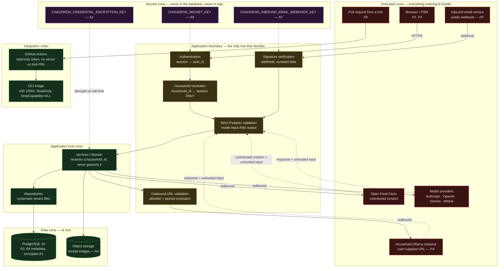

# Chaudron — threat model

> Scoping document. **All identifiers cited (tables, columns, environment
> variables, endpoints) are in English** and are authoritative as written.
> Status: proposal, to be re-read at every ADR touching one of the surfaces below.
> Companion: [`security-review-baseline.md`](security-review-baseline.md), which
> audits the existing baseline rather than the design.

---

## 1. Purpose and scope

This document describes **what we protect, against whom, with what, and what is
left uncovered**. It is not a best-practices checklist: it enumerates only the
threats that carry a concrete cost for someone who uses Chaudron or who operates
an instance of it.

It is written during the scoping phase, before any feature code. This is the
only moment when fixing a trust boundary costs an afternoon rather than a
migration.

**In scope.** The Chaudron application as designed: FastAPI backend, React PWA,
PostgreSQL 16, rootless Podman containers, GitHub Actions CI, and the four
external dependencies (model providers, Open Food Facts, inbound email service,
Ollama instances).

**Out of scope.** Host security, the reverse proxy's TLS configuration, the
internal security of Open Food Facts or of a model provider, and attacks that
assume an already-compromised instance operator with root privileges. These
exclusions are deliberate and consistent with [`SECURITY.md`](../SECURITY.md).

**Baseline assumptions.**

1. The instance is operated by a person who is not a security team. Any control
   that demands daily vigilance will fail.
2. The code is public (AGPL-3.0). See §7.
3. Phase 2 (accounts created by third parties) will come. A design that is safe
   only in phase 1 is a design to be rewritten.

---

## 2. Assets, ranked by severity of compromise

The order reflects the real cost to the injured party, not ease of exploitation.

| # | Asset | Where it lives | What its compromise costs |
|---|---|---|---|
| **A1** | **Provider API keys supplied by households** | `llm_provider_config.api_key_ciphertext`, and **in cleartext in memory** on every call | A **monetary secret belonging to a third party**. Theft = a bill at Anthropic/OpenAI/Google/Mistral, on an account that Chaudron neither controls nor can cap. Direct, uncapped financial damage, and an unrecoverable loss of trust: it is the only asset whose owner is neither the user nor the operator. |
| **A2** | **`CHAUDRON_CREDENTIAL_ENCRYPTION_KEY`** | Container environment | Decrypts **every** A1 on the instance at once. It is the single point of failure of at-rest protection. |
| **A3** | **A household's complete inventory** | `inventory_lot`, and above all `recipe_suggestion.stock_snapshot` (JSONB, frozen inventory) | A map of a household's consumption: diet, allergies, medical products, alcohol, faith-related products, presence of children, budget, daily rhythm, and **absences** (stock that stops moving says nobody is home). Data potentially **sensitive within the meaning of GDPR Article 9** (health, religious beliefs) — see §8. |
| **A4** | **Receipt images** | Object storage, key `receipt.image_object_key` | Where, when, what, how much. Loyalty card number, sometimes the last 4 digits of a bank card, sometimes a name. An image is harder to redact than a row: what is in the photo stays there. |
| **A5** | **`CHAUDRON_SECRET_KEY`** | Environment | Forging sessions/JWTs ⇒ impersonation of any account ⇒ access to A1, A3, A4. |
| **A6** | **Identities and authentication secrets** | `user_account.email`, `password_hash` | Password reuse outside Chaudron; the email alone is enough for targeted phishing ("your Anthropic key has stopped working"). |
| **A7** | **`CHAUDRON_INBOUND_EMAIL_WEBHOOK_KEY`** | Environment | Injection of arbitrary purchases into **any** household, and an entry point for untrusted content heading to a model (§6.6). |
| **A8** | **PostgreSQL password / database access** | Podman secret, `chaudron-net` network | Reads encrypted A1 (unusable on their own), A3 and A4 in cleartext. The cascade depends entirely on A2 remaining out of reach. |
| **A9** | **Integrity of a household's stock** | Business tables | Not a leak but a real nuisance: wrong stock makes people abandon the application. And **wrong allergen information has physical consequences**. |
| **A10** | **Map of a household's private infrastructure** | `llm_provider_config.base_url` (URL of a home Ollama), `CHAUDRON_OLLAMA_ALLOWED_HOSTS` | Compromises nothing on its own, but informs an attacker about a third party's internal network. |
| **A11** | **The operator's availability and budget** | `instance_owner` mode, Open Food Facts quota | Abuse makes the operator pay (A11a) or gets the instance's IP banned by Open Food Facts, cutting off the service for everyone (A11b). |

**The ranking says something important:** the first three assets do not belong to
the operator. That is what distinguishes Chaudron from a personal tool — we hold
somebody else's property.

---

## 3. Attacker profiles

Five realistic profiles. Each is described by what it **already has**, what it
**wants**, and what makes it credible here.

### P1 — Legitimate user of another household

**Already has:** a valid account, a valid session, a `household_id` of its own,
and intimate knowledge of the product (they use it).
**Wants:** to see another household's inventory, receipts or recipes; or to make
another household's API key pay.
**Credible because:** it is the only attacker with **nothing to bypass in order
to reach the API**. Substituting one identifier is enough. It is the most likely
profile and the one against which the design is weakest
([§6.3](#63-s3--tenant-isolation-between-households)).
**Capability:** UUID substitution, parameter tampering, concurrent calls,
exploration of the API from the public source code.

### P2 — Unauthenticated visitor

**Already has:** the instance URL and the source code.
**Wants:** any access at all — unsolicited account creation, reading a receipt
image by its URL, injection through the email webhook, account enumeration via
the login or reset form.
**Credible because:** a self-hosted instance is exposed on the Internet with no
WAF and no fail2ban, and the email webhook is by construction a public endpoint.
This is also the profile of automated scanners, which will find the instance
however obscure it is.

### P3 — Malicious or negligent instance operator

**Already has:** root on the host, the database, `CHAUDRON_CREDENTIAL_ENCRYPTION_KEY`.
**Wants:** the API keys of the hosted households, or their data.
**Credible because:** self-hosting encourages instances shared between friends,
flatmates or extended families. **Against this attacker there exists no technical
control**: the application must decrypt A1 in order to call the provider, so the
operator can read A1. This is a property of the BYOK model, not a fixable defect.
**Design consequence:** this fact must be **written into the interface**, at the
moment the user pastes their key — "the administrator of this instance can
technically read this key; supply a dedicated key with a spending cap". An
informed user who accepts is not a victim; a user who is unaware is one.

### P4 — Network attacker

**Already has:** a position on the network path, or control of a host that the
Chaudron server agrees to contact (an Ollama instance, a DNS, an inbound email
service).
**Wants:** to pivot into the instance's internal network via SSRF, or to
intercept data in transit.
**Credible because:** the Ollama URL is **supplied by the user and called by the
server** — it is an SSRF primitive by construction, and the usual filtering is
inoperative since the legitimate address of a co-located Ollama *is* private
([§6.2](#62-s2--ssrf-via-the-ollama-url)).

### P5 — Hostile contributor via pull request

**Already has:** a GitHub account, the right to open a PR from a fork (the
repository is public).
**Wants:** to run code on the CI runner, exfiltrate a repository secret, poison a
cache, or slip in a quiet regression (a `WHERE household_id` removed, a
non-constant-time signature comparison, an allowlist widened "for convenience").
**Credible because:** the project is maintained by a single person, who reviews
in their spare time, and CI builds an image from a `Containerfile` that the PR
controls. The "quiet regression" vector is more realistic than the
"exfiltration" vector: `CONTRIBUTING.md` §6 already lists the corresponding
grounds for rejection, which shows the risk is identified.

**Profile deliberately absent:** the state actor. Out of reach for a solo
project, and mentioning it dilutes the five above.

---

## 4. Trust boundaries

A boundary is a place where data changes owner or trust level. Any data crossing
an inbound boundary is **hostile by default**, including when it comes from a
model we pay for.

**Three rules read directly off this diagram, and none of them is
negotiable:**

1. **`household_id` never enters through an arrow coming from the untrusted
   zone.** Not a header, not a subdomain, not a body, not a path parameter. It is
   born from the session, once, at the boundary. It is already a ground for
   rejecting a PR (`CONTRIBUTING.md` §6); here is the reason.
2. **Responses from external services come in through the same door as user
   input.** JSON produced by a model, an Open Food Facts entry, an Ollama
   response: same Pydantic validation, same size bounds, same handling at
   display time. Paying a provider does not make its output trustworthy.
3. **Secrets never cross the boundary in the outbound direction.** Not to the
   browser, not to the logs, not to an exception trace, not to a database column
   (§6.1). The secrets zone has only inbound arrows toward processing, never
   toward persistence.

---

## 5. How to read the tables in section 6

Each surface is described by four columns. **The "Not covered" column is the most
important one in the document.** A threat listed as covered that is not is worse
than an unlisted threat: it produces false security, and nobody re-reads it.

A control is called **"adopted"** when it has been decided, not when it has been
implemented. At this stage of the project, **no control is implemented**: this
document describes the target, not the state.

---

## 6. Surfaces

### 6.1 S1 — Provider API keys supplied by households

**Assets:** A1, A2. **Attackers:** P1, P2, P3.

The structuring fact, stated bluntly in ADR-0007: *"encryption at rest does not
protect against an application compromise, since the application must decrypt in
order to call"*. Encryption at rest protects **a stolen database dump**, and
nothing else. Everything else in the setup consists of making sure that the key,
once decrypted in memory, goes nowhere.

| Threat | Concrete impact | Control adopted | Not covered |
|---|---|---|---|
| Theft of a PostgreSQL dump (backup, replica, a hosting provider's bin) | None if A2 is elsewhere — the ciphertext alone is unusable | AES-256-GCM; key taken from the environment, **never from the database, never from a migration, never from a seed**; AAD = `(household_id, config_id)`, so a ciphertext copied onto another row does not decrypt | **If A2 is stored next to the dump** — in the same home directory, in the same backup of `$HOME` — the control is worth nothing. The environment file and the dump travel together by default. This is the most likely failure mode, and it is operational, not cryptographic. |
| Reading the key through an API endpoint | Theft of A1 by P1 or P2 | No response schema contains the ciphertext or its decrypted form; only `provider`, `api_key_set_at` and `api_key_last4` go out. `deferred=True` column in SQLAlchemy: an ordinary `select()` **does not load** the ciphertext, an explicit `undefer()` is required — greppable and visible in review | A legitimate `undefer()` in the calling service is still an `undefer()`. Nothing prevents a Pydantic schema from serialising the whole ORM object if someone returns the entity instead of a DTO. **The control is friction, not a barrier.** |
| **Leak through the error channel** | Theft of A1, in cleartext, persisted | Structured logging filter; masked `__repr__` on configuration objects; rewriting of traces returned to the client | **The schema contradicts the control.** `llm_provider_config.last_error` and `receipt.parse_error` are `text` columns intended to receive the upstream error message, and `last_error` is displayed in the "your key has stopped working" banner. A provider, a proxy or a hostile Ollama that returns the `Authorization` header in its error message writes A1 in cleartext into the database, then onto the screen, then into the backup. **No redaction is specified when writing these columns.** |
| Leak through `raw_response` | Theft of A1 if the provider echoes the request | — | Not handled. `receipt.raw_response` (JSONB) receives the model's raw output with no described bound and no filter. |
| Rotation of A2 | Inability to decrypt, or a prolonged exposure window | `api_key_encryption_key_id` allows reading the old and writing the new, hence a background migration with no downtime | **The procedure does not exist**: no trigger, no frequency, no re-encryption task, no behaviour if the old key has disappeared from the environment (data-model §11 q15). A mechanism without a procedure will never be run. |
| Rotation of an A1 key by the user | The old key still valid at the provider | Idempotent write, the old value is overwritten | Chaudron cannot revoke a key at Anthropic. The interface **must** say "also revoke the old key in your console", otherwise the rotation is cosmetic. |
| Instance operator (P3) | Theft of every A1 on the instance | **None, and this is irreducible** | Not covered by construction. Handled through transparency: the warning at entry time (§3, P3), and the recommendation of a dedicated key with a spending cap on the provider side. |
| Theft of A1 through write access to the database | Reassigning another household's key to oneself | AAD bound to the row: a copied ciphertext does not decrypt. Composite FK on `llm_purpose_binding`: assigning another household's configuration is **impossible at the database level** | `instance_owner` mode is locked by a **cross-table** rule, hence not expressible as a `CHECK`; it rests on the service alone. |

**Consequence for v1:** the leak through the error channel is the most credible
flaw on this surface, because it assumes no attacker at all — just a talkative
provider and a developer who writes `last_error = str(exc)`.

---

### 6.2 S2 — SSRF via the Ollama URL

**Assets:** A10, the host's internal network. **Attacker:** P1, P4.

Recap of the problem, correctly stated in ADR-0007: the URL is supplied by the
user and called by the server, and **the usual filtering — rejecting private
ranges — is inoperative**, since the legitimate address of a co-located Ollama is
private. Hence the explicit allowlist `CHAUDRON_OLLAMA_ALLOWED_HOSTS`.

This is the right control. But an allowlist is only safe if **the host we allow
is exactly the host we contact**, and that is where everything is decided.

| Threat | Concrete impact | Control adopted | Not covered |
|---|---|---|---|
| URL toward an arbitrary host | The server becomes a proxy | Explicit allowlist via environment variable; scheme restricted to `http`/`https`; outside the allowlist ⇒ rejection at registration with an explicit message | — |
| **DNS rebinding** | The allowlist passes at validation, the call hits `169.254.169.254` or `127.0.0.1` | "DNS resolution performed at validation **and** before the call" | **The described control does not close the window.** Resolving twice leaves a TOCTOU: the HTTP client re-resolves at connection time. The only control that holds is **resolve then connect to the resulting IP**, carrying the original name in the `Host` header (and revalidating the IP after every resolution). This is written nowhere. |
| Alternative address notations | Bypassing a naive allowlist | — | **Not handled.** `0x7f000001`, `2130706433`, `127.1`, `0.0.0.0`, `[::1]`, `[::ffff:127.0.0.1]`, `localhost.` (trailing dot), `127.0.0.1.nip.io`. Any string comparison on the host is bypassable; the comparison must be on **the resolved and normalised IP**, not on the text. |
| **Arbitrary port on an allowed host** | Internal port scanner: `ollama:22`, `ollama:5432`, `ollama:6379` — response times alone are enough to map | `CHAUDRON_OLLAMA_ALLOWED_HOSTS` accepts "hostnames **or** host:port" | **Not covered if the port is optional.** An allowed host without a port allows all of its ports. The port must be **mandatory** in the allowlist, and an entry without a port must mean "port 11434 only", never "all". |
| `userinfo` in the URL | `http://ollama@attacker.example/` read as allowed by a naive parser | — | **Not handled.** The URL must be rejected if it contains `@`, a control character, or an encoded sequence in the host part. |
| Redirects | An allowed host redirects to an internal host | Redirects disabled | — (correct and sufficient control, provided it is actually set on the HTTP client: `httpx` follows `follow_redirects=False` by default, but a badly configured shared `AsyncClient` enables it) |
| Cloud metadata | Theft of the hosting provider's IAM credentials | Implicitly covered by the allowlist | Covered **as long as the operator does not widen the allowlist**. There is no **floor denylist**: `169.254.0.0/16`, `::ffff:169.254.0.0/112`, `fd00:ec2::254` must be refused **even if the operator allows them**. An allowlist with no floor makes security rest on configuration. |
| Response time and size | Connection exhaustion, memory saturation | Bounded timeout and response size (`CHAUDRON_OLLAMA_TIMEOUT_SECONDS`) | **Size** has no configuration variable; only time has one. Also missing: a bound on the depth/size of the deserialised JSON, and a per-household concurrency cap. |
| Capability probing at registration | Same primitive, triggered by a simple POST | "This call goes through the same SSRF validation as inference calls" | Correct control. To be verified in tests: this is the path people forget, because it is written before the inference client. |

**Consequence for v1:** the allowlist must be an object, not a string. A single
function `resolve_and_validate(url) -> (ip, port, host_header)` traversed by
**all** outbound calls toward a user-supplied host, with tests explicitly
containing each of the notations above.

---

### 6.3 S3 — Tenant isolation between households

**Assets:** A1, A3, A4, A9. **Attacker:** P1 — the most likely one.

This is the most severe and most likely surface of this product. A
multi-household product that leaks between households has nothing left to
defend: A3 and A4 go together.

The planned setup has **three layers**, and they are not equally solid.

| Layer | What it really prevents | What it does not prevent |
|---|---|---|
| **Application convention** (`HouseholdScope`, base repository, `household_id` as a mandatory typed parameter) | Careless mistakes on the nominal path; `mypy` catches a forgotten parameter | **Nothing** as soon as somebody writes `session.execute(select(Model))` without going through the repository. ADR-0006 acknowledges this explicitly. A mandatory parameter guarantees that a `household_id` is *passed*, not that it is used in the `WHERE`. |
| **Composite FKs** `(household_id, x_id)` → `parent(household_id, id)` | **Every** cross-household write: putting a lot into another household's fridge is impossible, even with a bug, even with a manual `UPDATE`. On `llm_purpose_binding`, this is what prevents spending another household's key | **Every read.** A composite FK filters nothing: a `SELECT` without `WHERE household_id` returns everybody's rows. And the leak that matters here is a read leak. |
| **PostgreSQL RLS** | Everything, on read as on write, whatever the calling code | **Not enabled in v1** in the current design. |

**What the current design leaves uncovered:**

| Threat | Concrete impact | Control adopted | Not covered |
|---|---|---|---|
| `WHERE household_id` forgotten on a stock aggregate | P1 sees another family's fridge | Base repository + review + per-resource isolation tests (404, never 403) | Isolation tests only cover the resources **somebody thought of**. Nothing fails when you forget to write the test — which is exactly the failure mode ADR-0006 holds against late migration, reproduced one level down. |
| A query "just for a dashboard" | Silent cross-household leak | Code review | A convention is only enforced at moments when a reviewer is present. The project is maintained by one person, who reviews their own code. |
| **Background jobs** (receipt parsing, expiry notifications, stock reconciliation) | Leak of A3/A4 outside any HTTP context | "They must load the household from the row being processed, never from an ambient context" | **Purely conventional, and the document itself says these are the ones that will leak first.** The `ix_receipt_pending` index is **deliberately cross-household**: the worker reads a mixed queue and must re-scope itself by hand on every row. A single row processed with the previous row's `household_id` is enough. |
| Cross-tenant `product_id` | Referencing another household's **private** product; exposure of identifying purchase habits (brands, diets, medical products) in autocompletion | Application-level only: the repository resolves a product only within `household_id IS NULL OR household_id = :current` | **Known and accepted hole** (data-model §5.2): `product.household_id` is nullable, hence unusable as the target of a composite FK. It is the only place in the schema where the database cannot help. |
| `instance_owner` usurped | A third-party household makes the operator pay | `uq_household_instance_owner` guarantees at most one owner household; `DEFAULT false` | The rule "only this household may create a configuration in `instance_owner` mode" is **cross-table**, hence not expressible as a `CHECK`, hence carried by the service alone. Furthermore, **two sources of truth coexist**: `household.is_instance_owner` (database) and `CHAUDRON_INSTANCE_OWNER_HOUSEHOLD_ID` (environment). Their divergence is an authorisation granted by mistake. |
| Guessable object storage key | Reading a receipt image without going through the API | Key **prefixed with `household_id`** + signed URL | The prefix does not protect if the bucket is listable or if the signed URL does not expire. See §6.5. |

#### Recommendation: require RLS as of v1

**Position: yes, PostgreSQL row-level security must be required in v1.**
Conventional discipline is not enough here, and the argument for deferring it
does not hold for the chosen stack.

*Why the convention is not enough.* Composite FKs close the class of cross-household
writes — a real gain, obtained cheaply. But the leak that destroys this product
is **an unfiltered read**, and neither of the first two layers prevents it. What
remains is review (one reviewer, who is the author) and isolation tests (written
by the same person, for the resources she thought of). That is not a safety net,
it is the same hand holding both ends.

*Why the deferral argument does not hold.* The deferral is motivated by pooling:
`SET LOCAL` would require transaction-mode pooling, and getting it wrong would
produce an inverted leak — a recycled connection that keeps the previous
household. The reasoning is correct **in the presence of an external pooler**
(PgBouncer in session or statement mode). But the chosen stack is asynchronous
SQLAlchemy 2.x + `asyncpg`, with an **in-process** pool that reserves a
connection for the duration of a transaction, and `SET LOCAL` is reset by
PostgreSQL itself at `COMMIT`/`ROLLBACK`. The feared failure mode assumes either a
session `SET` instead of a `SET LOCAL`, or a component that Chaudron has not
chosen. **The cost invoked is that of an architecture which is not its own.**

*What really remains to be paid.* A "one HTTP request = one transaction"
discipline. It is **already** listed as a prerequisite to be paid immediately.
Once paid, the delta to RLS is one migration.

*What RLS brings that nothing else brings.* It moves the guarantee from the
convention to the engine, and it covers the one place where there is **no
reviewer at runtime**: background jobs. A policy refuses the row; it does not
count on the developer remembering at 11 p.m.

*The current trigger is unusable.* "The day an account is created by a person
outside the family circle" is not an event observable by CI or by a test. It
will be crossed one evening, out of convenience, and nobody will notice. A
trigger that rests on the operator's memory is not a trigger.

*And the cost today is zero.* There is **no feature code**. Every hour of
retrofit that ADR-0006 dreads is an hour that has not yet been spent. This is
precisely ADR-0006's own argument, applied to its own conclusion.

**Recommended concrete form for v1:**

1. Application role `chaudron_app`, **not the owner** of the tables, plus
   `ALTER TABLE … FORCE ROW LEVEL SECURITY` (the owner bypasses RLS without
   it).
2. `SET LOCAL app.household_id = …` emitted from a single point — the session
   factory — inside the transaction, never scattered across the services.
3. Identical `USING` **and** `WITH CHECK` policies:
   `household_id = current_setting('app.household_id', true)::uuid`.
4. A separate `chaudron_worker` role for the cross-household queue, with a view or
   a `SECURITY DEFINER` function exposing **only** `(id, household_id)` of pending
   receipts; the actual processing happens after the tenant has been set.
   The `ix_receipt_pending` index stays cross-household, but it no longer gives access
   to the data.
5. **Keep the application layer**: RLS is a second barrier, not a replacement. A
   missing application filter gives a slow query, not a wrong query.
6. **Keep the isolation tests**: they now verify that the behaviour is indeed a
   404 and not a policy error.

*What RLS still does not cover, and which must be written down:* object storage
(§6.5) is not in PostgreSQL and knows no policy; the `product_id` hole remains
application-level; and a badly set `current_setting` — hence an absent one — must
make the query **fail**, not let it through (hence the non-owner role and
`FORCE`).

---

### 6.4 S4 — Inbound email reception webhook

**Assets:** A7, A9, A3. **Attacker:** P2.

This is Chaudron's only endpoint designed to be called by a stranger. Without
signature verification, anybody injects purchases into any household — and above
all, injects **attacker-controlled text into the path that leads to a model**
(§6.6).

**The corresponding design note (`docs/technical-notes-ingestion.md`) is
referenced but does not exist.** It is, today, the most under-specified sensitive
surface of the project.

| Threat | Concrete impact | Control adopted | Not covered |
|---|---|---|---|
| Unsigned webhook | Injection of arbitrary purchases into any household | Signature verified with `CHAUDRON_INBOUND_EMAIL_WEBHOOK_KEY` | The algorithm is not specified. A comparison with `==` is vulnerable to timing; `hmac.compare_digest` is mandatory. To be written, not assumed. |
| **Replay** | A captured legitimate webhook is resent N times | — | **Not handled.** A signed timestamp, a short tolerance window, and a cache of already-seen message identifiers are required. The signature alone does not protect against replay. |
| Single key for the whole instance | Its leak compromises **every** household at once | Podman secret | No rotation possible without downtime, no per-household scope. Acceptable for a single provider, provided it is written down. |
| **Guessability of the destination address** | A third party who guesses `foyer-dupont@receipts.example.org` injects into that household, even without the key if an unsigned path ever exists | Household attachment **by destination address** | **Not handled, and this is the most severe point of this surface.** The address is the only link between an email and a household: it is therefore, in effect, an **authorisation secret**. If it derives from the household name or from a counter, it is guessable and enumerable. It must be a **random token of at least 128 bits** (`r7k2m9x4q1w8@…`), revocable, regenerable, and **no column of the data model carries it today**. |
| Household enumeration | Mapping the instance's households | — | **Not handled.** The webhook must respond **identically** (same code, same delay) for an unknown address and for a known one. Otherwise it becomes an oracle for household existence. |
| Sender spoofing | A third party sends a fake summary to a household's address | — | **Not handled.** Even with a webhook signed by the provider, the email it relays can come from anybody. Either a per-household sender allowlist is required, or an "unverified" status visible in the review screen. The underlying control remains human review (§6.6). |
| Hostile attachments | Denial of service, path traversal, dangerous MIME parsing | `CHAUDRON_INBOUND_EMAIL_MAX_BYTES` | The size bound says nothing about the **number** of attachments, nested archives, or the file name. **The supplied file name must never be used to build a path**: the storage key is derived from `(household_id, uuid)`, never from the received name. The MIME type must be determined by inspecting the content, not from the header. |
| Decompression / image bomb | Memory exhaustion of the worker | — | **Not handled.** Image dimensions must be bounded before decoding, not after. |

---

### 6.5 S5 — Receipt images and personal data

**Assets:** A3, A4. **Attackers:** P1, P2, P3.

| Threat | Concrete impact | Control adopted | Not covered |
|---|---|---|---|
| Cross-household access to an image | Reading of A4 by P1 | Object key **prefixed with `household_id`**; served by signed URL; `receipt` row filtered by tenant | The prefix prevents **guessing**, not **enumeration** if the bucket is listable. The validity period of the signed URL is not defined; a long-lived URL passed in a `Referer` or a browser history is a persistent leak. |
| Unauthenticated access | Reading of A4 by P2 | Same | An image served directly by the reverse proxy from a directory, without going through the API, short-circuits everything. The volume `%h/chaudron/data/uploads` is a directory of files: nothing prevents publishing it by mistake. |
| **Retention** | A receipt photo lives indefinitely | — | **Not settled** (data-model §11 q5). The architecture recommends "purge after processing to be preferred", the data model carries **no column** to track it. Without a column there is no purge: there is an intention. |
| Residual content after deletion | The image remains while the row is gone | `ON DELETE CASCADE` from `household` | **The CASCADE only touches PostgreSQL.** Deleting a household erases the rows and leaves the objects. A partial GDPR erasure is a non-compliance that looks like compliance. |
| **EXIF** | The home's geolocation republished along with the image | — | **Not handled.** EXIF metadata (GPS, device model, timestamp) must be stripped **at ingestion**, before writing. |
| Content type when serving | Stored XSS if an image is served as `text/html` | — | **Not handled.** `Content-Type` determined by inspection, `Content-Disposition: attachment` or a separate domain, `X-Content-Type-Options: nosniff`. |
| Partial banking data | PAN fragments, loyalty card | Human review | These fragments **stay in the image** and in `receipt.raw_response`. We do not remove them; we limit their lifetime (§8). |
| `stock_snapshot` | A home's complete inventory, in JSONB, indefinitely | — | **Not settled.** It is, by the data model's own admission, "the most sensitive data in the database". It has neither a lifetime, nor application-level encryption, nor a bounded retention purpose. |
| Transmission to the model | A3/A4 leave for a third party | BYOK: the household chooses its provider, and therefore its jurisdiction (Mistral EU, or Ollama and nothing leaves). **Consent enforced since revision `0016`**: a configuration with no agreement on record is refused before its credential is decrypted, `ollama` excepted. | The **gate** exists; the **screen** does not. Consent can be recorded and is enforced, but no route grants or withdraws it, because no route creates a provider configuration at all — so today the only way to agree is a manual `UPDATE`. "The user must see, before sending, what leaves and to whom" therefore remains unmet. See §8 and §12. |

---

### 6.6 S6 — Model output is untrusted input

**Assets:** A9 (integrity), and indirectly A3. **Attackers:** P1, P2 via content
they control.

The principle is already stated — *"JSON produced by an LLM goes through the same
validation as a form posted by a stranger"*. What is missing is taking account of
the fact that **the injected content is not produced by the model: it is carried
by it**.

Two input vectors that Chaudron accepts by design:

- **The image of a receipt**, which can carry text printed by an attacker (a
  stuck-on label, a fake receipt photographed);
- **The body of a forwarded email**, entirely controlled by the sender.

| Threat | Concrete impact | Control adopted | Not covered |
|---|---|---|---|
| Prompt injection via a receipt or an email | The model produces invented lines, or ignores its instructions | Strict output schema + **mandatory human review before writing to stock** | Human review is the real control, and it is a good one. But it protects the **write**, not the **display**: the injected text is shown to the user before they decide. |
| Output containing HTML/JS | Stored XSS in the review screen or the recipe | Pydantic validation | Validation checks the **shape**, not the harmlessness of the content. The frontend must render any model-sourced field as **plain text**, never as HTML, never as Markdown with active links. A strict CSP, without `unsafe-inline`, is the second net. |
| Output containing a URL or a remote image | Passive exfiltration: a rendered `` calls the attacker from the victim's browser | — | **Not handled.** No remote resource must be loaded from model-produced content. |
| **False allergen information** | **Physical consequence** | "Never present model-sourced allergen information as authoritative" | There is no mechanism. A sentence in a document does not survive to the recipe screen. An explicit product control is required: allergens come from Open Food Facts or from manual entry, never from the model, and the recipe carries a warning that cannot be dismissed. |
| Absurd quantities | Falsified stock, wrongly measured waste | Schema bounds | To be made explicit: numeric bounds (`> 0`, realistic ceilings) must be in the Pydantic schema, not only in the database `CHECK`s — otherwise the error surfaces as a 500 instead of a clean rejection. |
| Oversized response | Memory saturation, cost | `CHAUDRON_LLM_MAX_TOKENS` | Bounds only the requested output, not the response actually received from a hostile endpoint (the Ollama case, §6.2). |
| **Open Food Facts contributed content** | Same class, forgotten | — | **Not handled.** `product.name`, `brand`, `image_url` and `off_payload` are **written by anonymous contributors** and stored raw. It is exactly the same rendering risk as model output, on a path nobody watches because it does not look like AI. `image_url` is moreover a third-party URL that must not be loaded directly from the client. |

**General rule to remember:** model output must **never** trigger an action. It
proposes; a human decides; the code writes. No model-produced field must serve as
an unescaped search key, a file path, a called URL, or a command argument.

---

### 6.7 S7 — Authentication, sessions and CORS

**Assets:** A5, A6, and by consequence all the others. **Attackers:** P1, P2.

The authentication strategy is not settled (`architecture.md` §8). What follows
describes the constraints the decision will have to respect.

| Threat | Concrete impact | Control adopted | Not covered |
|---|---|---|---|
| Session theft | Full access to a household | Configuration validated at startup, shutdown if incomplete | Neither the transport mode (`Secure`/`HttpOnly`/`SameSite` cookie vs in-memory token), nor revocation, nor duration are decided. A JWT with no revocation list cannot be withdrawn before expiry. |
| **JWT algorithm confusion** | Token forgery | — | `CHAUDRON_JWT_ALGORITHM` is **an environment variable**. Making the algorithm configurable opens up `none` and HMAC/RSA confusion. The algorithm must be a code constant, and verification must enforce a list of accepted algorithms. |
| Secret reuse | One leak compromises two functions | — | `CHAUDRON_SECRET_KEY` serves both sessions and JWTs. Two uses, two keys, derived if need be. |
| **Brute force / credential stuffing** | Account takeover | — | **Not handled anywhere.** No rate limiting is designed: not on login, not on the webhook, not on receipt upload, not on recipe generation (which costs money). On a self-hosted instance with no WAF, this is P2's default attack. |
| Account enumeration | Mapping of the users | — | Not handled. Identical responses and delays for a known and an unknown email, at login as at reset. |
| Password hashing | Offline cracking after a database theft | `password_hash` is `text`, nullable | The algorithm is **not decided** and no dependency is present. It must be **Argon2id**, parameterised, with re-hashing at login when the parameters change. |
| **Overly permissive CORS** | Cross-origin data theft | `CHAUDRON_CORS_ORIGINS` as an explicit list | `CHAUDRON_CORS_ALLOW_CREDENTIALS` exists with no documented guard rail. The pairing of `*` + `credentials: true` must **prevent startup**, not produce a warning. No origin must be reflected from the `Origin` header. |
| Roles | A `viewer` writes | `membership_role` **enforced**: `require_member` on every state-changing route, `require_owner` on the four that hand out or accept a credential (`api/deps.py`). A machine token carries its issuer's *current* role, re-read on every request (migration `0014`), so minting one does not walk around the check. The matrix is `ROLE_GUARDED` in `tests/api/test_route_authentication.py`, asserted in both directions. | The role was decorative until this: one line of `src/` read it, on one route out of sixty-seven, and a `viewer` could register a third-party export token and consent on the household's behalf — replayed end to end. Still open, and deliberately not decided in code: whether erasing a person (`DELETE /v1/members/{id}`) and spending the household's inference budget (`POST /v1/recipes/suggest`) should be owner-only. Both are product calls, and `UNGUARDED_WRITES` names the second one. |
| Session theft, once suspected | The victim has no remedy | `POST /v1/auth/sessions/revoke-all` and `POST /v1/auth/password`, both behind cookie + CSRF, both revoking **every** session including the caller's and rotating it (`api/routers/auth.py`) | Until these existed the only bound on a stolen cookie was the 30-day absolute expiry, and the only cure an operator with a psql prompt: `revoke_all` had been written and was called by nothing. There is still **no password reset**, because there is no SMTP — a forgotten password remains a forgotten account, and the change endpoint therefore requires the current one. |

---

### 6.8 S8 — Container chain and operations

**Assets:** A2, A5, A7, A8. **Attackers:** P2 after an application compromise, P3.

The baseline here is **good** — it is the most solid part of the project. The
gaps are corners, not holes.

| Threat | Concrete impact | Control adopted | Not covered |
|---|---|---|---|
| Escape / escalation inside the container | Host compromise | **Rootless** Podman; `USER chaudron` (fixed UID 10001); `NoNewPrivileges=true`; `DropCapability=ALL`; `ReadOnly=true`; explicit `Tmpfs` | The database keeps `AddCapability=CHOWN,DAC_OVERRIDE,FOWNER,SETGID,SETUID` — necessary for the `postgres` entrypoint, but `DAC_OVERRIDE` is broad. A `postgres` image prepared with the right UIDs would do without it. |
| Disk access by another container | Reading A4 and the database | SELinux **Enforcing**; `:Z` (private label) on every bind mount, with the justification written down; explicit ban on `setenforce 0`; `:U` pitfall documented | — (exemplary handling) |
| Network exposure | Database or API reachable from the Internet | API on `127.0.0.1:8000` only; database **never published**, joined via the `chaudron-net` network | The top-level `README.md` offers a quick-start command that publishes PostgreSQL on **all** interfaces. It is the most copy-pasted block of a public repository. |
| Secret leak through configuration | A2, A5, A7 in cleartext on disk | Podman secrets (`type=env`), masked entry, transmission via stdin, final `unset`, newline pitfall documented | **`CHAUDRON_CREDENTIAL_ENCRYPTION_KEY` (A2) is declared by no `Secret=`.** Following the documentation, the operator puts it in the `EnvironmentFile`, in cleartext, in the same home directory as the database backups — which cancels the benefit described in §6.1. Same for the OpenAI, Gemini and Mistral keys. |
| Upstream-compromised image | Arbitrary code execution | Two-stage images, with no build chain and no `uv` at runtime | Base images are pinned by **tag**, not by **digest**. `AutoUpdate=registry` on `docker.io/library/postgres:16` moreover causes a new database image to be **pulled automatically**, without review and without a maintenance window. |
| Backups | Theft of A3, A4, encrypted A1 | `pg_dump --format=custom`, restore verified before a destructive migration | The dumps are neither encrypted nor retention-managed, and the documented command writes them into the current directory — which may be the git repository. An instance's backup file and A2 live in the same `$HOME`. |

---

### 6.9 S9 — Supply chain and continuous integration

**Assets:** code integrity, A5/A7 as repository secrets. **Attacker:** P5.

| Threat | Concrete impact | Control adopted | Not covered |
|---|---|---|---|
| **`pull_request_target`** | Execution of a fork's code with the repository's secrets | **The trap is avoided**: the trigger is `pull_request`, and there is neither `workflow_run` nor `pull_request_target` | — (to be re-verified at every change to the workflow: this is the classic regression) |
| Overly permissive CI token | Writing to the repository from a job | `permissions: contents: read` at workflow level | No job further reduces its permissions. `contents: read` is already correct for all of them. |
| Compromised third-party action | Arbitrary execution in the runner | Major versions pinned (`@v5`, `@v7`, `@v2`) | A **tag is mutable**. `astral-sh/setup-uv@v7` and `gitleaks/gitleaks-action@v2` are third-party actions: pinning them by full SHA is the only pinning that protects against a tag being moved. |
| **Untrusted code execution on fork PRs** | Mining, exfiltration of whatever is reachable from the runner | Read-only token and **no secret** exposed to fork PRs (GitHub's default behaviour) | The build job runs `podman build` on a `Containerfile` **controlled by the PR**: the `RUN` instructions execute. The impact is bounded by the absence of secrets, but it is not nil. The "Require approval for all outside collaborators" setting must be enabled. |
| Cleartext secret leaked into the logs | Emergency rotation | `gitleaks` over the full history (`fetch-depth: 0`); `pip-audit --strict` on the locked dependencies; obligations written in `CONTRIBUTING.md` §4.9 and `SECURITY.md` | The two security jobs are neither chained nor declared required; nothing documents branch protection or the required checks. A scan that can be merged while failing does not protect. |
| Vulnerability published after the merge | A CVE sleeps until the next PR | `pip-audit` on `push` and `pull_request` | No **scheduled** run, and no `dependabot.yml`. On a project with a low commit frequency, that is several months of blind spot. |
| Hostile dependency | Execution at install time | **Exactly** pinned versions + `uv.lock` + `UV_FROZEN` + documented review for additions | No attestation verification and no SBOM. Proportionate at this stage; to be reassessed if the project publishes images. |
| Isolation regression slipped past review | Cross-household leak | Mandatory per-resource isolation tests; explicit grounds for rejection in `CONTRIBUTING.md` §6 | A convention enforced by a single maintainer. That is one more argument for RLS (§6.3): a database policy cannot be talked round in review. |

---

### 6.10 S10 — Availability and resource abuse

**Assets:** A11. **Attackers:** P1, P2.

| Threat | Concrete impact | Control adopted | Not covered |
|---|---|---|---|
| Abuse of `instance_owner` mode | The operator pays for a third party | Mode **locked by default**; reserved to a single household guaranteed by a unique index; `CHAUDRON_LLM_MONTHLY_BUDGET_USD` | No per-household quota, no rate limit on generation. The monthly ceiling is global: once reached, it cuts the feature off for everybody. |
| IP ban by Open Food Facts | **Service cut off for every household** | Global PostgreSQL cache, long TTL in *stale-while-revalidate*, short negative cache, single client with a 10 req/min limiter below the 15 ceiling, tolerance for HTML responses | The ceiling is **global to the instance**: a single household scanning in bursts can get the whole instance banned. Importing the dump is identified as a phase-2 prerequisite, not as a v1 control. |
| Disk saturation | Instance shutdown | `CHAUDRON_INBOUND_EMAIL_MAX_BYTES`; `Tmpfs=/tmp:rw,size=64M` | No bound on the size of an HTTP receipt upload, nor on the total volume per household. `python-multipart` spills to disk beyond a threshold: 64 MB of `tmpfs` against an unbounded upload is a shutdown, not a protection. |
| Expensive query | Pool exhaustion | Well-chosen partial indexes, hot queries identified | No mandatory pagination described on the lists (`stock_movement`, `receipt_line`). |

---

## 7. What the AGPL and the public repository change

**The code is readable by the attacker. This is not a weakness — it is a design
constraint that invalidates a whole category of fake controls.**

What really changes:

1. **Any security through obscurity is worth zero, and this must be verified
   explicitly.** An attacker knows the format of the identifiers (UUIDv7, hence
   time-ordered), the object storage key scheme, the SSRF allowlist validation
   logic, the webhook signature algorithm, the list of endpoints and the names of
   the environment variables. The only element that must remain secret is **a
   value**, never a mechanism: `CHAUDRON_SECRET_KEY`,
   `CHAUDRON_CREDENTIAL_ENCRYPTION_KEY`, `CHAUDRON_INBOUND_EMAIL_WEBHOOK_KEY`, the
   passwords, and **a household's inbound email address** (§6.4) — which must
   therefore be random, because the public repository will say exactly how it is
   built.

2. **UUIDv7 is time-ordered, and the repository says so.** An exposed identifier
   reveals its creation instant to the millisecond. That is not a flaw, but two
   identifiers are enough to estimate a volume of activity, and one identifier
   allows deducing when a person did their shopping. Do not expose an identifier
   where an opaque one would do, and never assume that a UUID is a secret.

3. **The window between a fix and its deployment is public.** A `fix(auth): …`
   commit on a public repository is a vulnerability announcement for every
   instance that has not been updated. That is the price of openness, and it is
   paid through coordinated GitHub security advisories rather than through
   discreet commit messages — the process is already described in `SECURITY.md`.

4. **The attacker can read the design documents, including this one.** The "Not
   covered" column of §6 is a roadmap for P1 and P2. This is accepted: publishing
   it accelerates fixes more than it accelerates attacks, and a serious attacker
   finds these holes by reading the code anyway. The consequence is that **this
   column must be emptied, not hidden**.

5. **CI is public, and so are its logs.** Everything a job prints is readable by
   the whole world, including environment values printed by mistake. The test
   database credentials in the workflow are ephemeral, but the habit of writing
   cleartext values there is the real risk.

6. **What the AGPL specifically adds.** Article 13 requires anyone operating a
   **modified** Chaudron as a network service to offer its sources to their users.
   Concrete security consequence: a modified third-party instance that refuses its
   sources is a signal — the user cannot verify what the code holding their API
   key (A1) and their inventory (A3) does. The AGPL does not technically protect
   against P3, but it gives the victim the right to audit. Restating it in the
   interface is the natural complement to the warning described in §3, P3.

7. **Contributions become a surface (P5).** It is already handled (§6.9), and the
   list of grounds for rejection in `CONTRIBUTING.md` §6 is its main control. A
   private repository would not have this surface; it is the only real security
   cost of openness, and it is largely offset by external review — which is, for a
   solo project, the only review mechanism that is not the author themselves.

---

## 8. GDPR

Chaudron is **software**, not a service. The data controller is **the instance
operator**, never the project. This section does not discharge them of anything:
it gives them what they need to meet their obligations, and lists what the
software must provide to make that possible.

### 8.1 Categories of data processed

| Category | Where | Sensitivity |
|---|---|---|
| Identity | `user_account.email`, `display_name` | Ordinary data. |
| Authentication | `password_hash`, `last_login_at` | Ordinary, to be strongly protected. |
| **Food consumption** | `inventory_lot`, `stock_movement`, `receipt_line`, `stock_snapshot` | Ordinary **in appearance**. See 8.2. |
| Purchases | `receipt` (merchant, date, amount, currency), images | Ordinary, but highly revealing in aggregate. |
| **Receipt images** | Object storage | Contain uncontrolled data: loyalty card, sometimes a name, sometimes banking fragments. |
| Technical | Logs with `household_id` and request identifier, IP addresses at the reverse proxy level | Ordinary, short duration. |
| Third-party secrets | `api_key_ciphertext` | Not personal data, but somebody else's secrets — identical security obligation. |

### 8.2 The point not to dodge: Article 9

A food inventory is not neutral data. Repeated gluten-free products reveal
coeliac disease; halal or kosher products reveal a religious belief; supplements
or substitutes reveal a health condition; alcohol, tobacco and infant products
reveal a lifestyle and a household composition.

Chaudron does **not** collect these data as such, and infers nothing from them.
But `recipe_suggestion.stock_snapshot` is **a home's complete inventory, frozen
and retained**, and it is sent to a model provider. Hence it must:

- be handled at the Article 9 level of protection, even if its legal
  qualification is debatable;
- be given **the shortest retention period in the system**;
- never be exposed in a cross-household administration interface.

### 8.3 Legal bases

| Processing | Legal basis | Note |
|---|---|---|
| Account, stock, lists, receipts | **Performance of the contract** (art. 6(1)(b)) — this is the requested service | Without these data there is no product. |
| Technical and security logs | **Legitimate interest** (art. 6(1)(f)) | Short duration, purpose limited to operations. |
| **Sending to an external model provider** | **Consent** (art. 6(1)(a)), explicit, per household, revocable | This is a transmission to a third party, often outside the EU. It must be **opt-in**, never a default. The `ollama` mode must remain fully functional without this consent. **Enforced since revision `0016`**: `llm_provider_config.consented_at` / `consent_revoked_at`, refused at `ProviderService._load` before the credential is decrypted, `ollama` exempt. Per *configuration*, not one flag per household — see below. The route that grants it is not built, because no route creates a provider configuration at all. |
| Open Food Facts product cache | Not applicable | No personal data: it is a shared external reference. This is also why it has **no** `household_id`. |

**Transfers outside the EU.** Anthropic, OpenAI and Google process in the United
States: a transfer under Chapter V, to be covered by the mechanism applicable to
the provider. **Mistral (EU) and Ollama (local) are the two configurations with
no transfer** — this is already presented as a selection criterion shown in the
interface, and it is also the simplest GDPR answer for a European operator.

**BYOK reduces the exposure but does not remove it.** ADR-0007 rightly notes that
each household contracts directly with its provider. But it is **the operator's
server** that builds and issues the request: it remains in the chain, and it must
therefore inform and collect consent.

**Why the consent is per configuration, when the row above says "per household".**
A configuration is household-scoped, so a consent attached to one *is* per
household; splitting it further is what makes it **specific** in the sense of
art. 4(11). The paragraph immediately below names Mistral (EU) and Ollama (local)
as the two setups with no transfer at all, and the interface already shows that as
a selection criterion. Agreeing to a French company processing in the EU is not the
same act as agreeing to a Chapter V transfer to the United States, and a single
household-wide flag would collapse the two into the blanket consent that
distinction exists to prevent. A household that withdraws from Anthropic keeps
Mistral.

**Rows that predate the consent columns were not backfilled, on purpose.** A
fabricated `consented_at` would not merely mislabel a record: it would manufacture
the legal basis for a transfer nobody agreed to. They fail closed instead — the
provider is refused at the next request, with the reason and the remedy on the
degradation banner — which is the same reasoning revision `0014` used when it
refused to invent a plausible registrant for an export destination.

### 8.4 Retention periods — to be defined before the first third-party account

None is fixed today. These are proposals to be arbitrated, not decisions. Each
one assumes **a column and a task**, without which it does not exist.

| Data | Proposal | Rationale |
|---|---|---|
| Receipt image | **Purge as soon as the review is confirmed**, or 30 days maximum | After review it serves only to contest; the extracted lines are enough. It is the heaviest and most sensitive item of data. |
| `receipt.raw_response` | 90 days | Useful for debugging a non-deterministic pipeline, useless beyond that. |
| `recipe_suggestion.stock_snapshot` | **30 days** | Serves to explain a recent suggestion. A year-old home inventory serves nobody and weighs heavily in the event of a leak. |
| `receipt_line.raw_label` | Long retention **after anonymising the link to the household** | It is the corpus for improving matching; it does not need a `household_id`. |
| `stock_movement` | 24 months | Annual waste statistics; beyond that, aggregate. |
| Application logs | 30 days | Diagnostics and security. |
| `user_session`, `machine_token` (dead rows) | **30 days after they stop authenticating**, swept weekly | *Decided and implemented*, unlike the rest of this table: `backend/scripts/purge_expired_credentials.py`, `ops/chaudron-purge-credentials.timer`. Not zero, because these rows are the only record of when a session ended and whose it was — the first thing a breach review reads (§8.6). Not never, because `user_session` is read on every authenticated request and nothing had ever removed a row from it. |
| Deleted account | Immediate and **total** erasure, database **and** object storage | See 8.5. |

### 8.5 Data subject rights, and what the software must provide

| Right | What must be built | State |
|---|---|---|
| Access and portability (art. 15, 20) | A complete export of a household in an open format: stock, movements, receipts, images, suggestions | **Built**: `GET /v1/households/export`, JSON, one key per table and the schema's own column names. Generated from `Base.metadata` rather than from a hand-written projection, so a column added later is disclosed by default; the only exceptions are the five credential columns in `services/privacy.py`'s `WITHHELD_COLUMNS`, and the document names them and says why. The public Open Food Facts entries a household's rows point at are exported separately and labelled as reference data, since §8.3 says they are not personal data. **Owner-only** — a member exercising art. 15 goes through the operator, which is a product decision argued in `api/routers/privacy.py` and sits next to the unsettled row below. **There are no images**: revision `0012` retains none. |
| **Erasure (art. 17)** | Deletion of a household **and** of its objects | **Built**: `DELETE /v1/households`, owner-only. `ON DELETE CASCADE` from `household` does the work; the route makes it reachable, verifies it by re-reading every tenant table before committing, and returns the per-table counts as a receipt. Migration `0017` adds the engine half — row-level security on `household` restricting `DELETE` to the posted tenant — so a wrong identifier erases nothing rather than a stranger. **On the objects**: this build stores no receipt image and has no object-storage client, so rather than imply a bucket was cleaned, the erasure **refuses** (`409`) when it finds a receipt carrying a retained key. A deployment that reintroduces retention has to reintroduce its deletion. Nothing is anonymised to survive: the §8.4 proposal to keep `receipt_line.raw_label` "after anonymising the link" is deliberately not applied here. |
| Rectification (art. 16) | Correction of the lines and of the entries; the local correction takes precedence over an external resynchronisation | Planned on the product side, to be carried into the schema. |
| Objection / withdrawal of consent | Disabling sending to the external provider without breaking the rest of the application | Acquired by design: the model features are optional and the rest of Chaudron works without them. |
| The member who leaves | What becomes of a household whose last member leaves? | **Not settled.** The `CASCADE` answers technically, not legally: a household's data belong to several people, and one person's departure must neither erase the others' data nor retain them indefinitely. |
| Information | A template privacy policy, shipped with the software, that the operator adapts | To be written. Self-hostable software that ships none leaves each operator to produce a false one. |

### 8.6 Data breach

The operator must notify within 72 hours. For that to be possible, Chaudron must
**log accesses to the sensitive assets**: reading an encrypted key, exporting a
household, deleting a household, changing a provider configuration. No audit
table exists today. Without one, the operator can neither delimit a breach nor
prove that there has not been one.

**One of those four is now recorded, and deliberately not in a table.** Deleting
a household writes a structured log line (`household_erased`) carrying the
household identifier and a count of rows removed per table — no name, no email,
no product — and the same counts go back to the data subject in the response
body. A table was rejected rather than deferred: a row that names the erased
household either cascades away with it, and proves nothing, or survives it, and
an article 17 erasure has then retained an identifier of the person who asked to
be forgotten. Hashing the identifier does not escape recital 26, because
everybody who could ask the question holds the original. Migration `0017` carries
the full argument. **The other three are still unrecorded**, and for them a table
does not have that problem: reading a key, exporting a household and changing a
provider configuration all leave the household in existence.

---

## 9. What this model has not covered

For honesty's sake, and so that the next review knows where to pick up:

- **No outbound mail, hence no account recovery.** The instance has no SMTP
  configuration — there is none anywhere in the repository. Three things follow
  from this, and they are accepted rather than worked around:

  1. **No address verification.** An account can be created with somebody else's
     address. The real impact is low as long as the only thing an address opens
     is a household created by the same gesture, but it will grow the day email
     invitations exist.
  2. **No password reset, and this is deliberate.** A recovery path that does not
     verify the address is an unauthenticated backdoor: whoever knows the address
     takes the account. A lost password is therefore a lost account, and the login
     screen says so. The path that works is a human one: an `owner` of the
     household re-invites the person.
  3. **Sign-up is an enumeration oracle.** `409 email-already-registered`
     confirms that an address has an account. Closing it would require responding
     identically in both cases *and* sending a message to the address — that is,
     exactly what cannot be done here.

  What it would take to lift all three, in order: an SMTP configuration
  **validated at startup** (fail-fast, like the rest of `config.py` — a send that
  fails silently turns "I did not receive the message" into an unsolvable
  incident), single-use short-lived tokens **stored hashed** exactly like sessions
  (`user_session.token_hash`), rate limiting per address *and* per IP on the
  request as well as on the consumption, and invalidation of **all** the user's
  sessions on password change (`AuthService.revoke_all` already exists for this).
  Until that is done, building nothing is better than half a path.

- **The "browser" Ollama topology** (case B) is out of scope for v1. It will
  reopen the whole of §6.2 from a different angle: the prompt becomes public, and
  the backend will validate a response whose provenance it does not control at
  all.
- **The PWA itself**: service worker, offline cache, IndexedDB containing an
  inventory on a shared or lost device. It is an A3-class asset on an
  uncontrolled medium, and it is not analysed here.
- **Offline synchronisation**: client-generated identifiers (UUIDv7) replayed on
  reconnection require server-side ownership validation that is not described.
- **External authentication mode (OIDC)**, mentioned for phase 2.
- **Governance of the public catalogue**: who may correct a shared `product`, and
  what a hostile contributor can write there for every household.

---

## 10. Revision

This document is re-read:

- at every ADR touching one of the surfaces in §6;
- before the first Alembic migration (the RLS and retention decisions must be in
  it);
- before opening an account to a person outside the family circle;
- after every security advisory received via [`SECURITY.md`](../SECURITY.md).

**A surface whose "Not covered" column has not moved in six months is either
perfect or forgotten. It is never the first.**
